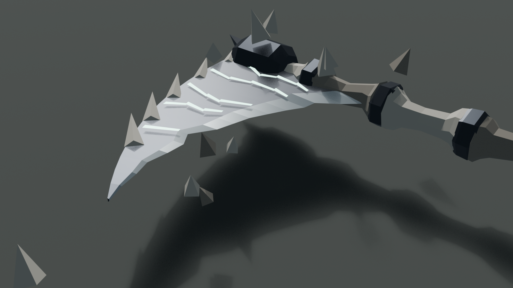
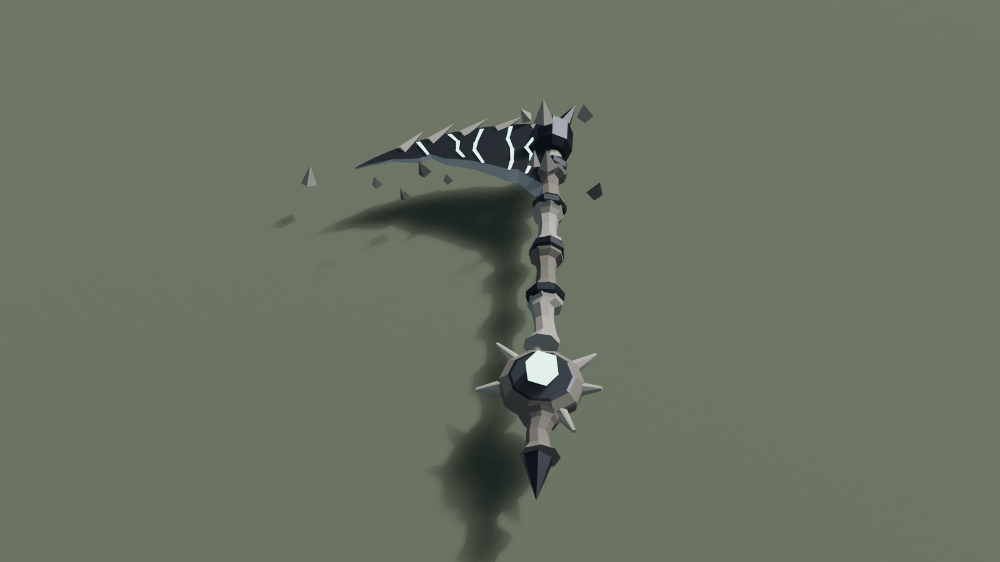
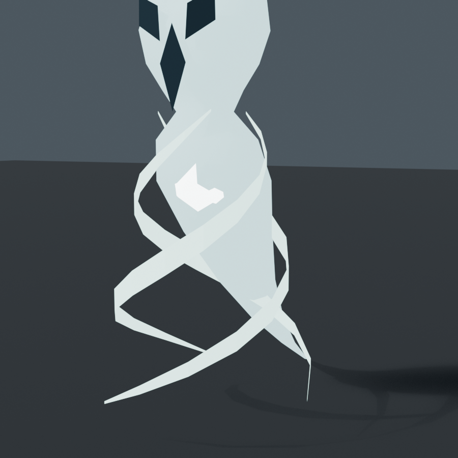

# Bone Reaper: Wandering Scythe and Soul Harvest

Bonelord Xarreth's two arena mechanics (the Buried Hoard bone boss). He stands his
ground; the room moves around the players instead.

Original project art authored procedurally in Blender from the owner's briefs. No
third-party mesh, texture or reference image is used.





## Where everything lives

| What | Where |
|---|---|
| Editable model source | `build_bone_reaper.py` (every dimension is a constant at the top) |
| Art review renders | `preview.py` |
| Blender exports | `scythe_components.glb`, `soul_components.glb` |
| Shipping build | `scripts/assets/bone_reaper/build.mjs` writes `public/vfx/bone-reaper/` |
| Choreography and every gameplay number (pure, shared) | `src/sim/rift/hoard_bone_reaper_core.ts`: `BONE_SCYTHE`, `SOUL_HARVEST` |
| Authoritative logic | `src/sim/rift/hoard_bone_reaper.ts` |
| Look numbers (pure) | `src/render/hoard_bone_reaper_core.ts`: `BONE_REAPER_LOOK` |
| Drawing | `src/render/hoard_bone_reaper.ts` |
| Tests | `tests/hoard_bone_reaper.test.ts`, `tests/hoard_bone_reaper_render.test.ts` |

## Rebuild

```sh
blender --background --python docs/design/bone-reaper/build_bone_reaper.py
node scripts/assets/bone_reaper/build.mjs
node scripts/build_media_manifest.mjs generate
npx vitest run tests/hoard_bone_reaper_render.test.ts
```

## Wandering Scythe: the double transform

The hazard is two motions at once, both closed-form functions of the cast's
elapsed time, so the server, an offline world and every client agree exactly and
nothing is simulated step by step:

    pivot(t) = anchor + path(progress(t))      scythePivot: the pivot travels
    blade(t) = facing + direction * spin(t)    scytheAngle: the blade turns

`progress` is a trapezoid speed profile (it leans into motion and settles, it
never snaps). `spin` rises over the cast, holds a constant rate, and runs down as
the weapon breaks. The renderer samples the same two functions each frame, and
for its trail samples them at PAST times, which is why the trail bends when the
pivot turns.

Routes are readable, never aimed at a player, and sized to the room the hoard
rolled (`boneReaperFrame` measures the floor's own shell): a serpentine down the
room, one grand loop, a figure of eight. The route a cast takes is its cue id
modulo the pattern count, so it varies cast to cast without a random draw.

The hit region is the BLADE only: an annular sector from `bladeInner` to `reach`,
leading the shaft by `bladeArc`. Beside the moving pivot is safe, beyond the reach
is safe, and the rest of the ring is safe until the blade comes round. A hit is
once per pass (`hitCooldownSec`, shorter than a turn) and throws the player
outward, clear of the ring. Jumping does nothing: the test is on the ground plane.
`tests/hoard_bone_reaper_render.test.ts` pins that every vertex of the modelled
blade edge lies inside that sector.

The boss is pinned where he cast for as long as the scythe is abroad, and every
route keeps the blade tip `bossClearance` yards off him, so whoever is holding
him is never swept for standing there.

## Soul Harvest

Souls are scattered over the WHOLE room (`soulSpawnOffsets`: one compass slice
each, turned by a hash of the cue id, alternating far and near, then a relaxation
pass that keeps them `minSeparation` apart, inside the walls, never near the boss
and never on a player). They form during the cast, hold and brighten, then walk a
straight line to where the harvest was cast. A player within `interactionRadius`
releases one; one that arrives gives the boss a stack of Harvested Soul
(`damagePerStack`, `maxStacks`, `stackDurationSec`). A soul is one cue in a list
that one function walks, so it resolves exactly once: it leaves the list in the
call that released or absorbed it. A released soul is withdrawn from every client
with a zero-length cue.

Releasing a soul costs the catcher: a stack of Soul Burden, a `vulnerability`
aura (`burdenPerStack`, `burdenMaxStacks`, `burdenDurationSec`). One player
cannot catch them all for free, so a party shares the catching and a lone player
chooses which souls are worth the damage taken.

`playerRewardEnabled` is the hook for rewarding the catcher (a small heal is
wired; it is off).

Past half health the two mechanics come faster, so a harvest can start while the
last scythe is still wandering: pressure, never a forced hit, because the souls
keep their clearance and the blade is always outrun by a walking player.

## Scaling: head count and rarity

Every hoard already scales the boss's health and damage by head count
(`vaultHealthFactor`, `vaultDamageFactor`) and maps rarity onto a Rift rank. On
top of that, `src/sim/rift/hoard_scaling.ts` presses the MECHANICS of every hoard
boss, not just this one:

- `HOARD_RARITY_PRESSURE` (rare is the identity the kits were tuned on): mechanic
  damage, the kit's cadence, extra simultaneous hazards, and hazard speed. Every
  hoard mechanic's damage goes through `hoardMechanicDamage`, and
  `tickHoardBossMechanics` runs the kit's clocks by the cadence, so a legendary
  hoard is harder than a rare one even for a lone player.
- Soul count is `soulCountFor(living, extra)`: `soloCount`, plus `perExtraPlayer`
  for each further living player, plus the rarity's extra, clamped to
  `minCount`..`maxCount`. Rarity also quickens the souls.
- `hoardIntensity(vault, living)` adds the rarity step to the living head count.
  At `HOARD_DOUBLE_MECHANIC_INTENSITY` the Wandering Scythe comes as a mirrored
  PAIR (legendary with four or more, epic with five): the same route mirrored left
  for right, the blades begun on opposite sides of the turn. The second carrier is
  an ordinary carrier cue whose `radius` is negated, so the wire carries nothing
  new. Where the room is narrower than `pairMinLateral` he calls only one.

## Blender or runtime

Blender: the scythe (bone shaft, metal bands, hub, blade with its bright edge,
glowing cracks, drifting shards) and the soul (body, core, the hint of a skull,
coiling wisps), as separate named parts.

Runtime: everything that depends on the moment. The travel and the turn, the lean
into motion, the spectral trail, the floor wake, scrape sparks, the assembly out
of the floor and the break-up, the souls' float, pull and stretch, the two
different endings (a bright release, a heavy green absorption at his ribs), and
the boss's empowered look. No dynamic light is used.

What a player acts on draws on every graphics tier: the weapon, the blade's
footprint on the floor and its leading edge, the reach ring, each soul, its halo
and its floor marker, and the glow in the boss's ribs. The low tier sheds only
flourish: the blade trail, the floor wake, the sparks, the souls' tails, and the
boss's aura ring and orbiting wisps (his stack count is still on his unit frame
as the Harvested Soul buff, and the rib glow still grows with it).

## Tuning after playtests

- Too punishing in a small party: lower `BONE_SCYTHE.damageFraction` (0.3) before
  touching the geometry.
- Too easy to ignore: shorten `rotationPeriod` (3.4 s) a little; do not raise
  `maxLateral`, which is also the pivot's pace.
- Souls unreachable solo: lower `SOUL_HARVEST.speed` or `soloCount`.
- Catching feels free or too costly: `burdenPerStack` and `burdenDurationSec`.
- A rarity feels flat or brutal: its row in `HOARD_RARITY_PRESSURE`, which moves
  every hoard boss at once.
- Stacks too scary: `damagePerStack` (6 percent) and `stackDurationSec` (45 s).
