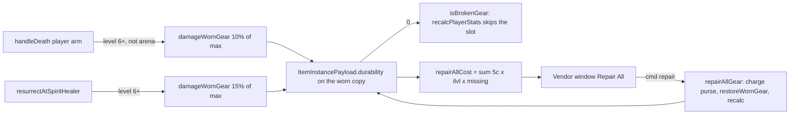

# Gear durability and vendor repair

The classic repair-bill gold sink. Worn gear carries a durability pool; dying
wears it down, a Spirit Healer resurrection wears it further, and any merchant
repairs it for copper. Broken gear (an empty pool) is worn but inert until
repaired. Rings and necklaces never wear and are never billed.

Source of truth: `src/sim/durability_rules.ts` (the pure rules) and
`src/sim/durability.ts` (the SimContext half). Pinned by `tests/durability.test.ts`.

## Rules

| Rule | Value | Where |
|---|---|---|
| Death loss | 10% of max on every worn pooled piece | `DEATH_DURABILITY_LOSS`, `applyDeathDurabilityLoss` (called from `handleDeath`) |
| Spirit Healer surcharge | a further 15% of max, on top of the death loss | `SPIRIT_REZ_DURABILITY_LOSS`, `applySpiritRezDurabilityLoss` (called from `resurrectAtSpiritHealer`) |
| Level floor | deaths at level 5 and below cost nothing | `DURABILITY_LOSS_MIN_LEVEL` |
| Arena | no loss (the Coliseum is a sport); Thornhollow Fields DOES cost gear | `applyDeathDurabilityLoss` |
| Corpse run | no loss beyond the death itself | (nothing runs on `resurrectAtCorpse`) |
| Bags | never touched; only worn gear pays | `damageWornGear` walks `ALL_EQUIP_SLOTS` |
| Repair cost | `5c x item level x missing points`, summed over every worn piece and every damaged copy in the bags | `repairCostFor`, `repairAllCost` |
| Item level | the tooltip item level when the def has a source, else the required level | `repairItemLevel` |
| Broken | a piece at 0 grants no stats, armor, ratings, or set pieces; a broken weapon swings unarmed and its procs are inert; a broken shield blocks nothing | `isBrokenGear`, the one `usableGear` gate in `recalcPlayerStats` beside the over-level rule, mirrored in `combat/equip_procs.ts` |
| Refuse-whole | a purse short of the full bill repairs nothing | `repairAllGear` |

Pool sizes (`maxDurability`): a per-slot ladder (chest 100, legs 75, helmet
and shoulder 60, feet 50, waist and gloves 35, one-hand weapon and held offhand
75, two-hand weapon 100, shield 100), scaled for armor class (cloth 0.8, leather
1.0, mail 1.2). Not scaled by item level: a bill grows through the cost
formula's item-level term, never through a bigger pool.

## Storage: on the copy, not on the character

Durability is `ItemInstancePayload.durability`, the CURRENT value, present only
while the piece is damaged. A full pool is the absent field, so:

- an undamaged copy stays a plain fungible stack, and a pre-durability save
  loads byte-identically (the load sanitizer keeps unknown non-string keys);
- unequipping a damaged piece carries the damage into the bags with it, so an
  unequip-then-re-equip can never be a free repair;
- repairing to full strips the field, and drops a payload that held nothing
  else, so the piece is plain again.

The max is a pure function of the def and is never stored.

## Wire and hosts

No new data member rides `IWorld`: the worn state is already on
`IWorldInventory.equipmentInstances` (PlayerMeta offline, the heavy-gated
`einst` self key online). The one new member is the command
`repairAllGear(npcId)` (`ClientCommand` `repair`). The public `eqi` trim never
carries durability, so another player's inspect shows no durability line.

Server re-diff triggers (`server/self_heavy_keys.ts`): `repair` and
`resurrect_healer` join `HEAVY_SELF_CMDS`, `playerDeath` joins
`HEAVY_SELF_EVENTS`, so the self mirror sees the new value on the next snapshot
rather than the staggered backstop.

## Presentation

- Vendor window: a Repair All button under Sell Junk (`vendor_window.ts`),
  quoted by the pure `repairButtonState` (`vendor_view.ts`) through the same
  `repairAllCost` the sim charges with; disabled when nothing is damaged or the
  purse is short.
- Item tooltip: a "Durability current / max" line
  (`item_instance_tooltip.ts` `instanceDurabilityLine`), only while damaged,
  red at zero. The paperdoll reads the worn payload off
  `IWorldInventory.equipmentInstances` through `wornTooltipInstance`.
- Sim text: "Repaired all items for {money}." on a repair (re-localized by
  `src/ui/sim_i18n.ts`). A loss itself has no notice: the death recap stays
  the one line the client renders, and the state shows on the paperdoll and
  in the vendor window.

