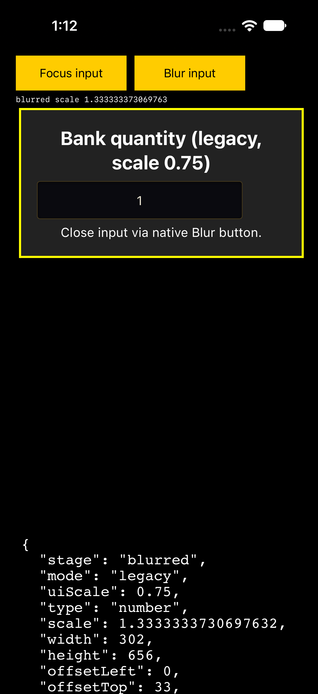
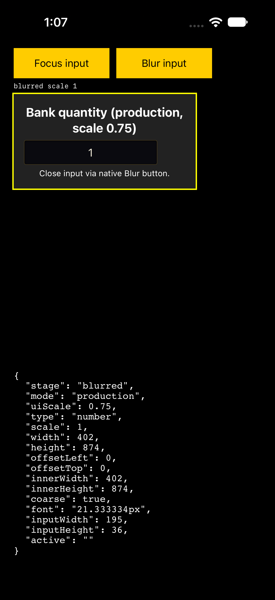

# iOS input focus zoom investigation

Investigated 2026-10-05 against `release/v0.45.0` at
`55de7ffe926d781df7b2caee4314318c7ff730ac`. Task branch:
`fix/ios-input-focus-zoom`.

## Report and cause

The 2026-09-30 report describes quantity and search popups zooming the native
iOS app, with the enlarged viewport persisting after the keyboard closes. The
six supplied screenshots show this cropping in bank and auction UI.

The existing mobile rule gives inputs a computed font size of 16px. However,
`src/styles/hud.css` applies CSS `zoom: var(--ui-scale, 1)` to `#ui`. At UI Scale
0.75, that 16px text renders at 12px; at 0.85 it renders at 13.6px. WebKit can
enlarge the page when a trusted tap focuses these small rendered inputs, and
does not automatically restore the original zoom on blur. The game's
`preventMobileZoom()` gesture handlers also cancel pinch gestures, explaining
why a player cannot readily pinch back out. This is browser viewport zoom,
rather than the game's camera zoom.

The player's UI Scale setting is unknown, so the screenshots alone cannot prove
this was their exact trigger. The simulator reproduction matches the reported
focus and persistent-zoom behavior.

Temporary workaround for this trigger: restart the app to reset an already
zoomed viewport, then use UI Scale 1 (100%). The original-rule simulator
control did not zoom at that setting. This patch prevents new focus zoom;
it does not add recovery logic for a viewport already zoomed before it loads.

## Fix

`src/styles/base.css` now inherits a touch input floor inside `#ui`:

```css
--touch-input-font-size: max(16px, calc(16px / var(--ui-scale, 1)));
```

The existing coarse-pointer rule uses this floor. A `body.mobile-touch` fallback
also covers explicit native touch mode independently of the primary pointer
media query. Outside the scaled HUD, the fallback remains 16px. Desktop inputs
retain their library fonts. UI Scale above 1 keeps the existing 16px computed
minimum. The fix applies centrally to quantity, search, select and textarea
controls, including controls created after a popup opens.

## Native simulator evidence

Device: iPhone 18 Pro, iOS 27 simulator. A disposable UIKit/WKWebView harness
loads the game's production CSS and places representative number/search inputs
inside the scaled `#ui`. XCTest taps the native web accessibility field and
closes the keyboard through a native blur button. Measurements include actual
focus events, `visualViewport.scale`, viewport dimensions and
`WKWebView.scrollView.zoomScale`. Production cases inject no font correction.

| UI Scale | Original 16px control: zoom after focus / blur | Production computed font | Production zoom after focus / blur |
|---|---|---|---|
| 0.75 | 1.3333 / 1.3333 | 21.333334px | 1 / 1 |
| 0.85 | 1.1766 / 1.1766 | 18.82353px | 1 / 1 |
| 1 | 1 / 1 | 16px | 1 / 1 |

The 0.75 baseline case loads the original base CSS verbatim from the release
commit within a cached production stylesheet, with no font overrides. It
reproduces persistent zoom: viewport width drops from 402 to approximately 302
CSS pixels and stays there after blur. The 0.85 and 1 baseline rows come from
an earlier mechanism control using the original 16px rule. The production run
passes all six number/search cases at
0.75, 0.85 and 1. Its viewport width stays 402; the keyboard reduces viewport
height from 874 to 504 and blur restores it to 874 without zoom.

Before and after keyboard dismissal at UI Scale 0.75:





Native verification is portrait and uses a focused WebKit fixture, rather than
a signed-in bank or auction session. The attempted native landscape run had an
orientation/tap-coordinate problem and supplies no landscape acceptance proof.
Chromium tests cover both orientations and CSS geometry, but cannot establish
iOS keyboard focus behavior. A physical-device pass through bank deposit,
withdrawal, sales and auction search in portrait and landscape remains advisable.

## Verification

Run from `/Users/trevcavill/Desktop/wocc/woc-ios-input-zoom`:

| Command | Outcome |
|---|---|
| `pnpm install --frozen-lockfile` | Passed with pinned pnpm 10.34.5. |
| `pnpm exec vitest run --config vitest.browser.config.ts tests/browser/mobile_input_zoom.browser.test.ts` | Before fix: 5 failed, 1 passed. After fix: 6 passed. Covers the real quantity prompt builder, representative search/select/textarea controls, HUD scales and runtime touch with a fine primary pointer. |
| `npm run test:browser` | 527 tests in 65 files passed, including the final regression fixtures. |
| `BASE_URL=http://127.0.0.1:5173 node scripts/mobile_input_zoom_check.mjs` | 1,005 checks passed, 0 failed. Covers both game entries, six viewport sizes, portrait/landscape, five UI scales, coarse-pointer and runtime touch paths, admin and desktop controls. Vite was served with `pnpm exec vite --host 127.0.0.1 --port 5173`. |
| `pnpm exec vitest run tests/styles_extraction.test.ts tests/css_value_validity.test.ts tests/css_token_resolution.test.ts tests/css_corpus.test.ts tests/ui_library.test.ts tests/per_entry_css_wiring.test.ts` | 89 tests in 6 files passed. |
| `pnpm exec vitest run tests/client_shell.test.ts` | 136 tests passed after preserving the existing CSS block order. |
| `WOC_SKIP_PRETEST=1 npm test -- --maxWorkers=4` | Completed: 70,550 passed, 28 failed, 2 expected fail, 576 skipped; 4,886 passed / 12 failed / 39 skipped test files. Pretest skipped because the earlier builds already generated wiki and i18n artifacts. See failure disposition below. |
| `pnpm exec vitest run tests/ci_workflow.test.ts tests/ci_leg_runner.test.ts tests/skill_icons.test.ts --maxWorkers=1` | 65 passed, 1 failed. CI workflow and icon tests pass on rerun after broader-run timeouts. The unchanged subprocess-output test still fails because its combined tail lacks the expected stderr marker. |
| `pnpm exec vitest run tests/desktop_publish_guard.test.ts` | 6 passed, 1 failed. The unchanged guard throws from its local grep invocation even though grep exits 0. |
| `pnpm exec vitest run tests/scripts_windows_paths.test.ts` | 3 passed on rerun after the broad-run scan timeout; includes the updated tooling source. |
| `pnpm exec tsc --noEmit` | Passed. |
| `pnpm exec turbo run check:types build:env build:server build:bot build:bundle --ui=stream` | All 7 tasks passed, including game/admin/bot type checks and client/server/bot/headless builds. |
| `npm run i18n:gen` | Passed; no translation changes. |
| `npm run security:gate` | Passed; no high-priority malware findings. |
| `pnpm exec biome check scripts/mobile_input_zoom_check.mjs src/styles/base.css tests/browser/mobile_input_zoom.browser.test.ts` | Passed with warnings only. |
| `git diff --check` | Passed. |
| `npm run gate` | Blocked in preflight: bundled `ffprobe-static/bin/darwin/arm64/ffprobe` is actually an x86_64 Mach-O binary on this ARM Mac, causing spawn system error -86. |
| `node scripts/gate_select.mjs` | Rechecked before PR creation; blocked in preflight by the same bundled probe architecture error. |
| `WOC_FFPROBE_PATH=/opt/homebrew/bin/ffprobe npm run gate` | Native probe override passes preflight, but `sfx:check` still requires the bundled probe and fails with the same architecture error. The full gate is not green. |

The broad unit run began before the CSS block-order correction. Its one
change-related client-shell guard failure is resolved by the correction and
the 136-test rerun. Three scan/asset test timeouts pass on focused reruns
(CI workflow, icon normalization, Windows paths). Of the remaining failures,
22 audio cases hit the incompatible probe, and two unchanged subprocess guards
fail locally: the CI output tail loses its stderr marker, and the desktop
publish grep exits 0 while Node reports `EPIPE`. No gate or unrelated test was
weakened to hide these failures.

Native production command (six cases, one XCTest; passed):

```sh
xcodebuild test \
  -project /tmp/woc-ios-zoom-sim/ZoomHarness.xcodeproj \
  -scheme ZoomHarness \
  -destination 'platform=iOS Simulator,id=3D4596D7-97AC-4988-A640-DA20285F74F6' \
  -derivedDataPath /tmp/woc-ios-zoom-sim/DerivedData \
  -resultBundlePath /tmp/woc-ios-zoom-sim/ProductionFinal.xcresult \
  -only-testing:ZoomUITests/ZoomUITests/testFocusZoomMatrix \
  -parallel-testing-enabled NO -collect-test-diagnostics never
```

The immutable baseline uses the same command with result bundle
`/tmp/woc-ios-zoom-sim/ImmutableLegacy.xcresult` and test selector
`-only-testing:ZoomUITests/ZoomUITests/testImmutableLegacyControl`; it passed
with both focus and blur asserted at 1.3333.

Reproducible harness source, successful native logs, raw measurements and
screenshots are saved locally in
`/Users/trevcavill/Desktop/wocc/ios-input-zoom-evidence/`.
Its `ios-input-zoom-harness.zip` contains both the unchanged successful production
source and the final project with the immutable legacy test. QA logs are in
the adjacent `qa-logs/` directory.

Frontend and test-coverage specialist reviews found no blocking defect in the
fix. QA status is **NOT READY**: the full contribution gate must be rerun on a
compatible audio toolchain, and the existing local subprocess-output and grep
guard failures must be resolved before treating this branch as ready to merge.
