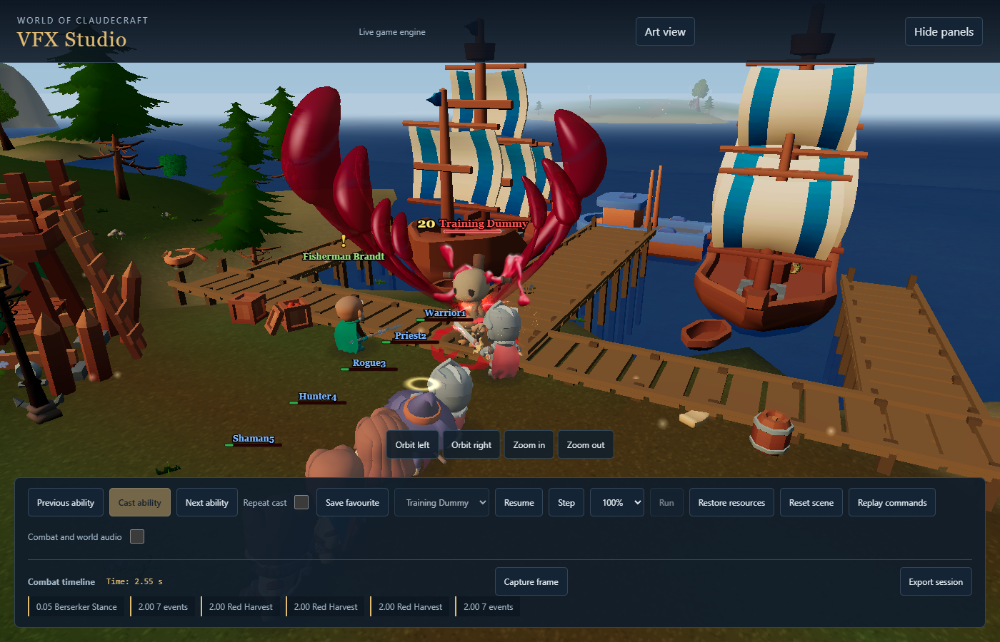
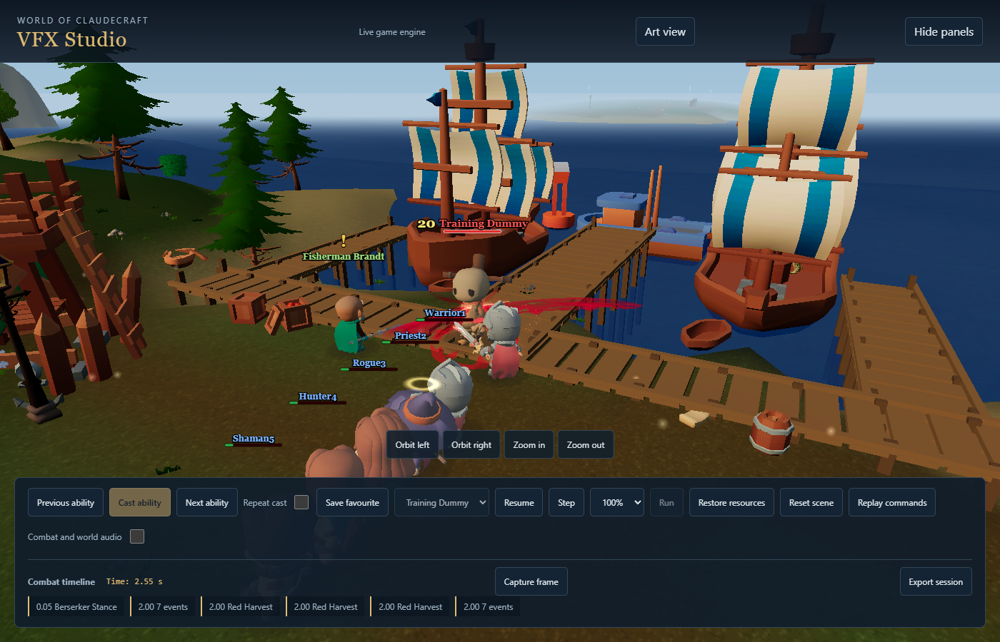

# Red Harvest: blade blood revision

## Direction and reference

Tony rejected the September 17 liquid impact as antler-shaped, blobby and misplaced.
This revision replaces that composition. It is not an increase in liquid volume.

Primary reference: [Rivers of Blood attacks in Elden Ring](https://www.youtube.com/watch?v=z7L91VKeCN8),
Game Clips And Tips, approximately 0:16 to 0:19. Read-only reference review inspected
paused and stepped gameplay: thin diagonal membranes, uneven scarlet density,
burgundy frayed boundaries, rapid breakup, separate opposing cuts and a changed
plane on the final attack. The video attacks empty space; it does not establish
enemy wound placement. No game footage or extracted reference assets are shipped.

## Implementation

- The large effect is an open, curved blade sheet with smaller trailing strands.
  It has more than ten units of authored lateral reach on the finisher, instead of
  seven mirrored upright liquid tubes. There are no swollen heads or closed tubes.
- A moving reveal and eroding tail establish the cut direction. The second cut
  reverses progression. Small splits and translucent regions preserve the enemy.
- The receiving blood is a separate original Blender animation: torn surfaces and
  narrow ballistic streaks, 64 frames, no white wet highlights or baked bloom.
  Its centred emission pivot is placed at the receiving contact. Camera changes
  project the world-space cutting axis into the sprite plane.
- Wounds still follow enemy translation and turning. The existing three contacts,
  native attack animation, recoil, hit sound scheduling and finisher resistance
  remain. Misses and defensive contacts cannot create blood.
- The saturated-pool fallback uses the same broad slash direction. It cannot
  restore the rejected tall branches. Secondary targets receive local impacts
  without duplicating the primary blade wave or camera movement.

## Authoring and verification

Source: `scripts/assets/vfx_production/bake_harvest_spray.py`.
Pack: `scripts/assets/vfx_production/package_harvest_spray.mjs`.
Working render: `tmp/harvest-spray`, 64 original 248px RGBA frames.
Shipping atlas: `public/textures/vfx/production/harvest_impact.webp`, 2048px,
4px cell gutters. Packaging checks complete ordered frames, centred pivot,
transparent endpoints, clipping margins and at least 60 nonempty frames.
No external generation service or new spending was needed.

The old minimum-height and closed-tube-normal tests encoded the rejected design.
Their replacements require greater lateral reach, a narrow cutting band, open
sheet boundaries, unit interior normals, disconnected layer topology and a
full-reach fallback. Existing contact, movement, slot reuse, outcome and pool
priority assertions remain. Camera-projection and reverse-cut tests cover the
new directional behavior.

This document records the design and implementation, not an AAA acceptance claim.
Final capture and check results are recorded below after verification.

## Review evidence

The first membrane draft exposed evenly spaced parallel lines in normal gameplay.
It was rejected during visual review. The final material uses smooth irregular
noise, one main film and short uneven patches instead of seven full-width strands.
The middle cutting edge passes through the authored contact origin.

Matching outdoor Low captures at 0.55 seconds, yaw -1.1, pitch 0.4, distance 18:

Focused tests: 117 passed across 13 files, including geometry, contact outcomes,
recoil, actual pool direction/reset, projected spray direction, prewarm, audio
scheduling, priority retention, asset hashes and coordinator size limits.
Command: `node node_modules/vitest/vitest.mjs run` with the 13 files recorded in
`tmp/harvest-elden-verified-tests.log`. Native TypeScript check passed:
`node node_modules/@typescript/native/bin/tsc --noEmit`.
Biome reported no errors or formatting changes and 14 existing non-null warnings.

The independent code review identified three issues during development: a reset
overwriting reverse direction, sprite direction opposing the second slash, and
final wound/crest angle disagreement. All were fixed and re-reviewed. Final
read-only visual review found no antler, blob or net pattern; the material remains
more stylized and cleaner-edged than the Elden Ring reference. Tony's motion review
is the next art-direction decision, not an automatic rollout to other abilities.

Final source captures: `warrior-final-rh-elden-film-world` completed 84 samples
across all six outdoor graphics profiles; `warrior-final-rh-elden-film-reduced`
completed 14 studio samples. Both report unchanged source, no runtime/console
errors and no missing assets. Earlier draft evidence remains separate.

Continuous playback: `warrior-natural-timing-rh-elden-film-crowd`, 30 simulation
seconds, 19 legal ability casts including four Red Harvest casts, 20 connected
auto attacks and five positive-damage recipients. No runtime errors, missing
assets or reported coverage gaps; source unchanged. This is a controlled dummy
fight, not a multiplayer raid, and this harness records timing rather than video.
Median frame interval was 7ms, p95 14ms. A 2610.4ms pause occurred at simulation
time 24.9, outside a Red Harvest cast. Its cause is unassigned. The first Red
Harvest window contained a 263.8ms interval; subsequent 0.8-second cast windows
peaked at 14.4, 14.3 and 20.9ms. These measurements do not establish cold-cast
or isolated GPU performance acceptance. This limitation remains open.

Production bundle generation, backdrop verification and hashed-media emission
completed (`npm.cmd run build:bundle`, `tmp/harvest-sept17-build.log`). The full
v25-baseline gate was rerun through `harvest-final-gate.mjs` and stops at manifest
freshness: the global media generator adds the unrelated pre-existing untracked
`warrior_steel.webp`. That draft is preserved. The committed catalogue is produced
by the owning generator against tracked-media staging; no generated rows are
hand-edited and no full-project gate pass is claimed.

Local review: `http://localhost:5173/vfx-studio.html`, Warrior, Bloodrush, Red Harvest.
The public Site is still version 28 and has not been updated by this revision.
