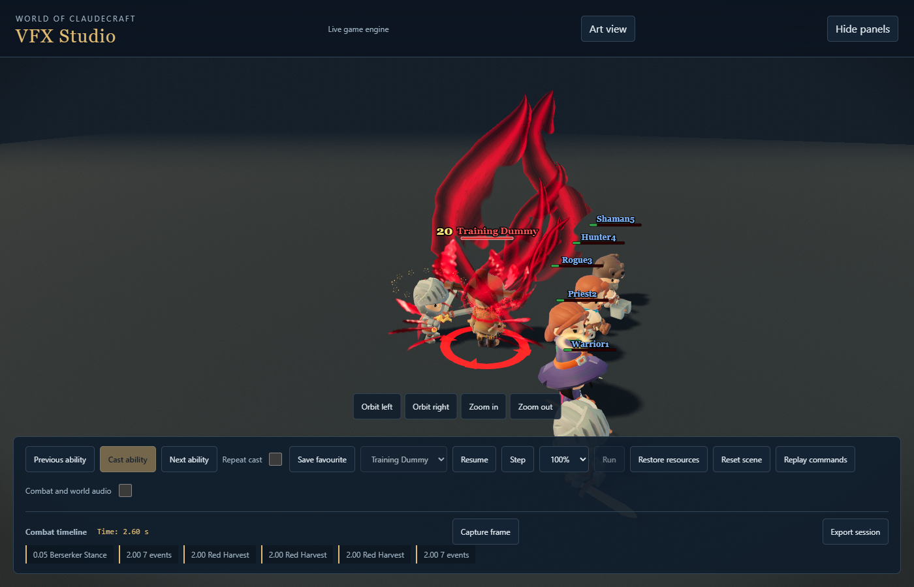
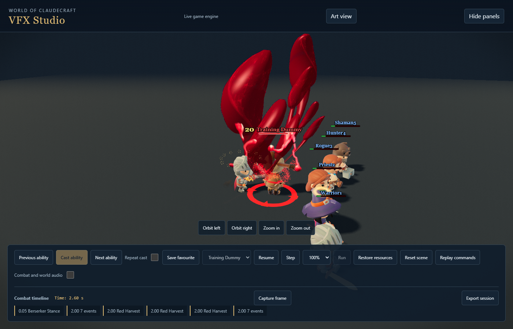

# Red Harvest liquid-impact checkpoint, 17 September 2026

Historical checkpoint: Tony rejected this liquid composition as blobby and antler-shaped.
The replacement is recorded in [the blade-blood review](red-harvest-blade-blood-review.md).

This continues the approved Red Harvest-only benchmark. It does not roll the treatment out to other abilities. Gameplay costs, damage, Enrage and contact times remain unchanged at 0.15, 0.32 and 0.49 seconds.

## Implemented

- Stronger planted loading, faster strike acceleration and the existing 40 ms extraction resistance. Measured foot drift is 0.000681 units, with 0.095 units of hip compression. All 138 Twinstrike animation arrays in the shared GLB remain byte-value identical to the preceding asset.
- A larger asymmetric extraction: seven rounded liquid streams, wet directional highlights, neck breakup, released droplets and an open centre. Circumference normals are joined across their UV seams; only the front of closed liquid surfaces renders, avoiding transparent back-face striping.
- A real offline Blender Mantaflow liquid bake supplies a 64-frame sprite, layered with the 3D eruption. Resolution 128, Cycles rendering, 2048-square lossless RGBA WebP, 321470 bytes. All 62 interior frames contain liquid; endpoints are clear and every frame has verified unclipped gutters. No AI image or model service was used.
- Brief angled cutting flashes and dark body-following wounds distinguish the two cuts and final extraction. The receiving body recoils away from the attacker, recovers without moving its gameplay position, and respects displayed enemy size and reduced motion. Misses and full absorption retain their existing outcome rules.
- Stronger final droplets, subtle foot dust, a slightly stronger directional camera impulse, and audio gain hierarchy favoring the final impact. Existing Enrage attachment already treats both swords without recolouring the character.
- Pool overflow retains the enlarged primary reach. Priority wound layers survive decorative crowding. No new per-frame allocation or simulation work was introduced.

## Production and evidence

Reproduce the atlas with Blender 5.2 using `scripts/assets/vfx_production/bake_harvest_fluid.py --output-dir tmp/harvest-fluid-v2 --resolution 128`, then `node scripts/assets/vfx_production/package_harvest_fluid.mjs tmp/harvest-fluid-v2`. The Blender command must use its standard `--background --python SCRIPT --` prefix. Packaging rejects preview-only metadata, incomplete frames and clipped alpha.

The reviewed blend, simulation cache, renders and mesh evidence remain under `tmp/harvest-fluid-v2`. The source scripts and shipped atlas are committed. External browser evidence is under `../studio-contact-pass`:

- `warrior-final-rh-sept17-before-native`: matched prior version, 14 samples.
- `warrior-final-rh-sept17-final-profiles`: all six graphics profiles, 84 samples, no browser errors. This precedes final rounded-head and front-face polish.
- `warrior-final-rh-sept17-surface-final`: final surface, 14 samples, no browser errors or missing assets.

Focused checks passed 76 tests in ten files for contacts, recoil, geometry, native performance, audio scheduling, outcome gating and pool pressure. A separate four-file asset/prewarm run passed 34 tests. TypeScript compilation passed. The independent review's seam, scaled-enemy recoil, preview-frame packaging and unrelated-media-manifest findings have been addressed.

## Remaining review at this checkpoint

The production bundle build passes. Final outdoor, reduced-motion and continuous crowd playback checks are being completed. The canonical v25-baseline gate stops at manifest freshness: generated assets differ from the existing index, and the global generator also includes a pre-existing unrelated untracked steel texture. The committed media catalogue is regenerated through the owning generator against tracked media only; the unrelated draft is preserved. No full-project pass is claimed. Two outdoor attempts are retained as failures (timeout and a destroyed browser context during generation).

The local preview contains this revision. The shared public Site still serves version 28 until a separately recorded publication succeeds. The delivery checkout was found with pre-existing deleted build output and has not been changed. Final sound balance requires human listening; this record does not claim AAA acceptance or measured multiplayer-raid performance.
