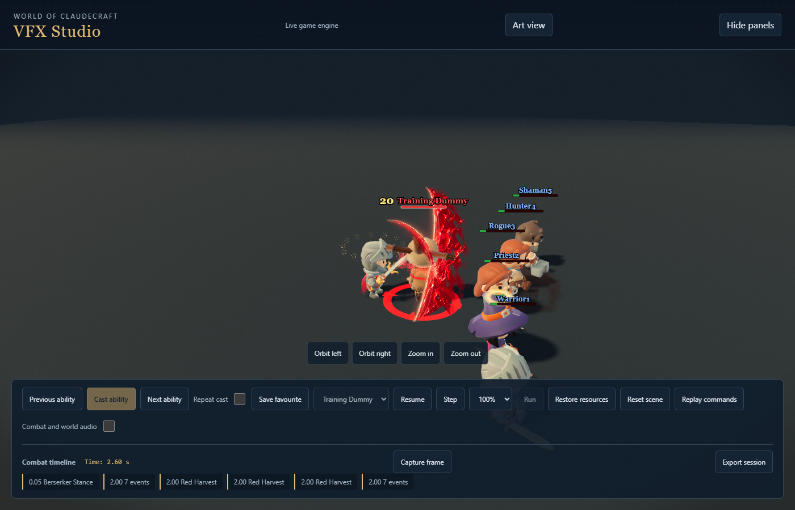
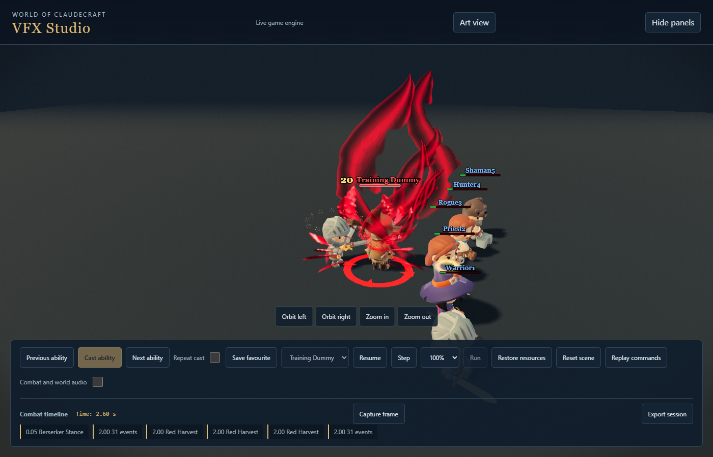

# Red Harvest impact rework: 10 September 2026

Tony approved the impact-first proposal. This checkpoint changes Warrior Red Harvest only: a lower planted stance, two opposed cuts, a held two-sword extraction, and a much larger enemy-centred crimson eruption. Damage, cost, contact times (0.15/0.32/0.49 seconds) and Enrage rules are unchanged.

## Art and production

- The last collision combines a jagged rose-white core, dark red backing, curved blood jets, two open rising clefts, torn folds, directional droplets and silver fragments. The open centre preserves the receiving character. No circular shockwave or crater was added.
- The main performance resolves by 0.75 seconds. The native animation holds its final compression for 40 milliseconds without pausing the simulation. The existing body response and actual weapon-tip trails remain connected to each contact.
- A new 64-frame Blender Cycles sprite supplies dense impact material and breakup. Its straight-alpha, guttered WebP atlas is 2048 square. Geometry, shader material and particles supply depth around it. This is authored animation, not a fluid simulation.
- Four sound roles have two new ElevenLabs takes each: release, first cut, reversal and finish. Source prompts and conform settings are checked in; private credentials are excluded. Eight half-second generations returned 48 total billed characters/credits in the provider headers; no image/model generation ran for this rework.
- Main geometry and sprite preparation are retained on every graphics preset. Reduced motion freezes internal movement and disables camera response while preserving the visible contact. A bounded ribbon fallback retains the final reach when the sculpture pool is unavailable.

## Evidence

Matched normal-camera evidence uses 1400×900, distance 18, yaw 1.9, and the same staged canonical cast. Before frames are under `warrior-final-rh-impact-before`; final six-profile frames are under `warrior-final-rh-quality-final` in the external `studio-contact-pass` evidence folder. The committed pair below shows the same 0.60-second sample.

Focused validation passed 206 tests across 12 files, covering outcome timing, clip mapping, geometry, audio routing, asset preparation and architecture. The delivered native clip has maximum planted-foot drift 0.000539 units and 0.075 units of hip compression, returning to its neutral stance; Twinstrike animation tracks are byte-value equivalent to the previous authored tracks.

All six graphics profiles completed 14 timing samples each without browser errors or missing assets. An outdoor angle and reduced-motion capture extend the visual checks. A 30-second continuous Bloodrush rotation produced 19 ability casts and 20 auto-attacks against five training dummies, with all five receiving damage, no browser errors and no capture coverage gaps. Separate natural playback recorded three Red Harvest casts: all 12 expected sound cues were accepted and nine contact events occurred.

## Review limits

This is an art-review checkpoint, not a claim of universally accepted AAA quality or full game release certification. The repository-wide canonical gate remains separately reported. The five-dummy rotation is not a multiplayer raid test. The saturated-pool regression is a real-pool unit check, not a measured raid performance claim. Short contact sprites and seams stay at the collision position; the existing body highlight follows the target. Full absorption retains the defensive contact treatment. Final sound balance and player satisfaction still need human listening and play review.

Reproduce the sprite with `scripts/assets/vfx_production/bake_harvest_impact.py` and `package_harvest_impact.py`; reproduce the native clip with `scripts/build_fury_anims.mjs` and validate with `scripts/anim/check_harvest_pose.mjs`. Sound generation and conformance use `--red-harvest-impact` on the Fury tooling. Raw source takes and the Blender scene are preserved in the local production workspace.
