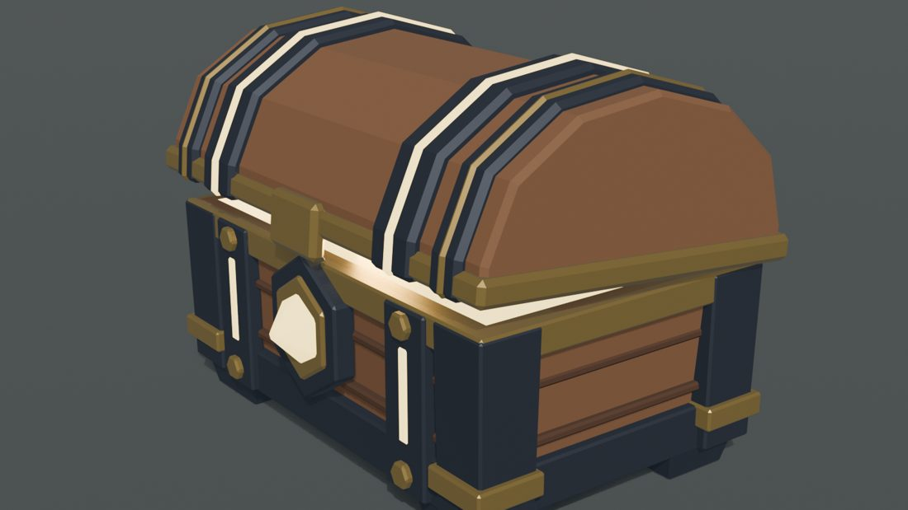
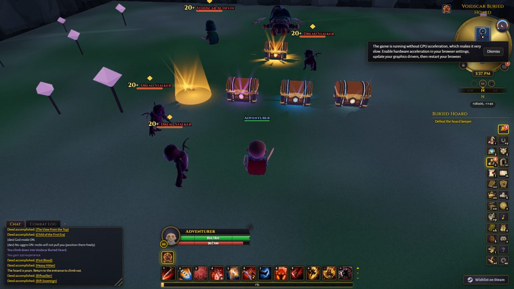
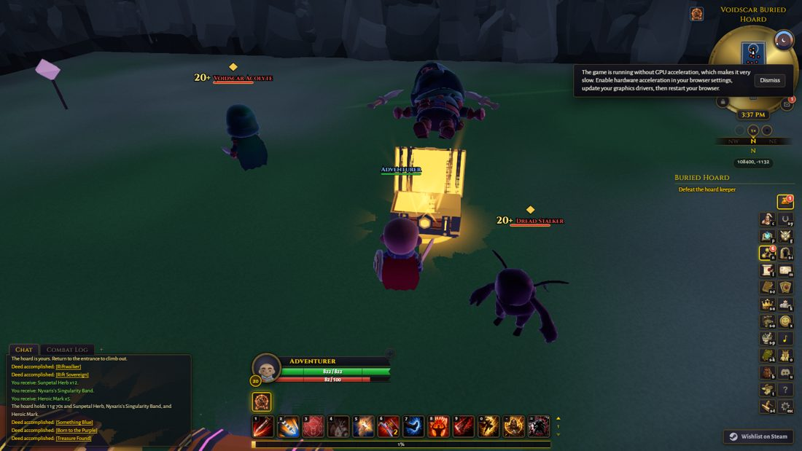

# Buried Hoard reward chest

The chest the final boss of a Buried Hoard leaves behind. Killing the boss no
longer pays silently: a chest arrives, waits with its lid a crack open and light
straining to get out, and each entrant opens it for their share.

Original project art authored procedurally in Blender from the owner's brief. No
third-party mesh, texture or reference image is used.





## Where everything lives

| What | Where |
|---|---|
| Editable model source | `build_chest.py` (every dimension and colour is a constant at the top) |
| Art review renders | `preview.py` (close-up, back, open, and the rarities from chase-camera distance on a dark and a light floor) |
| Blender export | `chest_components.glb` |
| Shipping build | `scripts/assets/reward_chest/build.mjs` writes `public/models/props/hoard_reward_chest.glb` |
| Ceremony numbers (pure) | `src/render/hoard_reward_chest_core.ts`: `CHEST_TUNING`, `CHEST_RARITY` |
| Body and effects | `src/render/hoard_reward_chest.ts` |
| Gameplay | `src/sim/rift/hoard_reward_chest.ts` |
| Tests | `tests/hoard_reward_chest.test.ts`, `tests/hoard_reward_chest_render.test.ts` |

## Rebuild

```sh
blender --background --python docs/design/reward-chest/build_chest.py
node scripts/assets/reward_chest/build.mjs
node scripts/build_media_manifest.mjs generate
npx vitest run tests/hoard_reward_chest_render.test.ts
```

## The model

One chest for every rarity. Four named parts, never joined, because the runtime
moves them: `Chest_Base`, `Chest_Lid`, `Chest_Lock`, `Chest_InnerGlow`, under
`ClueRewardChest_ROOT`. Six flat-colour materials and no textures: `Wood`,
`WoodDark`, `Metal`, `MetalLight` (the brass) are ordinary surfaces; `Glow` (the
clasp gem and the strap inlays) and `InnerGlow` (the light inside and the
underside of the lid) are the two the runtime tints by rarity.

The lid is authored with its origin on the hinge line. Mesh quantization in the
shipping build moves node origins, so the runtime does not trust it: it hangs the
lid on a hinge of its own at `CHEST_TUNING.HINGE_Y` / `HINGE_Z`, which
`tests/hoard_reward_chest_render.test.ts` pins. The lid therefore has four clean
states from one rotation: closed (0), waiting (`LID_IDLE_ANGLE`), opening, and
open (`LID_OPEN_ANGLE`).

## Blender or runtime

Blender: the geometry, its proportions, the bevels, the named parts and materials.

Runtime: everything that depends on the map's rarity or on the moment. The rarity
colour, the inner light and its surges, the light leaking from the gap, the rays,
the motes, the pool of light on the floor, the arrival and the opening. That is
what lets one model serve every rarity, and lets the numbers be tuned without
re-exporting anything. No dynamic light is used: the glow is emissive surfaces
and additive cards, so the point-light budget is untouched.

## Gameplay contract

The chest replaces WHEN a hoard pays, never what or whom. Eligibility is frozen
at the kill (the same participant list the payout always used) and the table is
`payTreasureVault`. Spawning is idempotent on the run's own state, so a duplicated
death event can never make a second chest. A share nobody opened is settled
automatically when its owner leaves the hoard or when the hoard is torn down, so
walking out can never cost a player their reward.
