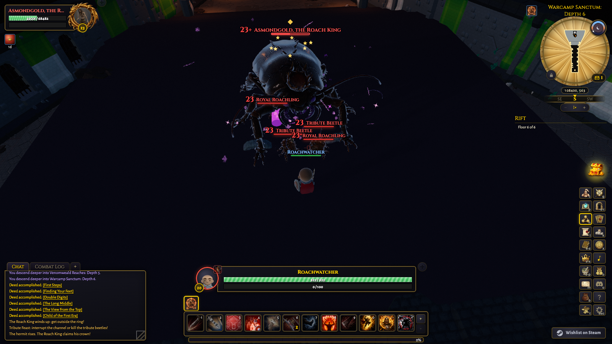
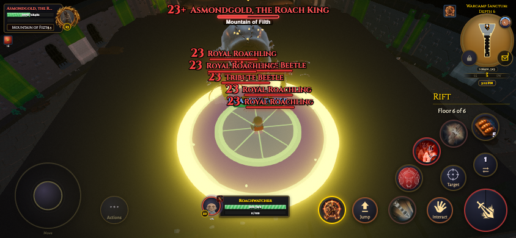

# Roach King local QA

Initial authoring used published release `v0.41.4` (`511ee2e1fa`). PR integration
merges the active `release/v0.42.0` branch (`17cc8505c1`) into the isolated
`feature/roach-king-rifts` worktree. The original checkout and its unrelated
changes remain preserved. The initial validation and animation revision records
below describe their original snapshots; current integration evidence follows.

## Reviewed scope

All procedural rift themes, both authored Infernal Citadel boss placements, and
rift upgrades resolve the new sovereign. Existing rank scaling, completion,
loot, and deed contracts remain in their owning modules. The encounter has a
human opening, interruptible tribute healing, a three-second coronation, summoned
roachlings, wider crowned attacks, and A/S-rank fixed lethal ground zones.

Independent reviews covered sim determinism and online parity, content and
localization obligations, frontend presentation, GPU preparation, and the asset
pipeline. Reviewers exchanged domains so their own implementation was not its
independent signoff. Findings resolved during review included Nature school
lockout handling, retained danger-zone fuse progress, Transform clip completion,
raised-floor warning placement, and missing eager VFX material preparation.

## Assets

The four Tripo P2 bodies have forty Blender-authored animation clips. The final
pipeline scorecards have no failures: both adds pass; the boss forms retain
1024-pixel textures and the crowned body is about 1.8 MB, producing documented
category-norm warnings. Shipping models use meshopt and KTX2. Provenance, paid
task IDs, source hashes, final hashes, and actual Tripo costs are in
`scripts/assets/specs/roach_king.provenance.json`. Tripo usage was 540 credits
($5.40); built-in reference-image pricing was not returned.

Hero, directional, and every animation preview were inspected. Final Death
frames were additionally rendered at the exact last skeletal keyframe. The
initial floor check used the lowest skinned vertex and failed to catch a floating
body and torn front paws. Animation revision 2 below supersedes that acceptance
with connected-mesh deformation and body-to-rendered-floor checks.
Editable Blender masters and raw generation jobs remain under
`tmp/asset_pipeline/roach_<name>_p2/` in this worktree.

The aggregate `asset:budget` command is already over its configured total and
creature budgets at the release base (about 466.4 MB total against 95 MB). These
four models add about 4.3 MB. The global limits were not raised.

## Initial feature validation record

- Frozen-source focused verification: 27 files passed, 1182 tests passed and
  three skipped. This merged the changed/new tests with architecture, i18n,
  content, GPU preparation, clip maps, online warnings, and portrait guards.
  Machine-readable output: `tmp/roach-final-focused-results.json`.
- Asset, portrait and generated-artifact freshness passed. The complete portrait
  render produced 245 images without failures; the existing portrait bytes were
  unchanged. All 58 tracked generated outputs reproduced without hash drift.
- Final security gate passed with zero high-severity findings after priors.
- All four headless hardware browser profiles passed: desktop 1600 by 900 and
  touch-emulated mobile 844 by 390, each on low and high graphics. All nine
  stages per profile retained zero cumulative `live-program` events, with no
  page errors or context loss. Warning and pooled-effect heights match on the
  raised arena. That initial corpse check recorded a height ratio of 1.029 and
  a lowest-vertex floor gap below 0.004 yd; those metrics did not establish body
  support and are superseded by the animation revision checks below.
  This establishes functional rendering, not FPS, normal-vsync smoothness,
  memory residency, or performance on a physical phone.
- Independent portrait guards passed 30 tests; the camp-density guard passed
  20 tests. The final prewarm policy suite passed 93 tests.

- Canonical type checks and all builds passed: client, admin typecheck,
  authoritative server, headless environment, and bot.
- The canonical browser regression run passed 32 files and 319 tests but hit
  timeouts/dependency-fetch failures in five files under concurrent load. A
  serial rerun of exactly those files passed all 25 tests without source edits
  or relaxed timeouts. All 37 browser files are covered by these results;
  `tmp/roach-browser-retry-results.json` records the retry.

An inherited `desktop_publish_guard` test harness failure was reproduced:
its `grep -qF` child exits successfully after finding the required define, then
Node reports `EPIPE` while still writing the remaining stdin. The test, Vite
config, and desktop workflow are byte-identical to the release base. The actual
workflow's filename-based grep passes. No desktop build guard was changed.

An inherited `ci_leg_runner` fixture also fails in isolation on the installed
Node runtime. It assumes ordering between separate stdout/stderr pipes: its
stderr signature arrives before the rest of a large stdout burst, which
legitimately evicts that signature from the combined 8 KB tail. All output and
the correct exit code are delivered. The runner, test, and classifier match the
release base; no gate implementation was changed.

The full Node run completed with 3438 passing files, 30 skipped files and 26
failing files: 50392 tests passed, 33 failed, 449 skipped and two expected
failures. It began before the final source/artifact freeze, so this is not a
claim of an all-green final-tree run. Every reported failure was triaged:

- Ten failures involved earlier revisions of the new gameplay/rendering paths,
  content inventory pins, or portrait receipts. Their corrected final versions
  pass in the frozen-source focused run above.
- All eighteen timeout cases passed with one worker and unchanged timeouts:
  seventeen cases across fourteen files in `tmp/roach-retry-results.json`, plus
  the late Groveheart case in `tmp/roach-groveheart-retry-results.json`.
- The timing-coverage failure is resolved by the canonical CI harvest below;
  all three partition/planning/parser suites pass (94 tests).
- Four local full-gate failures remain: the two inherited pipe-fixture issues
  described above and two i18n checks comparing intentionally unstaged generated
  files to the index. No test was disabled and no threshold was relaxed.

The ordinary full gate stops at its `git diff --exit-code` generated-artifact
freshness step because the intentional generated changes are unstaged. The
index was preserved. Remaining canonical gate commands were invoked separately;
working-copy regeneration hashes verify freshness without staging changes.

The new paired test modules initially crossed the timing-table coverage guard.
The unchanged owning command refreshed `scripts/ci_shard_weights.generated.json`
from [successful full-mode CI run 33955370006](https://github.com/levy-street/world-of-claudecraft/actions/runs/33955370006),
whose head is exactly the release base. All eight test shards and both long-sim
lanes succeeded and explicitly recorded full mode. The harvest measures every
baseline test file: 3472 of the current 3479 files (99.7988%). The seven new
feature suites retain the normal measured-median fallback. Partition
completeness, balance, and the unchanged coverage threshold pass. Independent
gate-integrity review checked the provenance and confirmed no gate weakening.

```sh
GH_REPO=levy-street/world-of-claudecraft node scripts/ci_shard_weights_harvest.mjs 33955370006
```

## Local use and evidence

The client is served at `http://127.0.0.1:5185/`. Choose Play Offline, then use
the chat commands documented in `docs/design/roach-king.md` to enter a real
final-floor encounter. The development shortcut leaves existing runs intact.

The reproducible scenario is `scripts/roach_king_smoke.mjs`, with its sim-side
setup in `scripts/lib/roach_king_scenario.mjs`. Raw local browser captures and
telemetry are in `tmp/roach-king-final/`. Full gate output is in
`tmp/roach-remaining-checks.log`; canonical post-test checks are in
`tmp/roach-post-checks.log` and `tmp/roach-build-checks.log`. These logs include expected offline API failures
and test fixtures that deliberately emit errors; browser page errors and GPU
context loss are checked separately.

Selected final captures and the consolidated browser receipt are preserved in
`docs/screenshots/roach-king/`. The receipt identifies the full local screenshot
set and the exact final model hashes.





## Animation revision 2 and Asmon naming

Player-facing references now use Asmon, with the localized Roach King title.
The king's front feet had skin weights belonging to other legs and antennae.
The old death roll also left root-weighted shell vertices stationary while
rotating the thorax. The Blender authoring repairs these weights and rolls the
whole king onto its shell. Asmon's final fall now rests his torso on the ground.
The shared export starts authoring at frame zero, eliminating the duplicated
stationary frame at every walk/run loop while preserving all clip durations.
Both forms use eased foot lifts and smoother anticipation/recovery; the hermit's
cast poses return to his hunched baseline and his coronation tremor tapers off.

The new real-Three deformation regression reproduced the original failures
before replacing assets. It measures connected triangle edges, looping vertex
positions and velocities, late-death settling, and torso/shell support. All
22 cases pass on the revised shipping GLBs. Together with asset provenance,
clip maps, cast timing, and texture compression, the focused run passed 43 tests
across five files
(`tmp/roach-animation-focused.json`). The name change separately passed 67 tests.
The final asset QA has no failures and retains the documented texture/size
warnings. No additional paid generation was performed.

Client typechecking and the client build pass. The complete 245-portrait refresh
finished without page errors or failed renders; the 30 portrait guard tests pass,
and the owning source manifest check is fresh. The existing 242 portrait bytes
remain unchanged. Localization regeneration reproduced all 55 current generated
artifacts without drift. Four additional smoke-probe tests verify that grounded toes or a grounded head
cannot hide a floating shell or torn triangles, and distinguish unsampled mixer
actions from real persistent weight gaps. Changed-file Biome, whitespace,
and the stop-hook checks pass. These are focused follow-up results, not a claim
that the earlier full-gate baseline failures disappeared.

The final shell-contact acceptance excludes the head, crown, root, and legs:
only vertices with more than 80% thorax/abdomen weight qualify. Both their
minimum and fifth-percentile floor clearance must be below 5% of the normalized
live height. A pure overturned pose failed this check with a 10.36% minimum
gap and a 13.30% contact-patch gap. The final landing adds a small head-up pitch
as the shell settles and passes without relaxing those limits or clipping the
whole body through the floor. Left and right low-angle game views independently
confirm the abdomen is supported. Normal-playback recordings cover walking,
running, attacks, idle, and complete casts on both forms; those unchanged clips
retain intact paws and staff. These checks establish animation behavior and
visual support, not physical-phone frame pacing.

Final desktop-low and mobile-high death checks each passed all five stages with
zero live shader-program events and no page errors. Both left and right corpse
views were inspected. The final 2,094 shell vertices have a lowest-16 contact
clearance range of 0.0048 to 0.0694 yd against raycasts of the rendered arena;
the total corpse-height ratio is 1.05944 and the maximum measured edge-stretch
ratio is 2.369. Final capture sources are `tmp/roach-king-shell-final/`; the
selected comparison images and revision receipt live in
`docs/screenshots/roach-king/`. Earlier candidate Death captures are marked
rejected and are not final acceptance evidence.


## Active release integration

The release overlap audit compared feature-owned surfaces with both merge
parents. Mob lifecycle cleanup preserves corpse-harvest cancellation and Roach
King state reset. The extracted `spawnBossAdds` binding retains current release
rank scaling, threat, loot, and Masterwrought reward behavior. Existing world
facets already carry the encounter state; no new facet or persistence schema
is needed. The real server/client danger-zone replay remains covered by
`tests/rift_death_zone_online.test.ts`.

The release extracted cast labels from the HUD. The merged
`src/ui/cast_display_name.ts` delegates rift casts to `riftCastDisplayName` while
retaining the release's other cast resolvers. Roach GLB definitions opt into
`authoredAtlas` under the release's material preparation contract. The VFX
prewarm regression now exercises the release's actual instanced light-pillar
pool. Renderer compile-tail preparation, terrain grounding, locale additions,
and generated inventories preserve both sides. Coordinator ceilings were
lowered after extraction; no gate threshold was raised.

Frozen-lockfile installation and TypeScript checks pass. The focused merge
verification covers sim/content contracts, online replay, real GLB deformation,
material preparation, cast labels, architecture, and coordinator budgets.
Canonical localization, wiki, media, and portrait generators produced the
merged artifacts. The portrait receipt records the actual macOS rendering
environment; historical Linux portrait byte pins are refreshed only after
before/after visual inspection. See the portrait source manifest and its
companion README for the complete generation record.

The release merge also replaces the initial timing harvest with the active
release's canonical timing snapshot. Earlier initial-base gate failures above
are historical findings, not evidence about the merged tree. The current
pre-merge gate and PR CI results are recorded with the PR.

The merged runtime was rechecked on a fresh Vite instance: desktop-low runs the
complete encounter and mobile-high checks transformation and death. Both pass
without page errors, shader errors, or live-program events. Body-only arena
raycasts retain shell support, and left/right corpse captures were inspected.
Committed current-release evidence is under
`docs/screenshots/roach-king/release-integration/`. A first desktop launch was
reset by Vite's initial dependency optimization; the warmed launch passed
without source changes. Expected offline API failures and unrelated startup
preload diagnostics remain distinguished from encounter errors in the receipts.

The broad release gate caught stale inventory and resolver assumptions in the
release's guards; those now include the new untagged templates and exact Roach
cast labels. CI sparse checkouts include the encounter's committed evidence.
The canonical Eastbrook runtime-input reseal updates only provenance hashes;
its historical captures and all measurements remain unchanged. A fresh
read-only review independently reproduced those hashes and checked that none
of the guard repairs narrowed coverage.

The current release also retains the stream-order fixture failure described
in the initial record. Its real subprocess delivers complete stdout/stderr
and the correct exit status, but a later stdout burst can evict an earlier
stderr marker from the bounded combined tail. The fixture repair exercises
both overflow streams independently, keeps each required suffix on its own
ordered stream, and verifies both complete sinks and the unchanged tail bound.
No runner behavior, timeout, retry, or exit-code policy changes.
