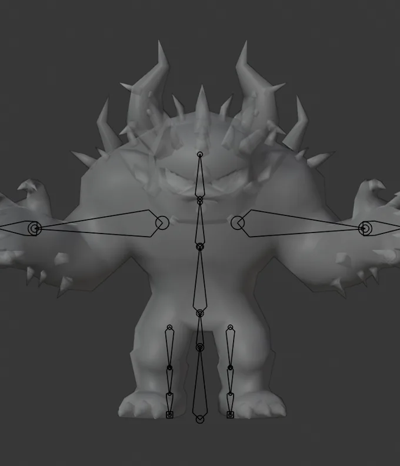
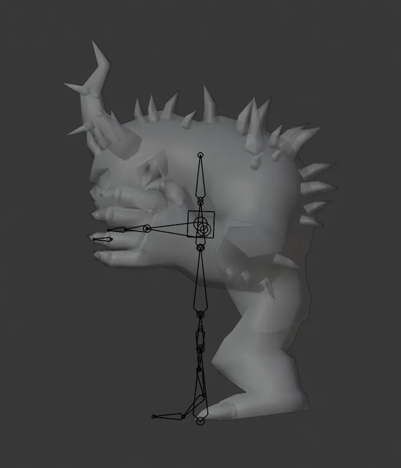
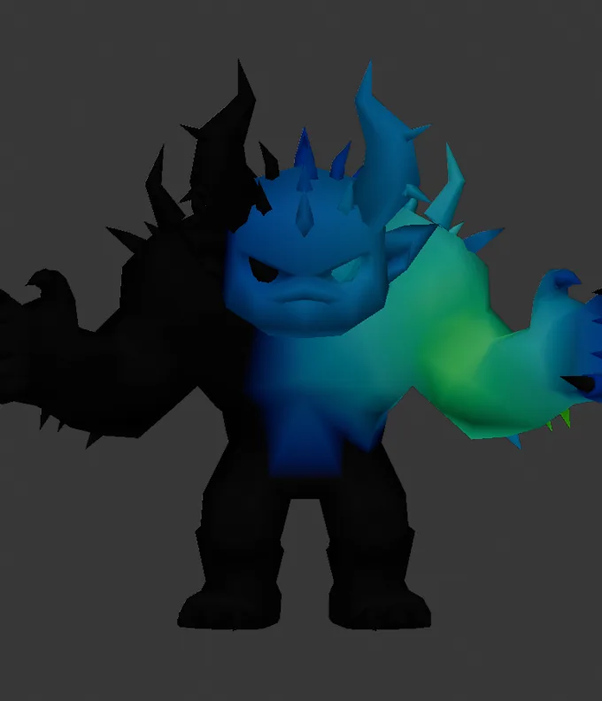
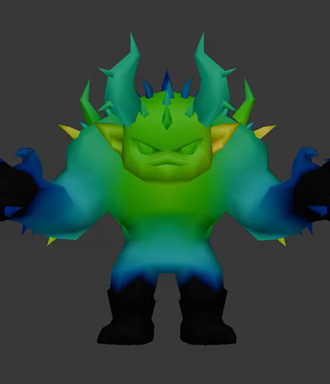
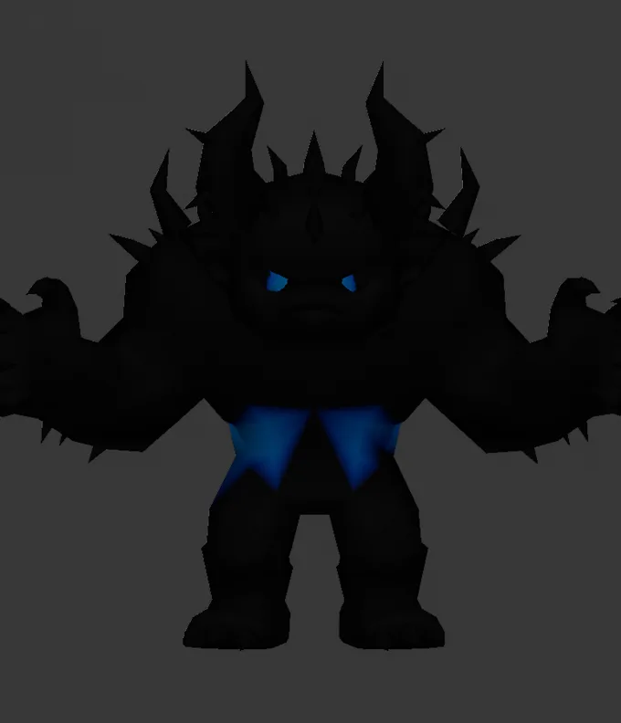
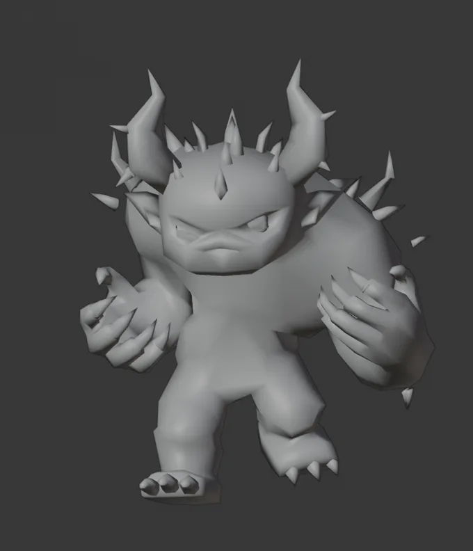
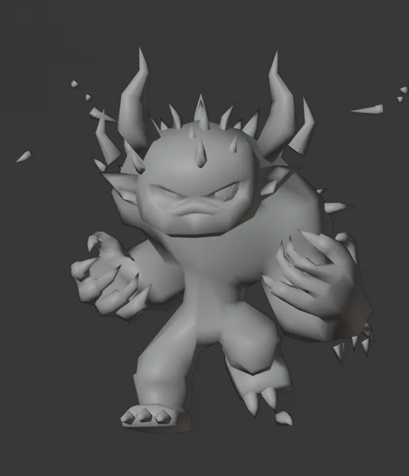

# Sundered Horror rig audit

**Date:** 2026-08-05
**Subject:** `sundered_horror_thicket.glb`, the manual-rig lane output shown in
`docs/design/last-bell-concept-art.html`
**Question asked:** the arms look joined to the body and the rigging looks off in general.
Does the rig match the model, and if the rig is good, what is actually wrong?

## Verdict

The skeleton placement is good. **The skin weights are the defect.** The bones sit correctly
inside the model, but the weight solver in `scripts/asset_pipeline/lib/manual_rig.mjs` spreads
every bone across the whole body, so no bone owns any region. The arm bones end up driving the
torso flank, the face, and the horn crown, which is exactly the "arms joined to the body" read.

A controlled re-solve (same skeleton, same clips, same mesh, weights replaced) cuts the worst
mesh tearing by 3x to 6x. That isolates the fault to the weights.

> **Superseded in part. Read "Resolution" at the end of this document before acting on
> anything here.** The ownership finding above held up and has been fixed. Three things in
> this report did not: the per-edge stretch figures are inflated by sliver edges and should
> not be quoted, the claim that no checked-in script produces the shipped file is wrong, and
> the claim that the asset is not applied yet is wrong. The ranking of root causes was also
> wrong: item 3, not item 1, is the dominant one.

## Method

Two independent readers were used and cross-checked against each other so no finding rests on
one tool:

1. A Node reader over `@gltf-transform/core`: reconstructs rest-pose world matrices from the
   node hierarchy, recovers each skin's dequantization frame from its inverse bind matrices,
   evaluates every animation channel, applies linear blend skinning, and measures per-edge
   stretch against the rest pose.
2. Blender 5.2 via the MCP bridge: bone positions, per vertex-group weight statistics, weight
   paint renders, and depsgraph-evaluated deformation at sampled animation frames.

The two agree on every shared quantity (bone positions to 6e-7, weight mass percentages
identical, mean dominant weight 0.507 from both).

The KayKit knight (`public/models/chars/players/knight.glb`) is the control, since its weights
are hand-authored and its clip library is the one being reused.

## The skeleton is correctly fitted

| check | result |
|---|---|
| joints inside the mesh | all 23, nearest-vertex distance 0.013 to 0.24 on a 2.145-tall model |
| arm chain reach | `hand.l` at x=1.17 against a mesh half-width of 1.29, so 91% covered |
| thigh region ownership | 84.3% leg bones |
| belly and pelvis ownership | 76.8% torso bones |

The one genuine geometric shortfall is vertical, not lateral: the `head` bone's synthetic leaf
segment ends at z=1.492 while the horn crown reaches z=2.145. The signature feature, the top
30% of the silhouette, sits beyond the end of every bone.

## The weights are the defect

Only `head` ever achieves real ownership. Every other bone in the rig peaks below 0.8.

| bone | peak weight | vertices touched (of 6,065) |
|---|---|---|
| `head` | 0.996 | 2,906 |
| `chest` | 0.794 | 4,477 |
| `hand.l` | 0.691 | 769 |
| `hips` | 0.614 | 524 |
| `lowerarm.l` | 0.507 | 2,274 |
| `upperarm.l` | 0.498 | 2,866 (47% of the mesh) |
| `wrist.l` | 0.491 | 1,024 |
| `lowerleg.l` | 0.355 | 360 |
| `upperleg.l` | 0.222 | 384 |
| `toes.l` | 0.198 | 172 |
| `spine` | 0.151 | 380 |

Against the hand-authored control:

| metric | Sundered Horror | knight (control) |
|---|---|---|
| mean dominant weight per vertex | 0.507 | 0.816 |
| vertices with no bone above 0.5 | 57.9% | 2.7% |
| bones dominating no vertex at all | `spine`, `upperleg.l`, `upperleg.r`, `toes.l`, `toes.r` | `wrist.l`, `wrist.r` |

### Where the influence actually goes

| region | arm bones | torso bones | `head` |
|---|---|---|---|
| torso flank, chest band | **63.8%** | 33.9% | 2.4% |
| face and skull | 24.1% | 54.9% | **20.9%** |
| horn crown, above the head bone tip | 21.6% | 31.9% | **46.6%** |
| belly and pelvis | 6.5% | 76.8% | 0% |
| thighs | 0% | 15.7% | 0% (84.3% leg bones) |

The torso flank belongs to the arms more than to the spine. The face is only 21% driven by
`head`, so it swims whenever the shoulders move. The horn crown is under half `head`, so it
shears with the shoulders.

`upperarm.l` painting the torso, the face and the horns:

`chest` holding 24% of all weight in the rig, reaching the face and the full horn thicket, yet
never exceeding 0.794 anywhere:

`spine`, functionally dead at 0.66% of total mass and a 0.151 peak:

## Proof the fault is the weights, not the rig or the clips

Worst edge stretch relative to the rest pose, sampled over 12 frames per clip. The skeleton,
the clips and the mesh geometry are identical in both columns; only the weights differ. The
right column replaces the pipeline weights with Blender heat diffusion, limited to 4 influences
and renormalized to match the glTF budget.

| clip | pipeline weights | re-solved weights | knight control |
|---|---|---|---|
| `2H_Melee_Attack_Chop` | 16.47x | **2.98x** | 0.99x |
| `Walking_A` | 11.75x | **3.42x** | 0.86x |
| `Running_A` | 10.63x | **3.34x** | 0.89x |
| `1H_Melee_Attack_Chop` | 10.42x | **2.49x** | 0.89x |
| `Death_A` | 7.87x | 12.67x | 1.03x |
| `Idle` | 5.56x | **2.05x** | 0.75x |

Edges stretched past 2x drop from 1.20% to 0.04% on `Walking_A`. The knight never exceeds
1.04x on any of its 22 clips, which is the standard this rig should be measured against.

The two readers sample frames at slightly different offsets, so absolute peaks differ a little
between them (the Node reader reports 12.45x for `2H_Melee_Attack_Chop` where Blender reports
16.47x). The conclusion is insensitive to that: both readers put this asset an order of
magnitude above the control on every clip.

`Walking_A` at the same frame, shipped weights then re-solved weights:

`Death_A` gets worse under the naive re-solve, and loose horn shells fly off, so heat diffusion
is not a drop-in replacement. See "What a fix needs" below.

## Root causes in the solver

All in `manualRigOntoReference` (`scripts/asset_pipeline/lib/manual_rig.mjs`). Cited by the
code expression rather than line number.

### 1. The falloff has no length scale

The weight is `1 / (d ** POW + 1e-8)` with `POW = opts.falloff ?? 4`. Weights therefore depend
only on the *ratios* between distances, never on absolute distance. The Horror's torso is 1.264
half-width at chest height while `upperarm.l` starts at x=0.212, so most vertices are far from
every bone at once, all candidate distances come out near-equal, and the 4-way blend lands at
roughly 0.25 each.

The knight does not hit this because its limbs match its own rig. This failure is specific to
bodies bulkier than the reference, which is precisely the case the manual-rig lane is being
asked to handle here.

### 2. Hard top-K cutoff over near-equal candidates

After merging, the solver takes `merged.slice(0, K)` with `K = opts.influences ?? 4`. When six
or more candidates are near-equal, adjacent vertices select *different* top-4 sets as
candidates 4 and 5 swap rank. The weight field becomes discontinuous across those edges and the
mesh tears under animation. This is the mechanism behind the 16.47x figure, and it is worst
exactly in the smear zone the previous item creates.

The guard `if (merged.length >= K && merged.length > 8) break;` is also dead code: with `K` at
4 the first clause can never gate anything the second does not already gate, so the loop always
walks every segment.

### 3. Multi-child joints accumulate summed segment weight

Segments are attributed to the proximal joint, one per child (`for (const c of kids)`), and
duplicate joints among the candidates are summed (`hit.w += c.w`). `chest` owns three segments
(to `head` and to both upper arms) and so accumulates three contributions, while single-segment
`spine` gets one.

Result: `chest` holds 24.1% of all weight in the rig and `spine` holds 0.66%. The knight's
hand-authored weights are the other way round, `spine` 13.2% and `chest` 6.7%. With the torso
welded to `chest`, the whole upper body hinges rigidly at one joint 45% up the figure, which is
the severe forward pitch visible in `Walking_A`.

### 4. The head leaf segment is sized off the wrong quantity

The synthetic leaf is `0.4 * wristAbove` tall. For this silhouette that ends at z=1.492 while
the mesh reaches z=2.145, leaving the horn crown outside every bone and in the worst part of
the far-field smear. The clip-preview note in `last-bell-concept-art.html` records that the
first generation "shredded the head" and that regenerating in a T-pose "fixed it outright". It
reduced it; it did not fix it. The crown is still only 46.6% `head`.

## Secondary findings

### The reference bind-pose comment is wrong

A comment in `manual_rig.mjs` states that a rig's rest node pose is not necessarily its bind
pose, "true for the KayKit rigs, verified: jointWorld*IBM deviates by >1.0 on the legs". It
does not deviate. For the knight, bind equals rest to 5e-5 across all 23 joints.

The apparent deviation is an artifact of `quantize()`: the knight carries **nine skins**, one
cloned per primitive, each with that primitive's dequantization matrix folded into its inverse
bind matrices. `root.listSkins()[0]` picks the left arm's frame, whose scale is about 2.18x with
the body axis at x=-1.113. Measuring leg joints against the arm's frame is what produced the
>1.0 reading.

This is currently harmless, because every anchor (`groundY`, `centerX`, `wristAbove`) is
computed in that same frame and so stays self-consistent. It is silently fragile: a reference
model whose primitive order or quantization changes would shift the entire fit with no error.

### Two versions exist with different arm skeletons

- `tmp/asset_pipeline/skinmodel_horror_thicket_tposed_msei4kp3/horror_thicket_tposed.glb`
  stops its arm chain at x=0.899.
- `tmp/void_out/sundered_horror_thicket.glb`, the one named in the concept-art doc, reaches
  `hand.l` at x=1.17.

Nothing in the repo references `void_out`, so the re-fit between the two came from an ad-hoc
step with no checked-in script. The measurements above are all against the `void_out` file.
Anyone re-opening this asset should confirm which file they have loaded first.

### The mesh is a triangle soup

5,901 boundary edges out of 8,747, and 1,212 disconnected islands. Welding by distance removes
4,080 duplicate vertices, taking the mesh from 6,065 to 1,985.

This does **not** cause the deformation: the pipeline weights produce identical stretch figures
before and after welding (16.47x either way), because co-located duplicates receive identical
weights from a purely positional solver. What it does cause is that no topology-aware solver can
run at all. Blender's heat weighting refuses to converge on the unwelded mesh
("failed to find solution for one or more bones") and only succeeds after the weld.

### The horn crown is separate shells

After welding, 58 connected components remain. Any diffusion or geodesic solver will orphan
shells that have no topological path to the head, which is why the naive re-solve flings horn
fragments off the model.

### The asset is not applied yet

There is no `public/models/chars/enemies/sundered_horror*.glb` and no entry in the render
manifest. `sundered_horror` exists as a mob with i18n entity names, currently on the KayKit
skeleton golem. Nothing shipped is broken by this; the defect is confined to the candidate
asset and to the pipeline lane that produced it.

## What a fix needs

Ordered by expected impact on the observed deformity.

1. **Give the falloff a real length scale.** Replace `1 / d^POW` with a bounded kernel whose
   support is derived from the local limb radius, for example a smooth falloff over a radius
   measured from the segment to the mesh surface, so a vertex deep inside a limb resolves to a
   single owner instead of a 4-way tie.
2. **Distribute multi-child joints instead of summing them.** Take the best segment per joint
   rather than the sum, so `chest` stops out-massing `spine` by 36x and the torso regains
   mid-spine articulation.
3. **Soften the top-K cutoff.** Drop candidates below a fraction of the best weight before
   truncating, so the selected bone set stops flipping between adjacent vertices.
4. **Size the head segment from the mesh, not from `wristAbove`.** Extend it to cover the
   actual vertical extent of the mesh above the head joint.
5. **Weld before solving, and rigid-assign loose shells.** Weld by distance for the purpose of
   computing weights, then assign each disconnected shell rigidly to the bone that owns the
   shell's centroid, so the horn thicket travels with `head` as one piece.
6. **Add a deformation gate to the lane.** Worst per-edge stretch across all clips is a cheap,
   decisive metric: the knight sits at 1.04x, this asset at 16.47x. A threshold around 1.5x in
   `pipeline.mjs qa` would have caught this before any preview was eyeballed, and would catch
   the same class of failure on every future manual-rig asset.

Items 1 to 4 are changes inside `manualRigOntoReference`. Item 5 needs a connected-component
pass over the indices. Item 6 belongs with the other structural checks in
`scripts/asset_pipeline/lib/qa.mjs`.

## Reproducing the measurements

The audit scripts were scratch work under `tmp/rig_audit/` and are not checked in. The
measurements that matter are reproducible from the descriptions above; the two that are worth
promoting into `scripts/` are the per-edge stretch metric and the per-vertex-group weight
statistics, both of which are a few dozen lines over `@gltf-transform/core` and neither of
which needs Blender.

## Resolution

**Date:** 2026-08-05, same day. The solver is fixed, the asset is rebuilt and applied, and a
deformation gate now exists so this class of defect cannot ship unremarked again.

### What was actually wrong, re-ranked

The report's root cause 3, multi-child joints accumulating summed segment weight, is the
dominant one, and it alone explains every regional finding in the tables above. Segments are
attributed to the proximal joint one per child, and on the KayKit skeleton exactly two joints
have three children: `chest` (to `head` and both upper arms) and `hips` (to `spine` and both
thighs). Every other bone has one. Summing handed those two a 3x multiplier over their
neighbours everywhere the distances are close, which on a body bulkier than the reference is
the entire far field.

Measured on the raw solver output, comparing each vertex's dominant bone against the bone
whose segment is geometrically nearest to it:

| reading | before | after summing fix alone |
|---|---|---|
| dominant bone == nearest bone | 64.5% | 93.5% |
| vertices `chest` is nearest to / dominates | 74 / 1833 | 74 / 194 |
| vertices nearest `head` that `chest` drove | 1144 | not in the top 8 |

That one change is the "arms joined to the body" fix. The falloff (root cause 1) is real but
second: it governs how MUCH a bone owns, not which bone owns what.

**"Agreement with the nearest bone" is not a target to maximize.** The hand-authored knight
sits at 67.9%, below the 93.5% above, because real skinning deliberately lets `spine` and
`chest` carry shoulder and hip geometry for a smooth transition. The knight's actual
distinguishing quality is ownership: mean dominant weight 0.816 against this asset's 0.457.

### The per-edge stretch figures in this report should not be quoted

The 16.47x and the whole "order of magnitude above the control" framing are sliver artifacts.
This mesh carries edges a few thousandths of a unit long that reach 5x while moving a distance
nobody can see, so a pure RATIO gate reads noise. A verdict needs the ratio AND an absolute
gap, which is exactly what the review tooling checked in beside `void_rigs.py` documents
(`review_stretch_check.py`, whose `MIN_ABS` default exists for this reason). The audit's Node
reader had no gap floor.

With a gap floor the same shipped file reads **3.77x, not 16.47x**. The conclusion that this
asset is worse than the control survives; the magnitude does not.

The weight statistics in this report are sound: an independent Node reader reproduces the
0.507 mean dominant weight and 57.9% unowned figures exactly.

### Fixes applied

The solver moved into its own pure, unit-tested module,
`scripts/asset_pipeline/lib/skin_solver.mjs`, with `manual_rig.mjs` reduced to the glTF I/O
and the bind-space transform. Pinned by `tests/asset_pipeline_skin_solver.test.ts`, one case
per defect below.

1. **A joint's weight is its best segment, never the sum.** The dominant fix, above.
2. **The falloff has a length scale.** Each segment gets a radius measured from the mesh (a
   high percentile of the distances of geometry nearest to it, bounded into a band around the
   median), and the kernel is a bounded bump over it, so influence reaches exactly zero rather
   than tapering into a four-way tie. Ordering inside the support still comes from absolute
   distance: radius-normalized weighting alone lets a thick bone outrank a thin one over
   geometry sitting on the thin bone, which handed 400 shin vertices to `toes`.
3. **Geometry outside every radius is assigned rigidly to its nearest bone.** A horn tip or
   shoulder spike has no articulation to represent, and a blended spike is the one that gets
   flung off the model.
4. **The top-K cutoff drops candidates below a fraction of the winner** before truncating, so
   the selected bone set stops flipping between adjacent vertices. The dead
   `merged.length > 8` guard is gone.
5. **The head leaf segment is sized from the mesh.** It now runs to the top of the actual
   geometry (y=2.223 in the bind frame) instead of `0.4 * wristAbove` (y=1.492), so the horn
   crown is inside a bone.
6. **Weights are solved per welded position, not per vertex**, so the 4,080 co-located
   duplicates cannot disagree and pull apart. The weld reproduces the report's 1,985 distinct
   positions and 58 shells exactly.
7. **Loose shells ride one bone as a piece**, weights taken at the shell's centroid. Shells
   above a size threshold are left alone so a real limb is never frozen.
8. **The weight field is relaxed against the welded neighbour graph** (4 Laplacian iterations).
   This is the one pass that fixes what better per-vertex candidate picking cannot: two nodes
   five millimetres apart whose weight vectors differ by half, same dominant bone, opening a
   6cm gap under a swing. Each vertex's answer is defensible alone; only relaxing makes
   adjacent answers agree.

### Results

The shipped file is `public/models/chars/npcs/sundered_horror_thicket.glb`, rebuilt through the
full chain (`manual_rig` then `void_rigs.py`) and byte-reproducible from the scripts in this
branch's working tree (rebuilding the chain from the job's solver output reproduces the shipped
file hash-identically).

| reading | before | after | knight control |
|---|---|---|---|
| mean dominant weight | 0.507 | **0.631** | 0.816 |
| vertices with no bone above 0.5 | 57.9% | **39.7%** | 2.7% |
| worst edge stretch (ratio and gap) | 3.77x | **3.21x** | 0.88x |
| sampled edges over 2x | 0.063% | **0.038%** | 0.000% |

Torn edges (over 2x AND over a 0.04 absolute gap), summed over 12 frames a clip, on the
shipped file:

| clip | before | after |
|---|---|---|
| `Death_A` | 307 | **71** |
| `Running_A` | 148 | **109** |
| `1H_Melee_Attack_Chop` | 122 | **57** |
| `Walking_A` | 104 | **89** |
| `2H_Melee_Attack_Chop` | 100 | **83** |
| `Idle` | 60 | 64 |
| total | 841 | **473** |

`Death_A` was the worst clip by a wide margin and is now in line with the rest: the shipped
version collapsed the horn crown and flattened the head by the fourth sampled frame. Only
`Idle` is marginally worse, by four edges.

The solver's own output, before `void_rigs.py` re-aims the arm chain, measures 2.06x worst
stretch with 0.000% of edges over 2x and 0.754 mean dominant weight. The re-aim and the reskin
that follow lift that to the shipped 3.21x, so roughly a third of the residual deformation is
introduced downstream of the solver.

### The concept book shows the fixed model

`figures.py` routes both void creatures through `build_shipped`, which photographs the GLB the
game loads rather than rebuilding the body, on the stated grounds that "the plate has to show
the GLB the game actually loads, or the book is lying". So the book was lying until its images
were re-rendered: `docs/design/last-bell-concept-art.html` referenced 17 files (12 turntable
frames and 5 animation sprite sheets) baked from the pre-fix weights.

All 17 are regenerated from the shipped GLB at identical dimensions (turntable 440x581, sheets
3900x380, thirteen 300x380 cells), so the page picks them up with no HTML change. The
turntable frames are visually unchanged, correctly: only weights changed, and the rest pose
never deformed. The animation sheets are where the fix is visible.

Note for whoever regenerates these next: run the plate render WITHOUT `CREW_OUT`. This figure's
cast entry is `kind: "spawn"`, and `model.py` re-exports a spawn's GLB when `CREW_OUT` is set,
which would overwrite the shipping asset with a re-export of itself.

### The deformation gate

`lib/qa.mjs` now reports two independent readings for the rigged lanes (`creature`,
`skinmodel`), pinned by `tests/asset_pipeline_skin_metrics.test.ts`:

- **worst per-edge stretch** across every clip, with the absolute gap floor scaled off the
  model's own height. Warns above 1.5x, fails above 6x.
- **weight ownership**: mean dominant weight, the share of vertices no bone owns above 0.5,
  and the bones dominating nothing. Warns below 0.6.

Both are needed because they fail independently: a mesh can tear without swimming (one sharp
seam) and swim without tearing (nothing owns anything, so the whole body follows the average).
Run against the pre-fix solver output the gate WARNs on both readings (2.47x, 0.457); against
the fixed output it passes ownership (0.754) and still WARNs on stretch (2.06x, above the
1.5x hand-authored line), which is the honest verdict for this lane: WARN means a human
reviews the clip previews before shipping, and that review is mandatory here anyway.

Every other check in that file passes on a rig whose weights are garbage, because the rest
pose looks perfect no matter how bad the weights are. This is the first check that looks at a
posed frame.

### Corrections to the secondary findings

- **"Nothing in the repo references `void_out`, so the re-fit came from an ad-hoc step with no
  checked-in script" is misleading.** `scripts/assets/last_bell_crew/void_rigs.py` is the
  script: it reads `VOID_SRC` and writes `VOID_OUT`, which is why grepping for the literal
  directory name finds nothing. It sits in this branch's working tree awaiting commit (as does
  this report), so "not yet committed" was literally true and "ad-hoc step with no script" was
  not. It is the real shipping path for both void creatures,
  it re-aims the arm chain onto the mesh's actual bent-forward arms, re-skins the arm bands,
  retargets all 22 clips onto the new rest pose, and authors the two attacks. It also ships
  four review tools beside it (`review_rig_audit.py`, `review_stretch_check.py`,
  `review_strip.py`, `review_rig_viz.py`) that this audit should have used.
- **"The asset is not applied yet" is wrong.** It was already applied and wired: the report
  looked for `public/models/chars/enemies/sundered_horror*.glb`, and the file is under
  `chars/npcs/`, registered as `mob_sundered_horror` in `src/render/characters/manifest.ts`
  and mapped from the `sundered_horror` mob key. The defect was shipping, which raises the
  stakes on the report rather than lowering them.
- **The reference bind-pose correction stands.** Bind does equal rest on these rigs; the
  `inverse(IBM)` read is load-bearing for the per-primitive quantization frame rather than for
  correcting the rest pose, and the comment in `manual_rig.mjs` now says so.
- **The naive heat-diffusion re-solve was worse, not better.** The report's own
  `walk-resolved-weights.webp` shows horn fragments detached and flying off the model, and its
  `Death_A` figure regressed. It should not be read as a target.

### Still outstanding

- `foot.l` and `foot.r` dominate no vertices in the solver output. Raising the radius band
  floor to 0.75 revives every leg bone, and costs 65 torn edges across the reviewed clips,
  with `Walking_A` and `Running_A` ending up worse than the unfixed solver. Taken
  deliberately: a stiff ankle shows in no frame, a torn walk cycle shows in every one. The
  trade is recorded at the constant in `skin_solver.mjs`.
- `spine`, `upperleg.l` and `upperleg.r` dominate nothing in the SHIPPED file although the
  solver gives them real regions. The cause is `void_rigs.py`'s 14-iteration global Laplacian
  smoothing, which diffuses small regions into `chest` and `hips`. Reducing it to 6 iterations
  revives all of them and improves ownership, and flings visible shoulder fragments in
  `Walking_A`. The original tuning is correct for now; fixing this properly means smoothing
  that respects region boundaries rather than fewer passes.
- **The Riftspawn is now reproducible, resolved by finding its lost source.** Rebuilding from
  the manual-rig job output looked wrong in renders however the weights were solved: the dark
  mane shards drape over the FACE through every locomotion stride. The reason is that the
  shipped mesh is not the job output: it carries a hand edit (6,366 vertices against the job's
  6,338, claws already curled, mane repositioned) whose intermediate survived only as
  `tmp/rift_stage1.glb`. That snapshot is preserved as `tmp/void_src/riftspawn_antler.glb`,
  and rebuilding it through `void_rigs.py` stages 2 and 3 (`VOID_SKIP_CLAWS=1`, since the
  talons are already curled) reproduces the shipped asset: judged frame by frame in renders
  across Walking_A, Idle, 1H_Melee_Attack_Chop and Death_A, the rebuild is indistinguishable
  from the old shipped file, and it now ships. Two related changes landed in `void_rigs.py`:
  the `VOID_SKIP_CLAWS` flag, and the riftspawn's `head` channel damped 0.35 in locomotion
  clips alongside its arms, so a future rebuild with properly head-owned weights (the new
  solver) does not bury the face under the mane, the failure the old chest-owned weights were
  accidentally hiding. Note the pristine sources under `tmp/void_src/` are gitignored like all
  of `tmp/`; whether to store them somewhere durable is a maintainer call.
- **Enforcing `pad_z` was tried and reverted.** The spec comment claimed decoration above that
  line must never take arm weight, but the code only counted. Enforcing it with a tapered
  ceiling puts a boundary in the weight field, and on the Riftspawn that boundary lands inside
  the arm (its wrist is at z=1.39 against a `pad_z` of 1.60), tearing the shoulder for no
  visible gain. The counter is now documented as the diagnostic it is.
- The full cast was re-photographed (all 14 figures, `CREW_PLATES` only, `CREW_OUT`
  deliberately unset so no shipping GLB is re-exported) and the book rebuilt from the
  complete manifest set: all 14 figure sections plus the scale lineup are on the page, in
  story order, and the Horror, the Riftspawn and a crew figure were verified by reading the
  rebuilt page images. The one-figure refresh gap in `build_concept_book.mjs` (it rewrites
  the page from every manifest present, so a partial plates directory silently drops
  figures) still stands as a tooling improvement worth making.
