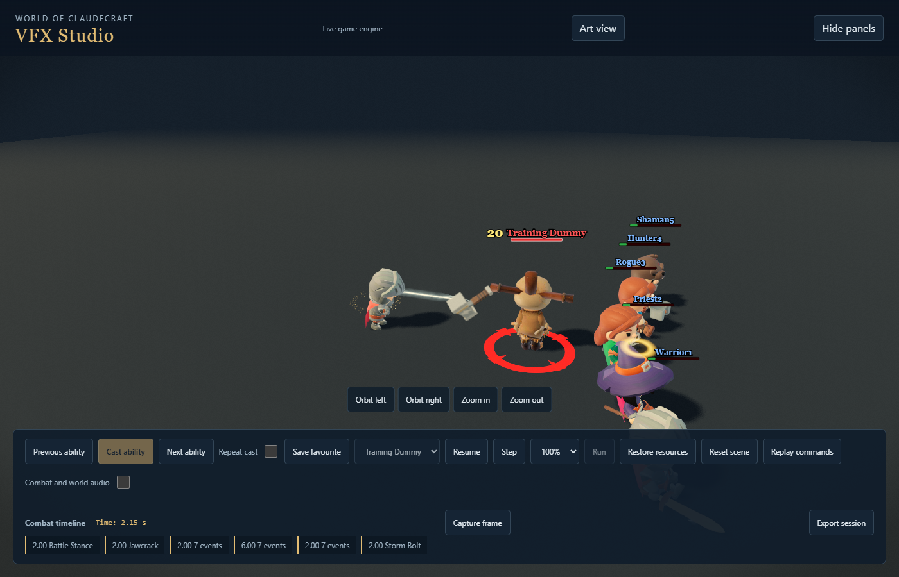
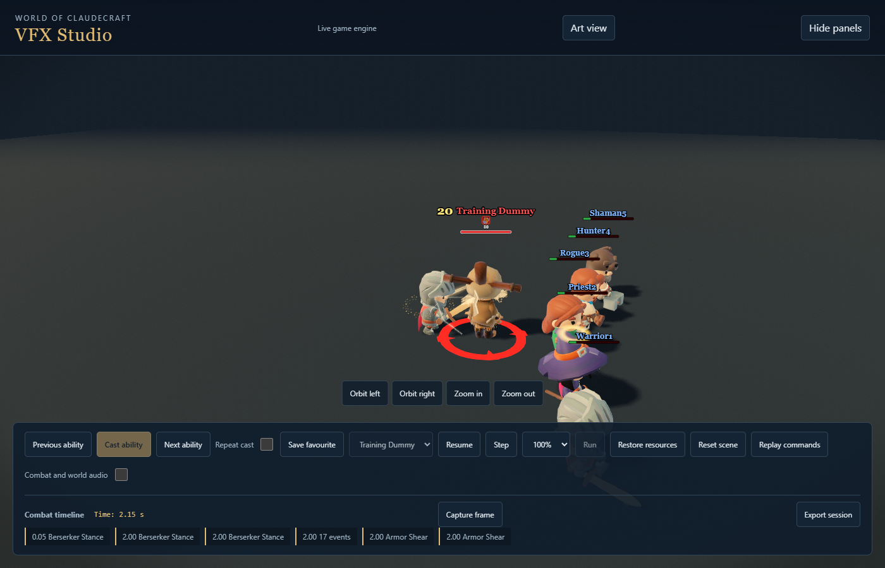
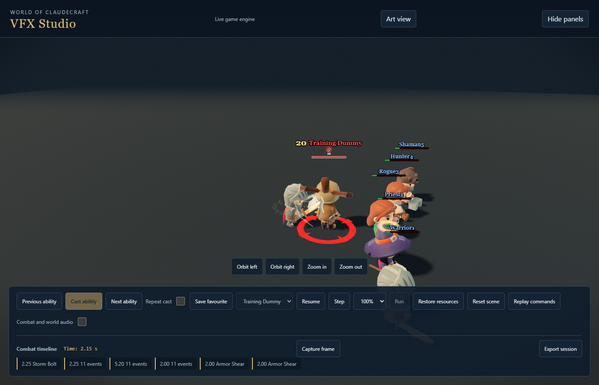

# Warrior controls and weapon reflections

This continues the approved Warrior impact rollout. It is a checkpoint, not
whole-class visual acceptance.

Jawcrack retains both equipped weapons and its native armed jab. Its successful
interrupt has a short, fractured compression catch at jaw height. Armor Shear
has a cool steel scrape and two unequal fans of metal peeling from the receiving
surface. Body-height anchors remain correct above raised ground. Neither
zero-damage control invents an injury, hit reaction, blood or extra stun.
Authoritative lockout and shared armor-aura outcomes still own success.

Storm Bolt now projects a solid hammer into eight sprite cells, with changing
depth, striking faces, wrapped grip and lighting through the tumble. The
existing prepared atlas and projectile pool own it. A failing gutter test
found adjacent-cell bleed; projection padding fixes it and the world-size
compensation retains the visible hammer size. Actual damage owns one blunt
surface collision, body-following creases, metal splinters and short crunch.
Misses and absorbed hits retain separate, non-injury outcomes.

Battle and Berserker stance reflections now sweep obliquely across the actual
blade face instead of drawing three disconnected stripes. Berserker retains
both equipped weapons, and reduced motion keeps a stationary highlight. Proc
patterns, actual stacks, equipment replacement and state expiry are preserved.

## Evidence and limits

Matching local evidence lives under `studio-contact-pass`:

- `warrior-final-warrior-controls-before-sept18`: original full Ultra captures.
- `warrior-final-warrior-controls-after-native-sept18`: first full Ultra pass,
  including stance reflections and new hammer flight. All five abilities
  completed with no runtime errors, missing assets or source drift.
- `warrior-final-warrior-controls-contact-polished`: three contact abilities
  after visual review lengthened their short catches and strengthened Storm
  Bolt's contact. All completed with no errors, missing assets or source drift.
- The sandbox attempt `warrior-controls-after-sept18` timed out before any
  case. It supplies no visual coverage.

Review found that extremely brief flashes clear too quickly in the fixed
50ms sampling. The revised catches last 130ms for Jawcrack and Storm Bolt,
and 140ms for Armor Shear. Their gameplay timings are unchanged. These still
captures cannot by themselves prove natural-speed feel or subjective audio.

Nine targeted suites passed all 94 tests: control outcomes and receiving
surfaces, readiness, persistent marks, hammer flight/contact and atlas,
crush contacts/contention and frame allocation. Native typecheck passed before
the final numeric contact calibration. Final checks are recorded at checkpoint.

| Before | After |
|---|---|
|  |  |
|  |  |

The broader power, mobility, full-kit combat/audio and two-cycle visual reviews
remain part of the active Warrior task. No simulation or balance change is
included in this checkpoint.

Final outdoor Low and reduced-motion passes each completed all five controls
and stances without runtime errors, missing assets or source drift. Evidence:
`warrior-final-warrior-controls-low-world-final` and
`warrior-final-warrior-controls-reduced-final`. A fresh review caught a bright
reflection reset at the blade end. Three failing actual-draw regressions
reproduced it; a smooth edge envelope now fades the reflection before its
position wraps. All six loop and reduced-motion tests pass. The reduced-motion
pass predates only this normal-motion envelope fix.

Production bundle passed, including backdrop validation and media emission;
logs are `tmp/warrior-controls-build*.log`. The tracked manifest was regenerated
through its owning script to preserve the unrelated unused steel draft. These
checks are scoped evidence and do not claim the remaining canonical gate.
