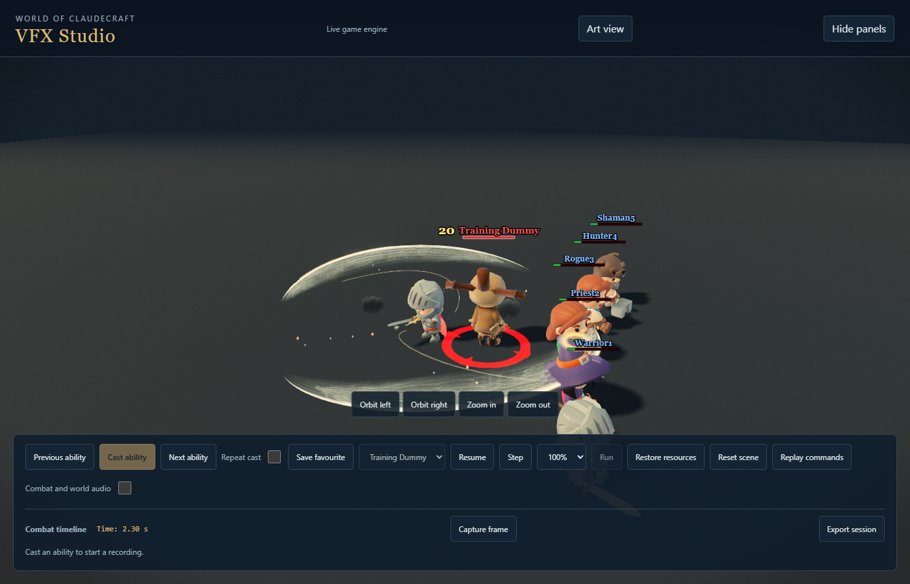
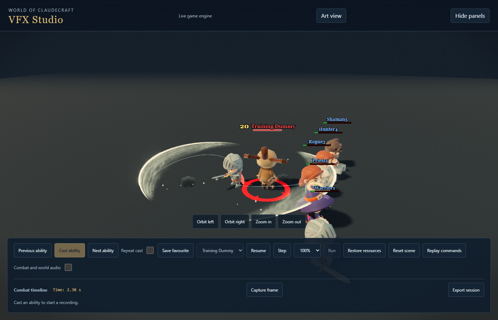
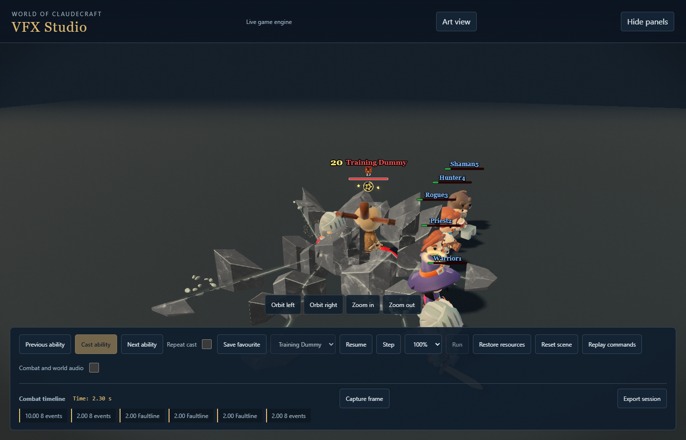

# Warrior shield, ground and spinning attack review

This checkpoint continues the approved Warrior rollout. It is an implementation
and review record, not a declaration that the whole class has reached final
visual acceptance.

Shieldcrack keeps the actual equipped shield as its source. A short compression
flash and unequal, body-following creases sit on the receiving surface. The
bright catch clears before the darker impression; debris separates from that
contact and stance grit remains at the caster's feet. Misses and absorbed hits
retain their distinct outcomes. Secondary creases cannot displace the primary
shape of another attack when the ribbon pool is full.

Quaking Blow and Faultline raise whole ground pieces outward in sequence.
Every vertex of a piece carries the same phase, avoiding a rubber-like bend.
The full horizontal footprint remains visible from the start, including on
reduced motion. Fresh fracture edges catch light as their pieces lift. Revenge
uses a transparent, cool steel wake instead of a solid metal panel. Guard
activations sample the actual equipment; Iron Resolve retains its opposing
orbiting shields and authoritative absorb lifecycle.

Bladed Gyre loads deeper, exchanges blade heights through its revolution and
brakes into recovery. Bladestorm's turn is baked into its continuous native
loop. Native animation tests retain root-position, foot stability, finite
normalized tracks and loop-seam checks. A decoded comparison against the saved
animation pack found only these two performances changed.

## Review findings

The real-pool `warrior_crush_contention` regression reproduced primary shape
loss with Quake and Shieldcrack in either cast order. Secondary creases now
preserve active slots at decorative priority; both orderings retain the full
ground footprint and primary shield contact.

Native-clip tests alone missed the character renderer's existing generic spin.
The first integrated spin pass therefore contains doubled rotation. Its clean
browser execution is not final animation acceptance. The runtime dispatch now
leaves the turn to the native loop, and the displayed weapon drives wake
orientation so observation time and character facing cannot separate them.

Local evidence is under `studio-contact-pass/warrior-final-warrior-spin-before-sept18`
and `warrior-final-warrior-iron-spin-sept18`. The outdoor Low attempt
`warrior-iron-crunch-low-world` timed out before any case and proves no coverage.
Follow-up captures and validation are recorded below as they complete.

The corrected outdoor Low pass `warrior-iron-spin-world-final` completed every
selected ability with no runtime errors, missing assets or source drift. The
subsequent `warrior-iron-spin-reduced-final` pass verified the spinning and ground
attacks with reduced motion. The large fracture faces were revised after the
outdoor review to compress polished highlights and add matte mineral grain;
their full size and travel phases are unchanged. This surface treatment also
applies to Avatar's existing matte ground rupture, not its worn armor or model.

The actual `CharacterVisual.update` regression proves one world-space native
turn, no doubled wrapper rotation, and preserved generic and one-shot fallbacks.
`WarriorStormAnchor` samples the displayed mainhand into owned scratch and bounds
missing-equipment searches; crests, cutting seams and dust share its measured
angle. Target-following tests now forward the full real ribbon call signature
and check exact geometry through movement, removal and expiry under maximum
guard and power load. Existing pool and geometry budgets were not increased.

Final normal-motion Ultra contact/recovery checks are retained in
`warrior-iron-spin-polished`, with no runtime errors, missing assets or source
drift. The targeted command covering fifteen relevant suites passed all 163
tests. Native typecheck passed. These checks do not replace the remaining full
Warrior review cycles, sustained combat/audio checks or canonical project gate.
The production bundle passed with an exit-code-safe PowerShell invocation;
backdrop validation and hashed-media emission completed. The tracked-media
manifest was regenerated through its owning script, preserving the unrelated
untracked steel draft. Build logs are `tmp/warrior-iron-spin-build*.log`.

Matching studio frames at the same camera, quality and time:

The public Site remains on its previous version. The working preview is
`http://localhost:5173/vfx-studio.html`. Existing unrelated files remain intact.
