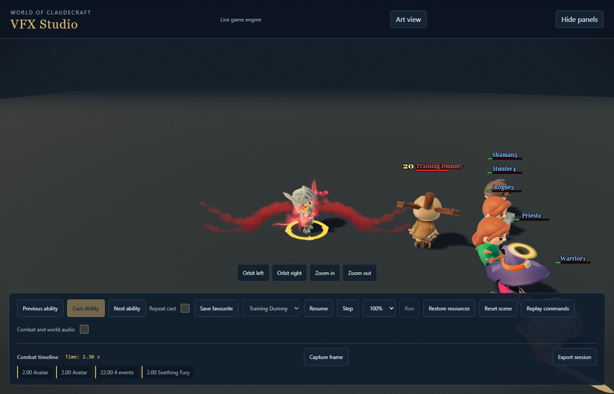
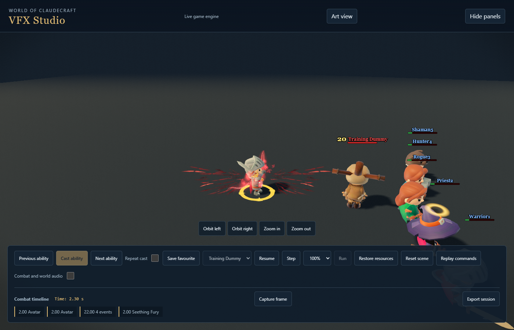
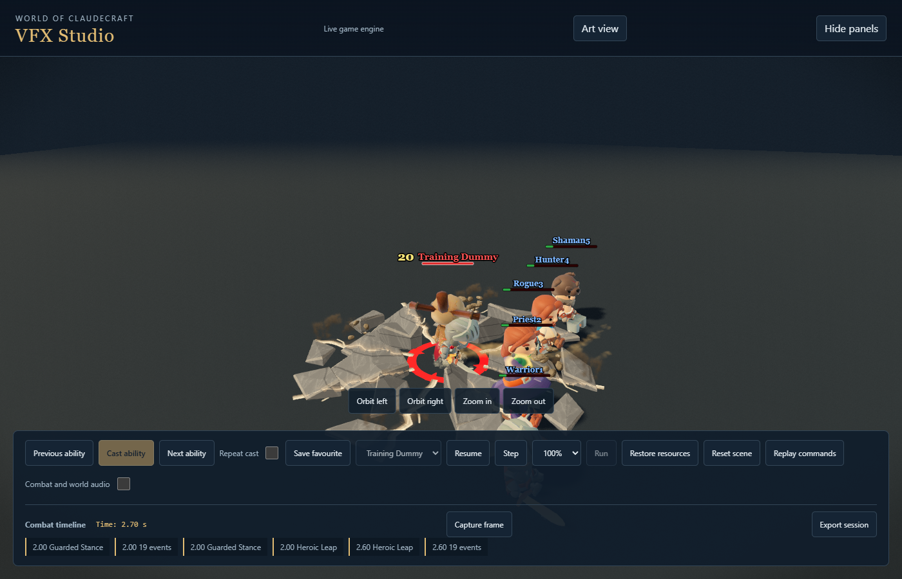
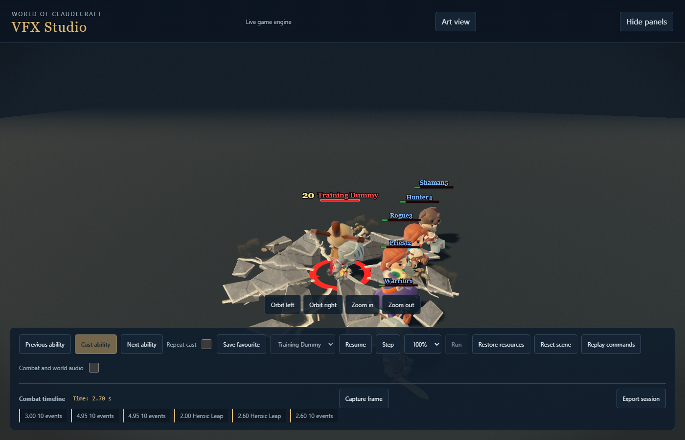

# Warrior movement and power activations

This checkpoint continues the approved Warrior rollout. Whole-class acceptance,
continuous combat listening and the complete canonical gate remain separate work.

Heroic Leap keeps its full landing footprint and closed stone geometry. Each
slab now lifts as a rigid piece, in an outward sequence. A short ground-level
compression sprite and one landing crunch replace the floating power plume.
Only the authoritative landing triggers it; real damage events own victim hits.

Onrush has an angular steel-colored acceleration wake and paired boot skids on
arrival. Intervene opens its guarding shoulder and finishes with a catch on the
actual equipment face. Neither rush invents damage or changes the real stun or
ally protection timing.

The original Blender-authored `warrior_fervor` sprite replaces thick curling
power smoke with torn travelling streaks and separated flecks. Review rejected
the first long, dark strips because they read as spikes. The final atlas uses
shorter moving pieces, varied translucency and brighter torn edges while keeping
the release reach. Recklessness climbs, Seething Fury spreads, Blood Toll pulls
inward, Mending braces inward, and Sanguine gathers at the equipped weapons.
Red Harvest's approved impact and anticipation assets are unchanged.

Avatar's native armor seats into its actual joints in staggered rigid pieces.
Its settled dimensions and specialization colors remain exact. Reduced motion
uses the settled pose immediately. Widening Arc and Guarded Stance gain brief
steel reflections on their actual equipment; their held states remain aura-owned.

## Ownership and preparation

The sprite reuses the existing bounded baked pool and material. Its texture has
explicit deferred loading, upload work, boot/resume dependencies and actual slot
readiness. It adds an uncompressed base texture cost of roughly 16 MiB; the WebP
file size is not a GPU-memory claim. The source and strict atlas packer live in
`scripts/assets/vfx_production/`. Packaging checks every frame for clipping,
transparent gutters, valid pivot and empty endpoints. No AI generation was used.

A fresh review found repeated equipment searches in followed reflections. The
`prepareWeaponFace` seam now resolves the real equipment once and retains its
sampler and frame scratch. Real-engine tests prove tracking, removal, expiry and
no repeated resolution. Both decorative layers preserve existing pool occupants.

Review also found Mending's two camera-facing sheets shared the same mirror.
A failing three-tier regression reproduced the one-sided convergence. Opposite
mirror signs now draw the inward brace from both sides without extra healing.

## Evidence

Local immutable captures under `studio-contact-pass`:

- `warrior-final-warrior-mobility-powers-before-sept18`: matching baseline.
- `warrior-final-warrior-mobility-after-sept18`: revised rushes and leap, Ultra.
- `warrior-final-warrior-powers-fervor-first`: rejected spike-like sprite study.
- `warrior-final-warrior-powers-polished`: refined Ultra powers. Mending's mirror
  correction and the geometry-preserving sampler cache came afterward.
- `warrior-final-warrior-mobility-power-low-final`: outdoor Low, including the
  Mending correction. The sampler cache came afterward without geometry changes.
- `warrior-final-warrior-mobility-power-reduced-final`: final reduced-motion pass.

The completed Ultra and outdoor Low shards reported no runtime errors, missing
assets or source drift. Final reduced motion also completed every selected case
without runtime errors, missing assets or source drift. Fixed-time screenshots establish visual composition and state
cleanup; they do not by themselves prove full-speed feel or subjective sound.

| Before | After |
|---|---|
|  |  |
|  |  |

The scoped movement, preparation, power-state, equipment and frame-cost suites
pass. Avatar assembly tests retain the old settled transforms and unrelated
branches, and landing tests retain geometry, immediate footprint and contention
behavior. These are focused contribution checks, not a canonical gate pass.

Final validation: the scoped batch passed 172 tests, followed by the expanded
real-engine frame-cost suite (23 tests) and equipment preparation suite (9 tests)
after the cached sampler fix. Native typecheck and staged-file Biome pass. The
production bundle exits successfully; logs are `tmp/warrior-mobility-powers-*`.
The shipping media manifest is regenerated from tracked assets through its owning
generator, preserving the unrelated untracked draft in the real workspace.
