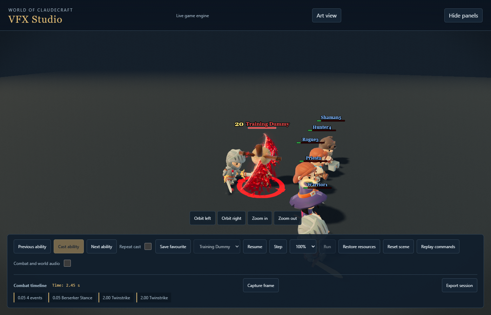
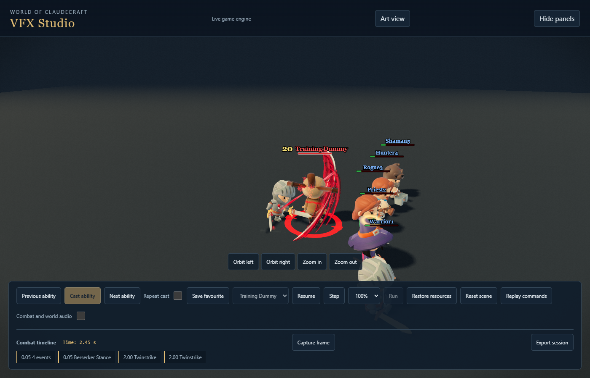
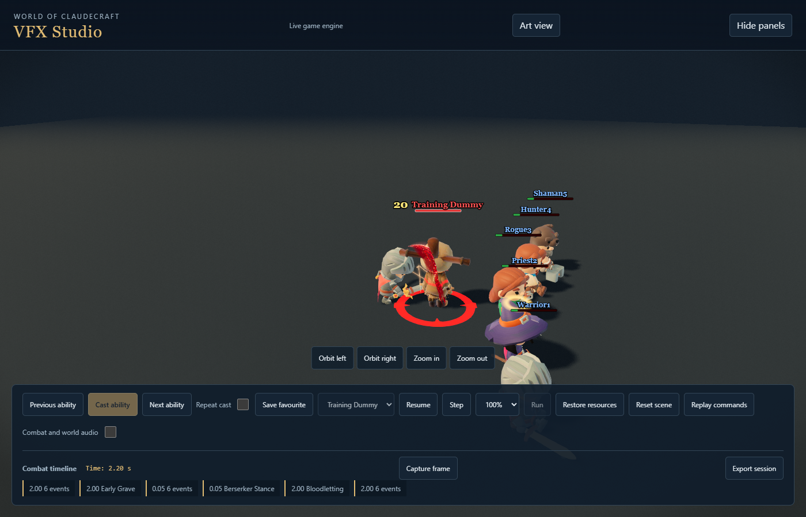
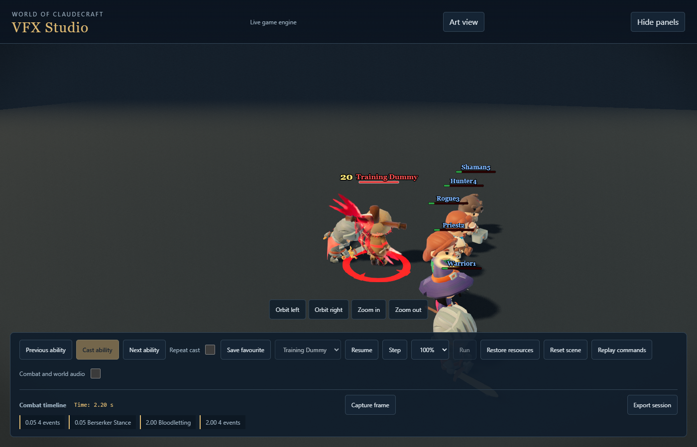

# Warrior blood attacks, second art pass

Twinstrike now has two opposing steel-led cuts, each with its own receiving
incision, short impact sprite and independent hit response. The second contact
has greater weight. Bloodletting has a single broad bite that peels into a torn
exit as the planted Warrior extracts the blade. Its self-heal remains owned by
the actual effective-healing event. Neither performance adds gameplay hits.

The impact sprite is an original Blender render from
`scripts/assets/vfx_production/bake_warrior_bite.py`, packed by the existing
atlas conformance path. Prepared pooled surfaces keep steel and blood separate,
with a broad reserved ribbon fallback if optional drawing capacity is busy.
All geometry and material preparation uses the existing scheduler and pools.

## Matching gameplay-distance captures

| Ability | Before | After |
| --- | --- | --- |
| Twinstrike, second cut |  |  |
| Bloodletting, contact |  |  |

The captures use matching camera, quality and elapsed cast time. Additional
external evidence includes outdoor Low captures and continuous thirty-second
Fury combat against five training dummies, with real resource/cooldown limits,
actual secondary recipients and no runtime errors or missing assets.

## Verification and remaining review

Purpose-based choreography tests cover component outcomes, secondary recipients,
finite geometry and full-span fallback under refused optional draws. Existing
component/audio timing and prewarm tests continue to pass. The native Twinstrike
checker verifies planted feet, loaded hips and neutral recovery. Red Harvest's
native channels remain byte-for-byte equal as typed animation arrays; the
Bloodletting exporter preserves every other native contact clip.

This is an implementation milestone within the full Warrior rework. The complete
kit quality matrix, second visual review and canonical contribution gate remain
required before final handover. Existing audio is retained; no new paid generation
was needed for these two attacks.
