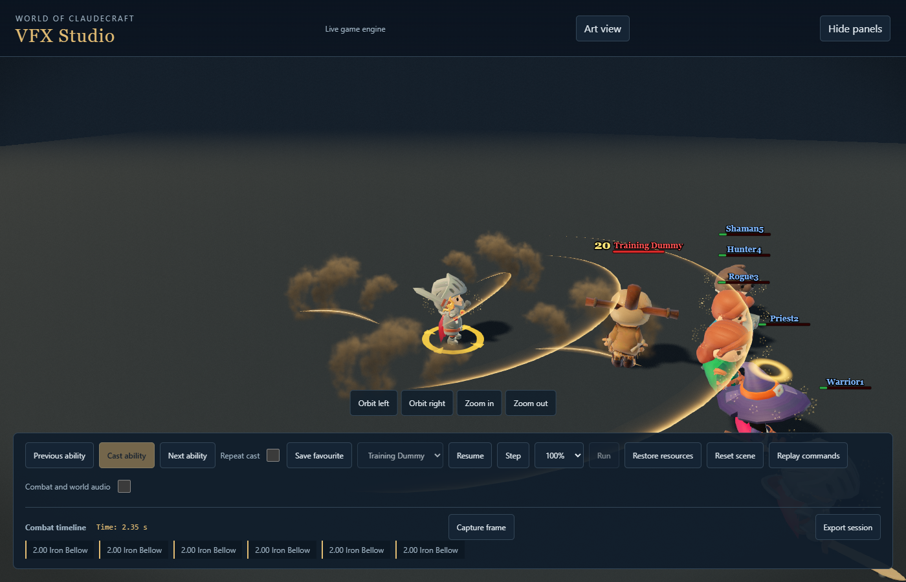
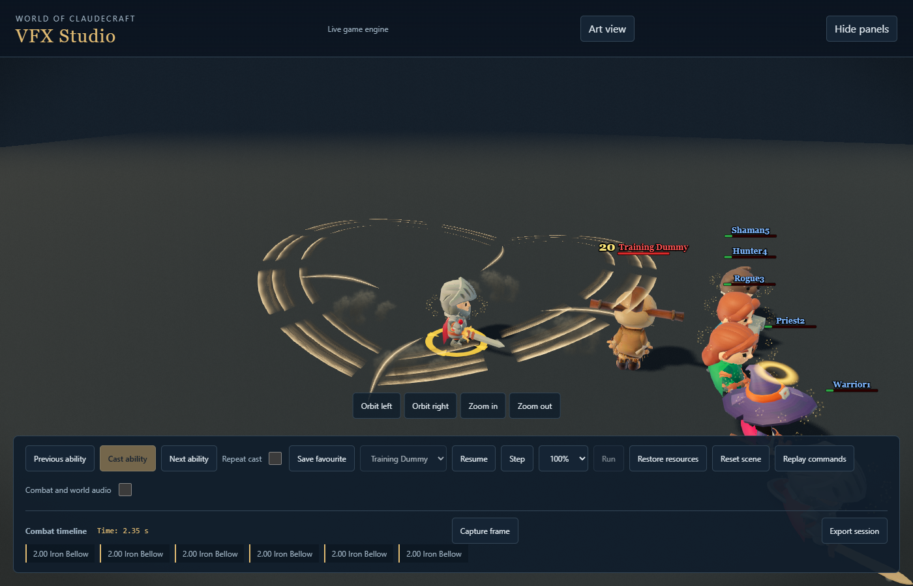
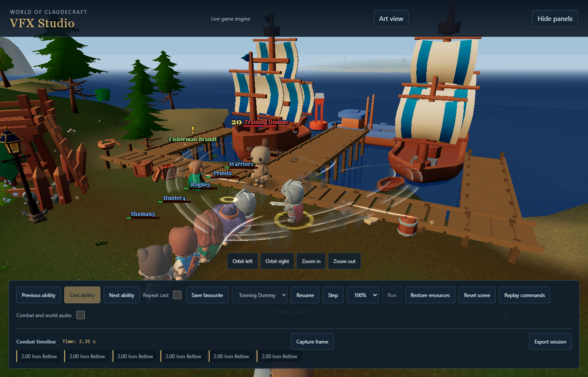
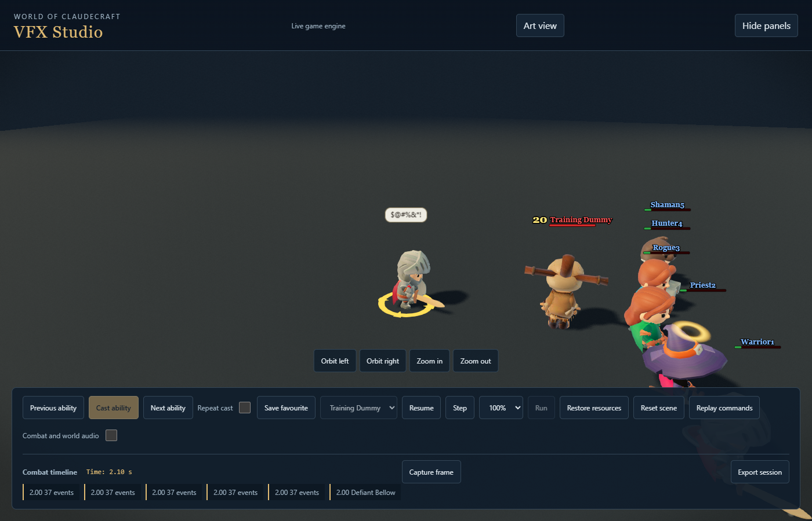

# Warrior voices after Red Harvest approval

This milestone reauthors seven shouts and Goad. It is an initial group review, not final acceptance of the Warrior kit.

## Purpose and direction

The previous shouts looked like liquid sheets. These performances use a braced chest, equipped weapons, three separated acoustic fronts (five harsh fronts for fear), fine pressure texture and brief displaced dust. The fronts travel outwards independently and dissolve in under a second. The caster and the space between fronts remain visible. No voice adds a damage collision, hit stop or whole-body recolor.

| Ability | Intended read and actual purpose |
|---|---|
| Iron Bellow | An open-chested rally; warm steel compression. Party attack power, not damage or healing. |
| Direhowl | A lowered, forward challenge; slate fronts press down. Affected enemies deal less damage. |
| Emboldening Roar | The widest raised paired-weapon pose; rose pressure. Allies prepare their next three qualifying critical hits. |
| Defiant Bellow | Aggressive chest projection with overhead swearing. Real forced-target state separately indicates which enemies obey. |
| Valor Roar | Raised chest and warm light. Temporary maximum health, not a healing event. |
| Intimidating Shout | A forward threatening pose and five serrated fronts. Actual fear state owns duration and damage break. |
| Piercing Howl | A shorter, sharp bark and close-spaced cool fronts. Actual recipients receive a slow. |
| Goad | Directed textured breath with short pressure strokes and overhead swearing. Its receiving attention marks follow actual forced targeting. |

The fronts express caster presence, not an exact range boundary: several party effects have very different gameplay ranges. Existing recipient state remains authoritative.

## Review and implementation

The first air prototype was rejected for weak visibility. Compression edges were broadened and given a dark contrast band, retaining real geometric gaps rather than filling the effect with smoke. The supportive chest silhouettes were then strengthened after review of the delivered native tracks. Each of the seven new clips retains its equipment sockets, loads the hips and recovers in .57–.72 seconds. All 33 earlier clips remain identical.

Goad now uses the existing authored pressure texture through a new prepared airborne geometry. It does not sample ground height or launch soil from the mouth. Defiant Bellow receives the same once-per-release symbolic swearing as Goad. Intimidating Shout's shout/nova phases share the gesture deduplicator, preventing an animation restart.

Piercing Howl has two original ElevenLabs wordless human bark takes, conformed to .45 seconds through the existing audio pipeline. Generation used twelve credits total. Its recorded cue replaces the generic nova sound and owns release/impact coverage; the voice is anchored at the caster. The other six recordings remain in place. Format, routing and onset conformance are checked; subjective listening remains pending because this session cannot hear the audio tool output.

No pool caps changed. The new bark shape uses the existing eight-slot prepared crest family, active-kit preparation, cold fallback and disposal path. Primary attack contacts can still take precedence over optional pressure effects.

## Evidence

Matching 14-frame before/after takes: external `warrior-final-warrior-r2-voice-before` and `warrior-final-warrior-r2-voice-final`, all eight IDs, Ultra studio. All eight also have complete Low outdoor takes in `warrior-final-warrior-r2-voice-lowworld`. Both after batches completed without browser errors or missing assets and retained unchanged source during capture. The shorthand “final” in the capture label means the last prototype of this group, not whole-kit acceptance.

Native checks measure under .000025 native units of foot drift, .047 units of body loading, and neutral recovery for all seven clips. Regression coverage includes all geometry quadrants and disconnected segments, original fallback reach/spacing, terrain anchoring, prewarm counts, duplicate gestures, source audio anchoring and insult phase ownership. A natural crowd review interleaves legal shouts with ordinary attacks; its results are recorded externally. The final all-quality matrix, second whole-kit visual cycle, auditory review and full workspace gate remain open.

The final focused run passes 241 tests across seven suites, including architecture guards. The natural voice/crowd run completes three 30-second takes: 21/22/22 casts, actual multi-recipient damage, no browser errors or missing assets, and unchanged source. Median frame time is 7ms and the 95th percentile 14ms in these recorded studio takes; occasional screenshot pauses remain, so this is not the final performance matrix. Arms did not acquire Sudden Death in this sample, explicitly retained as a separate proc-coverage gap.

Read-only review also caught frozen opacity under reduced motion and a truncated fifth fear pulse. Their opacity now follows real elapsed time while large motion remains frozen, and each delayed front completes inside its allocated lifetime. Three subsequent reduced-motion takes in `warrior-final-warrior-r2-voice-reduced` show clean dissipation without errors. All six graphics profiles still belong to the final kit matrix.

The design follows the existing [Riot clarity guidance](https://www.leagueoflegends.com/en-us/news/dev/clarity-in-league/) and the approved Warrior style guide: readable primary shape, smaller supporting detail and effects tied to real gameplay.
