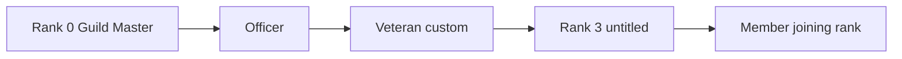
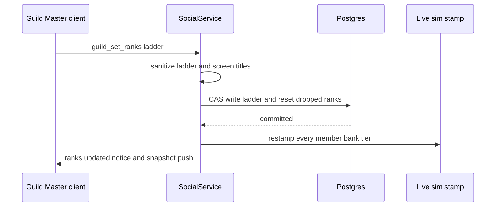

# Guild Custom Ranks

Status: implemented for release/v0.44.0. Player ask: "make new guild titles and
a way to modify their access", with a classic guild-control sheet (Rank, Position
Title, Invite, Expel, Storage) as the reference, "and also an option for which
titles has access to guild vault".

## Why

Every guild had exactly three ranks: Guild Master, Officer, Member. A guild that
wanted a trusted banker who cannot kick people, a recruiter who cannot touch the
treasury, or a Veteran tier above fresh joiners had no way to say so. The only
lever was Officer, which handed over every power at once, including the shared
guild bank.

## The model: a rank ladder

A guild owns an ordered **ladder** of ranks, most senior first.

- Rank 0 is always the **Guild Master** (`leader`). It holds every permission,
  which is never stored and never editable, and it moves only by transfer.
- The last rank is always the **joining rank** (`member`): new recruits land
  there, and deleting a rank drops its holders there.
- Everything between is the guild's to name, reorder, grant and delete: the
  default ladder's `officer` plus custom ranks `r1` to `r99`, up to ten ranks in
  all (the classic guild-control ceiling).
- Every rank may carry a title (up to 20 letters, digits, spaces, apostrophes or
  hyphens). An untitled rank shows its default label: Guild Master, Officer,
  Member, or "Rank N" by ladder position.

A member row stores a stable rank **id**, never a position, so renaming or
reordering a rank never rewrites a member. An id the ladder does not know (a rank
deleted under a racing promote, a row from a newer binary) reads as the joining
rank everywhere, the fail-closed direction.

## Permissions

| Permission | Lets a rank | Default holders |
| --- | --- | --- |
| Invite | invite players, answer pledges, see the pledge dashboard, edit the recruiting settings | Guild Master, Officer |
| Remove | remove members who hold a lower rank | Guild Master, Officer |
| Promote | move members of a lower rank up or down one step, never to their own rank or above | Guild Master |
| Guild Bank | deposit and withdraw at the guild bank (every member can always view it) | Guild Master, Officer |
| Officer Chat | read and speak in officer chat | Guild Master, Officer |
| Billboard | edit the guild billboard | Guild Master, Officer |
| Calendar | add and remove guild calendar events | Guild Master, Officer |

Every power over another member reaches **strictly lower** ranks only, which is
what keeps an officer from removing another officer, exactly as before.

A guild that never edits its ranks stores no ladder (the `guilds.ranks` column is
NULL) and resolves to the default ladder above, whose rules are byte-for-byte the
pre-ladder ones. Existing `guild_members.rank` values (`leader`, `officer`,
`member`) are already valid ids, so the feature needs no data migration.

## Where it lives

- `src/sim/guild_ranks.ts`: the host-agnostic core. The ladder shape, the one
  sanitizer (the wire intake's validator AND the persisted row's load path), and
  every permission predicate the server authorizes with and the client mirrors
  for its buttons. Pinned by `tests/guild_ranks.test.ts`.
- `server/social.ts`: every rank gate (invite, pledges, kick, promote/demote,
  officer chat, billboard, calendar, pledge notifications, the snapshot's pledge
  list) resolves through the core. `guildSetRanks` is Guild Master only, validates
  the whole ladder, screens titles with the chat hard-word tier, and re-stamps
  every member's live guild bank tier after the write. Pinned by the
  `guild custom ranks` block in `tests/social_system.test.ts`.
- `server/social_db.ts`: the `guilds.ranks` JSONB column; the ladder rides the
  membership read (no extra query per gate); the ladder write is a
  compare-and-set on the caller still being Guild Master, and a deleted rank's
  holders fall back to the joining rank in the same transaction. Pinned by
  `tests/social_db_guild_ranks.test.ts`.
- `server/guild_rank_cmd.ts`: the shape checks for `guild_promote`,
  `guild_demote`, and the new `guild_set_ranks` command.
- `src/ui/guild_ranks_view.ts` + `src/ui/social_window.ts`: the Social window's
  Ranks tab. Every member reads the table; the Guild Master edits titles and
  checkboxes, adds, reorders and removes ranks, and saves.

### The guild bank stays on its own gate

The sim's guild bank gate (`src/sim/guild_bank.ts`) is a positive allowlist over
the built-in tiers and reads a session-only membership stamp. The sim never learns
rank names: the server collapses a member's rank to a tier before it stamps
(`guildBankStampRank`: the Guild Master stamps `leader`, a rank holding Guild Bank
stamps `officer`, every other rank stamps `member`, the read-only view). A ladder
edit that revokes the bank from a rank re-stamps its holders in the same call, so
no stale officer stamp survives the save.

### Server text for custom titles

Rank-change lines stay server English, re-localized on the client. A built-in
rank at its default title keeps its bare label ("Bob is now Officer."); a guild
title or an untitled custom rank rides in brackets ("Bob is now [Veteran].",
"Bob is now [Rank 3]."). The brackets let `src/ui/server_i18n.ts` pick a
player-authored title out of the line with a precise rule, instead of a
catch-all that would also swallow the sim's own "... is now full." lines, which
the client matches after the server rules.

## Known follow-ups

- The public signpost roster (`server/guild_roster.ts`) and the guild board's
  "officers online" read (`server/guild_board_db.ts`) still recognize only the
  built-in `leader` and `officer` ids, so a custom rank shows as Member there.
- The admin guild views show a custom rank by its raw id.
