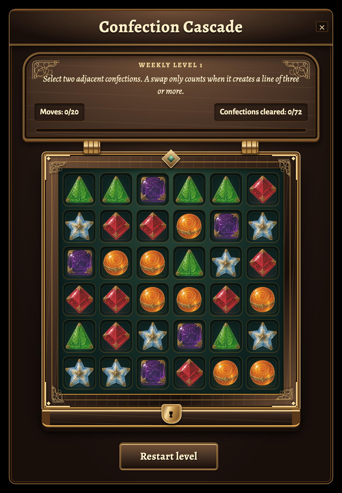
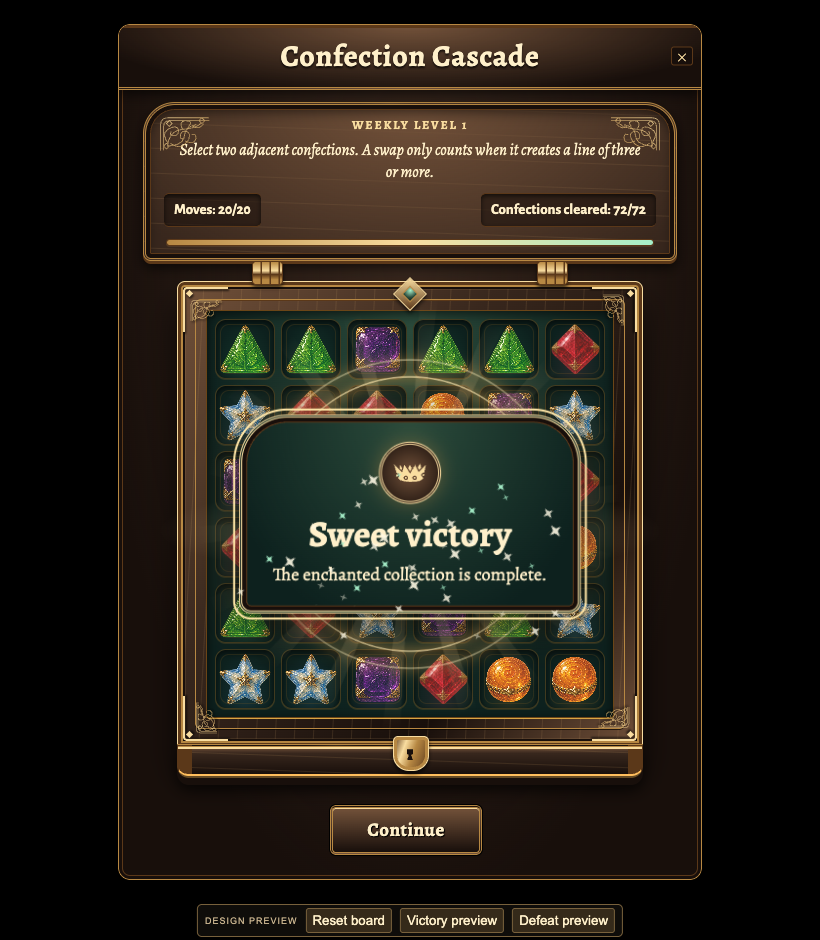

# Confection Cascade: enchanted coffer and endings

Second local design iteration on `codex/confection-cascade-polish`, based on PR
#3847 at `0abacf03af5d11862609b6476f3c78465560eb3b`.

The board is now a fitted confectioner's coffer with a carved lid, gold filigree,
brass hinges, recessed velvet compartments, and a raised front with a clasp.
A centred Alegreya title and gold-framed instructions/counters complete the box.
The existing five illustrated candy pieces remain unchanged.

Confirmed matches create brighter trails, sugar bursts and gold/mint stars.
Victory has expanding rings, rays, a sparkle fountain and a crowned result plaque.
Defeat has fading embers and an enchantment rune. The result and its action persist
until dismissal or a quest-cycle change. Low effects and OS/app reduced-motion modes
retain the result without the decorative motion.

## End-of-game correction

Reaching the target wins even on the last allowed move. Victory takes precedence
over move exhaustion. A completed puzzle remains visible instead of immediately
closing through the quest completion presenter. Continue dismisses it; Try again
requests the existing authoritative reset on a loss.

Production completion rows omit the final board, variant and move counter. The UI
retains only previously observed board data as the backdrop, hides an unavailable
final move counter, and announces the completed collection. If authoritative final
fields are supplied, they take precedence and remain visible. The UI never creates
a final board or counter from its cosmetic move receipt. Event/snapshot ordering,
late snapshots, disappearance and cycle rollover are covered independently.

No objectives, scoring, move limits, refill order, server commands or wire schemas
are changed. The local preview now stops on completion and includes labelled design
controls for replaying victory/defeat fixtures. Those controls do not ship in the game.

## Review visuals

[Motion recording](motion.webm), [settled victory](victory.png),
[defeat](defeat.png), [360px victory](phone-small-won.png),
[enlarged UI defeat](large-ui-lost.png).

These capture the actual component and styles against a neutral backdrop using
a local IWorld fixture. End-state preview buttons supply labelled terminal fixtures;
a separate browser check reaches 72 on move 20 through a real accepted resolver move
and the actual click handler. These are component captures, not live multiplayer
screenshots. Scripts and raw logs remain in `tmp/puzzle-preview/` in this worktree.

The candy atlas and its exact generation/edit prompts are documented in the
[first-pass provenance](../confection-cascade/README.md#artwork-provenance).
This iteration adds code-authored CSS materials and an inline SVG filigree mask;
no new generated raster asset, dependency or third-party artwork was added.

## Validation

Local design preview; the full repository merge gate is not green. No files were
staged, committed or pushed and the remote PR was not changed.

| Check | Result |
|---|---|
| Focused outcome suites: `npx vitest run tests/world_quest_match3_view.test.ts tests/world_quest_confection_view.test.ts tests/world_quest_confection_window.test.ts tests/world_quest_puzzle_window.test.ts tests/quest_event_view.test.ts tests/world_quest_confection_fx_controller.test.ts --maxWorkers=1` | Final integrated pass: 70 passed across all six files. |
| `npx vitest run tests/world_quest_confection_fx_controller.test.ts --maxWorkers=2` | 13 passed, including finite cleanup, live/initial motion suppression, disposal and unavailable animation APIs. |
| `npx vitest run tests/architecture.test.ts tests/localization_fixes.test.ts tests/i18n_completeness.test.ts tests/css_layer_containment.test.ts tests/css_token_resolution.test.ts tests/css_value_validity.test.ts tests/css_corpus.test.ts tests/world_quest_match3_trace.test.ts tests/world_quest_match3.test.ts --maxWorkers=1` | 231 passed, 3 skipped, 1 existing i18n failure. All 150 reported leaks are `hudChrome.vehicle` strings; the base commit already contains these English values in the five non-Latin bundles. No Confection strings appear in the failures. |
| `npx vitest run tests/world_quest_snapshot_wire.test.ts tests/server_quest_snapshot_wire.test.ts tests/server_quest_command_wire.test.ts tests/focus_visible_guard.test.ts tests/mobile_window_coverage.test.ts tests/mobile_window_layout.test.ts tests/mobile_window_transform.test.ts tests/hud_perf_budget.test.ts tests/language_fanout_registry.test.ts tests/language_fanout_relocalize.test.ts --maxWorkers=1` | 246 passed, 4 existing skips. |
| Final CSS: `npx vitest run tests/css_layer_containment.test.ts tests/css_value_validity.test.ts tests/css_token_resolution.test.ts tests/css_corpus.test.ts --maxWorkers=1` | 42 passed. |
| `npm run i18n:gen` | Generated the seven new result/action keys and five required non-Latin prose translations. Other contributor-tier locales use the existing English fallback workflow. |
| `npm run ci:changed` | Passed, with existing warning-level lint diagnostics. |
| `npm run security:gate` | Passed: 7752 files, 0 high findings after established priors. |
| `node_modules/.bin/turbo run check:types build:env build:server build:bot --ui=stream` | All five tasks passed including dependencies. Final outcome/cycle changes also passed `npx tsc --noEmit`. |
| `npm run build:bundle` | Passed; CSS backdrop survival passed and 1,696 hashed media assets emitted. The task-generated `dist` was removed afterward to recover disk space. |
| `node tmp/puzzle-preview/outcomes-qa-v2.mjs` | 13 passed: won/lost at 360px, enlarged UI and landscape; six motion-mode/outcome combinations; actual accepted final swap at 72/72 and 20/20. No page errors. |
| `node tmp/puzzle-preview/interaction-qa-v2.mjs` | 14 passed: confirmed moves, cleanup, interruption, motion suppression, focus, forced colors and failed-art fallback. No page errors. |
| `node tmp/puzzle-preview/browser-qa-v2.mjs` | Four responsive layouts passed; no horizontal content overflow, touch cells at least 40px. |
| `node tmp/puzzle-preview/locale-qa-v2.mjs` | Six Russian, Japanese and expanded pseudo-locale outcome layouts passed at 1.4 UI scale with no horizontal text overflow. |
| `node tmp/puzzle-preview/capture-v2.mjs` | Final board/victory/defeat images captured with Alegreya/Alegreya Sans fonts loaded. |
| `npm run gate` | Stopped at i18n freshness because regenerated files are intentionally unstaged. The gate requests staging; staging was not authorized. No guard was bypassed. Further checks were run directly as listed above. |

Frontend, test coverage and cross-platform reviewers inspected the changed seams.
Findings about unavailable final counters and empty/populated next-cycle logs were
fixed with regressions. Browser inspection caught and corrected the OS reduced-motion
specificity of the result reveal. The earlier pass records the unchanged resolver's
54,000-case differential check and the repository's known broader test failures.

Merge verdict: **NOT READY** until the repository gate is green. This design preview
is ready for visual feedback.

Remaining integration checks: a green full repository gate after staging and baseline
repairs, live multiplayer round-trip testing, and Safari/WebKit rendering.
