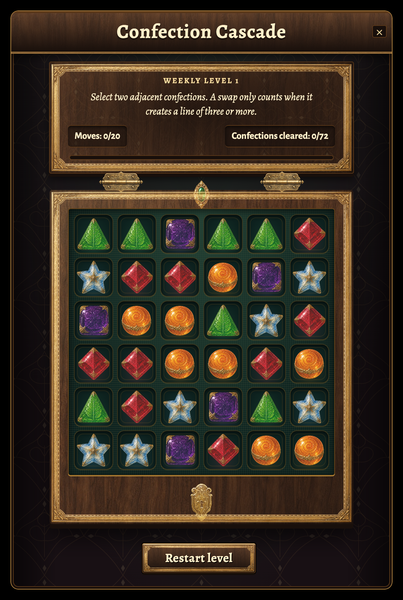
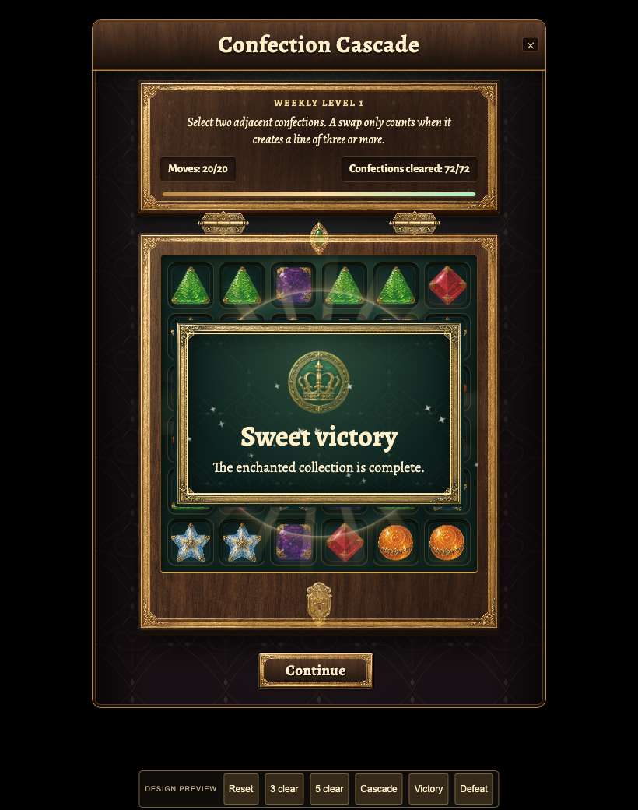

# Confection Cascade: engraved coffer, framing and light

Fourth local design iteration on `codex/confection-cascade-polish`, based on PR
#3847 at `0abacf03af5d11862609b6476f3c78465560eb3b`.

The lid, confection tray, both result plaques and action button now share one
continuous engraved gold frame. Generated sculpted hinges, an emerald bezel,
a keyhole clasp and separate victory/defeat medallions replace the flat hardware.
Continuous walnut grain, recessed velvet compartments, patina and highlights add
depth. Matched frame dimensions and inset spacing remove disconnected corners and
misaligned borders, including at 1.4 UI scale.

Victory and defeat have the same detailed frame geometry. Victory uses bright gold,
emerald velvet and a crowned seal; defeat uses aged bronze, charcoal/plum velvet and
an extinguished rune. Foreground stars remain visible over the result plaque while
the rays and halo sit behind it. Brighter star cores and softened light improve the
sparkle without obscuring the candies.

This pass changes presentation and adds an exact regression pin for the existing
three-clear effect. Objectives, move limits, scoring, refill order and server/wire
behavior are unchanged. Earlier completion fixes are recorded in the
[second-pass notes](../confection-cascade-v2/README.md).

## Actual component captures

[Effects and both endings](effects-and-victory.webm), [settled victory](victory.png),
[defeat](defeat.png), [360px victory](phone-small-won.png),
[enlarged UI defeat](large-ui-lost.png), [Russian victory](ru_RU-won.png),
[Japanese defeat](ja_JP-lost.png), [forced-color defeat](forced-lost.png),
[failed candy-art fallback](art-fallback.png).

These are browser captures of the actual component and styles with a local IWorld
fixture, not live multiplayer screenshots or generated mockups. The local preview
has labelled controls for Reset, 3 clear, 5 clear, Cascade, Victory and Defeat. Clear
controls find real accepted swaps through the resolver; ending controls supply
terminal fixtures. A separate check reaches 72/72 on move 20 through a real accepted
swap and the actual click handler. Preview controls do not ship in the game.

## Effect hierarchy

| Confirmed total cleared | Treatment |
|---|---|
| 3 | Existing burst profile: five stars per matched cell, no rings or rays. |
| 4 | A brighter burst with seven stars per cell. |
| 5 to 7 | Ten stars per cell, a luminous ring and six rays. |
| 8 or more | Twelve stars per cell, two rings and twelve rays, within a 72-star budget. |
| Victory | Layered fountains, rings, sweeps and golden confetti lasting up to 5,525ms. |
| Defeat | A restrained veil and fading embers lasting up to 1,400ms. |

Profiles use the authoritative trace's total cleared count, including cascades.
The recording demonstrates actual totals of 3, 5 and 9. Each accepted move resolves
once. The controller retains its 120-live-effect ceiling and finite cleanup;
Continue, reset, close and reduced-effects changes cancel outstanding motion.
Reduced-motion and low-effects modes retain the readable outcome and framing.

## Generated artwork

Six optimized WebPs total **311,222 bytes**. Exact prompts, selected original files,
dimensions, hashes and conversion settings are in the
[frame provenance](frame-provenance.md),
[hardware provenance](hardware-provenance.md) and
[medallion provenance](seals-provenance.md). Artwork was generated and edited using
OpenAI's built-in `image_gen.imagegen` on 2026-09-06, with no third-party art.

The selected art uses opaque black backgrounds and CSS screen blending. It does
not contain alpha transparency. The image-generation edits replaced rejected
checkerboard backgrounds; delivery processing only resized and encoded the art.
Original PNGs remain intact. All six shipping assets live in
`public/ui/minigames/` and are credited in `CREDITS.md`.

The original candy atlas and third-pass walnut material remain in use. See the
[candy prompts](../confection-cascade/README.md#artwork-provenance) and
[walnut provenance](../confection-cascade-v3/material-provenance.md).

## Validation

All commands ran in the isolated design worktree. Raw logs and runnable preview
scripts remain in `tmp/puzzle-preview/`. No files were staged, committed or pushed.

| Command | Result |
|---|---|
| `npx vitest run tests/world_quest_confection_fx_view.test.ts tests/world_quest_confection_fx_controller.test.ts tests/world_quest_confection_window.test.ts tests/world_quest_confection_view.test.ts tests/world_quest_match3_view.test.ts tests/world_quest_puzzle_window.test.ts tests/architecture.test.ts tests/hud_perf_budget.test.ts tests/css_layer_containment.test.ts tests/css_value_validity.test.ts tests/css_token_resolution.test.ts tests/css_corpus.test.ts --maxWorkers=1` | 380 passed, 4 existing skips, 12 files. |
| `npx vitest run tests/css_layer_containment.test.ts tests/css_value_validity.test.ts tests/css_token_resolution.test.ts tests/css_corpus.test.ts tests/focus_visible_guard.test.ts --maxWorkers=1` | Final styles: 48 passed, 5 files. |
| `npx tsc --noEmit` | Passed. |
| `npm run ci:changed` | Passed; 1,091 existing warning-level diagnostics and 2 infos, no fixes applied. |
| `npm run security:gate` | Passed: 7,754 files, 419 flags, zero high findings after established priors. |
| `node tmp/puzzle-preview/build-v4.mjs` | Production bundle passed, CSS backdrop survival passed, 1,696 hashed media assets emitted. All six v4 shipping sprites matched source SHA-256 hashes. See the disk-conscious delivery note below. |
| `node tmp/puzzle-preview/browser-qa-v4.mjs` | 4 layouts passed: desktop, phone, landscape and 1.4 UI scale. Lid/tray edges align within 0.1px, no horizontal overflow, cells at least 40px. |
| `node tmp/puzzle-preview/outcomes-qa-v4.mjs` | 13 passed: both endings at 360px, enlarged UI and landscape; six motion/outcome combinations; actual accepted final swap reaching 72 on move 20. Actions remain clear of the preview toolbar after scrolling. |
| `node tmp/puzzle-preview/interaction-qa-v4.mjs` | 14 passed: confirmed moves, cleanup, interruption, motion suppression, keyboard focus, forced colors and failed-art fallback. |
| `node tmp/puzzle-preview/locale-qa-v4.mjs` | 6 passed: Russian, Japanese and expanded pseudo-locale endings at 390px and 1.4 UI scale, without text overflow. |
| `node tmp/puzzle-preview/forced-outcomes-v4.mjs` | 3 passed: 40px preview controls at 360px and both opaque Canvas-colored outcomes with visible fallback glyphs. |
| `node tmp/puzzle-preview/effect-comparison-v4.mjs` | 7 passed: actual 3/5/9-clear effects, victory still active after 3 seconds and complete before 6, shorter defeat, immediate Continue cancellation. |
| `node tmp/puzzle-preview/capture-v4.mjs` | Board and both endings captured with fonts loaded. All 47 browser QA cases reported zero page errors. |
| `PATH="$PWD/tmp/puzzle-preview/bin:$PATH" npm run gate` | Stopped at i18n freshness: previously regenerated result strings differ from the intentionally unstaged index. The gate requests staging; no staging or bypass was performed. |

The local build script runs the repository's pre-generation, Vite compilation,
backdrop guard and media emission. With only 1.3GiB of disk space available, it sets
Vite's `build.copyPublicDir` to false and uses APFS `cp -cR public/. dist/` clones for
the same public files. This avoids a second physical 726MB copy without omitting
public assets or checks. This was an equivalent delivery check, not an invocation
of `npm run build:bundle`. Only the task-generated, untracked `dist` was removed
after verification. `git diff --check` passed, and the original working tree
remained clean.

Frontend and test-coverage specialists reviewed the presentation and effect seams.
The final frontend review found no remaining actionable issues. Browser verification
caught and fixed the blend layers, foreground sparkle order, scaled frame alignment,
landscape action spacing, forced-color opacity and non-Latin result-title layout.

Merge verdict: **NOT READY** until the full repository gate is green. This local
design preview is ready for visual feedback. Earlier baseline failures are recorded
in the first and second-pass notes. Live multiplayer and Safari/WebKit rendering
remain unverified.
