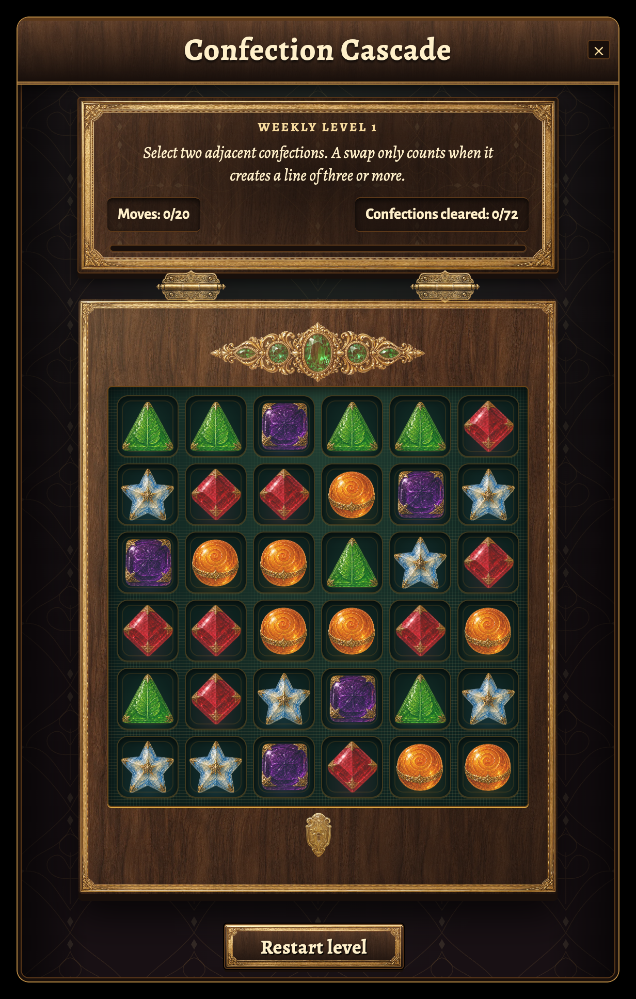

# Confection Cascade: inset jewels and refined motion

Local design refinement on `codex/confection-cascade-polish`, based on PR #3847 at
`0abacf03af5d11862609b6476f3c78465560eb3b`. This builds on the
[previous framing pass](../confection-cascade-v4/README.md).

## Changes

- The tray now reserves separate inset wooden areas for the jeweled ornament and
  keyhole clasp. Neither crosses the gold frame or the candy compartments. The
  thinner continuous outer rail and shallow base still convey the coffer's depth.
- A new generated ornament has one faceted central emerald, two smaller round
  emeralds and two small marquise emeralds, with matching engraved gold settings
  arranged symmetrically. Its shipping WebP is 42,962 bytes.
- The loss title is now **Bitter defeat**, including updated Chinese, Japanese,
  Korean and Russian translations for the existing title key. The detail and retry
  action remain unchanged.
- All effect tiers have more deliberate movement: curved and staggered stars,
  bent swap trails, a quick burst ignition with a soft decay, double-rimmed light
  rings and twirling settling glints. Stars have fine bright cores and soft halos.
- Victory has rising and falling sparkle fountains, fluttering golden foil and
  slowly unfurling radiance. Defeat has dimmer curling embers and an inward-fading
  halo. Victory remains the longer, brighter event.

The existing intensity hierarchy, authoritative outcomes, move limits and scoring
are preserved. Victory ends by 5,525ms, defeat by 1,400ms and move effects by 1,242ms.
The controller retains its 120-live-node limit; restart, close, Continue and motion
settings cancel outstanding effects. There are no permanent particle loops.

## Visual evidence

The images and recording capture the actual component with its local IWorld
fixture, not generated mockups or a live multiplayer session. The labelled preview
controls exercise real accepted 3/5/9-clear moves and terminal-state fixtures.

[Revised effects recording](effects-and-victory.webm), [Bitter defeat](defeat.png),
[victory flourish](victory-flourish.png), [phone](phone.png),
[360px defeat](phone-small-lost.png), [enlarged UI](large-ui.png).

The [exact image-generation prompt and saved file provenance](jewel-provenance.md)
record the built-in `image_gen.imagegen` call, source image, optimization and hashes.
The new art lives at `public/ui/minigames/confection-jewels-v5.webp`; the other
generated assets from the preceding passes remain in the project.

## Verification

The hardware-clearance browser assertions first failed against the previous layout
with `jewel overlaps frame rail or tray`. They now pass on desktop, phone,
landscape and enlarged UI, comparing physical bounds after applying UI scaling.
The same checks retain aligned lid/tray edges, no horizontal overflow and at least
40px candy targets. The result-title test exercises the actual window text.

| Command | Result |
|---|---|
| `npx vitest run tests/world_quest_confection_fx_view.test.ts tests/world_quest_confection_fx_controller.test.ts tests/world_quest_confection_window.test.ts tests/world_quest_confection_view.test.ts tests/world_quest_match3_view.test.ts tests/world_quest_puzzle_window.test.ts tests/architecture.test.ts tests/hud_perf_budget.test.ts tests/css_layer_containment.test.ts tests/css_value_validity.test.ts tests/css_token_resolution.test.ts tests/css_corpus.test.ts tests/focus_visible_guard.test.ts tests/localization_fixes.test.ts tests/i18n_completeness.test.ts --maxWorkers=1` | 449 passed, 7 existing skips, 1 existing failure: 150 unrelated `hudChrome.vehicle` English leaks in non-Latin locales. No Confection strings are among those leaks. |
| `npx vitest run tests/world_quest_confection_fx_controller.test.ts tests/world_quest_confection_fx_view.test.ts --maxWorkers=2` | Final coverage refinement: 37 passed. Added visible-opacity and emitted-coordinate regressions without changing production code. |
| `npm run i18n:gen` | Passed, regenerating the revised defeat title through the owning tool. |
| `node tmp/puzzle-preview/browser-qa-v5.mjs` | All four responsive and hardware-clearance cases passed. |
| `node tmp/puzzle-preview/outcomes-qa-v5.mjs` | 13 passed, including a real accepted final move reaching 72/72 on move 20, both endings at 360px and in landscape, and reduced-motion combinations. |
| `node tmp/puzzle-preview/interaction-qa-v5.mjs` | 14 passed, including interruption, cleanup, keyboard focus, forced colors and failed-art fallback. |
| `node tmp/puzzle-preview/locale-qa-v5.mjs` | 6 passed: both endings in Russian, Japanese and the expanded pseudo-locale at 1.4 UI scale. |
| `node tmp/puzzle-preview/forced-outcomes-v5.mjs` | 3 passed: 360px preview controls and both readable forced-color endings. |
| `node tmp/puzzle-preview/effect-comparison-v5.mjs` | 7 passed: actual 3/5/9 clears, victory remains active after 3s and finishes before 6s, shorter defeat and immediate Continue cancellation. |
| `node tmp/puzzle-preview/capture-v5.mjs` | Final board, victory and Bitter defeat captures. All 47 browser QA cases reported zero page errors. A separate settled phone capture confirms crisp candy art after image rasterization. |
| `npx tsc --noEmit` | Passed. |
| `npm run ci:changed` | Passed with existing warning-level diagnostics. |
| `npm run security:gate` | Passed: 7,754 files, 419 flags and zero high findings after established priors. |
| `PATH="$PWD/tmp/puzzle-preview/bin:$PATH" npm run gate` | Stopped at i18n freshness because generated translations differ from the intentionally unstaged index. No staging or guard bypass was performed. |
| `node tmp/puzzle-preview/build-v5.mjs` | Production bundle and backdrop guard passed. Initial normal media copy ran out of disk space. The final equivalent delivery check used APFS clones and passed: 1,696 hashed media assets, each byte-verified, and all seven v4/v5 sprites matching source SHA-256. See the delivery note below. |
| `git diff --check` | Passed. |

The local delivery script runs the repository's pre-generation, Vite compilation,
backdrop guard and media emitter. Vite's public-directory copy is replaced with
`cp -cR public/. dist/`. For the final media emission, the process-local
`tmp/puzzle-preview/apfs-media-copy.mjs` adapter replaces only the emitter's file-copy
operation with `/bin/cp -c`, checks the source/destination path bounds and compares
every resulting file byte-for-byte. Repository build scripts are unchanged. This
verifies the same generated content using APFS copy-on-write storage; it is not a
claim that the unmodified `npm run build:bundle` completed on this disk. Only this
task's untracked `dist` was removed after verification.

The final frontend review found no actionable gaps, including hardware placement,
clear-count escalation, foreground sparkle layering, translations, forced colors
and scrollable actions. A separate coverage review identified two assertion gaps,
which were filled: tests now reject invisible sparkle paths and collapsed emitted
coordinates, and verify alternating match curves plus a fountain that rises then
falls. The effect suites also cover finite timing, node limits and interruption.

No files were staged, committed or pushed. The original working tree remains
separate from this design worktree. The full repository merge gate was already
blocked by intentionally unstaged generated translations and baseline issues;
earlier details are in the preceding pass notes. Live multiplayer and Safari/WebKit
rendering remain unverified. Merge readiness is **NOT READY** until the full gate
is green; the local design preview is available for visual feedback.
