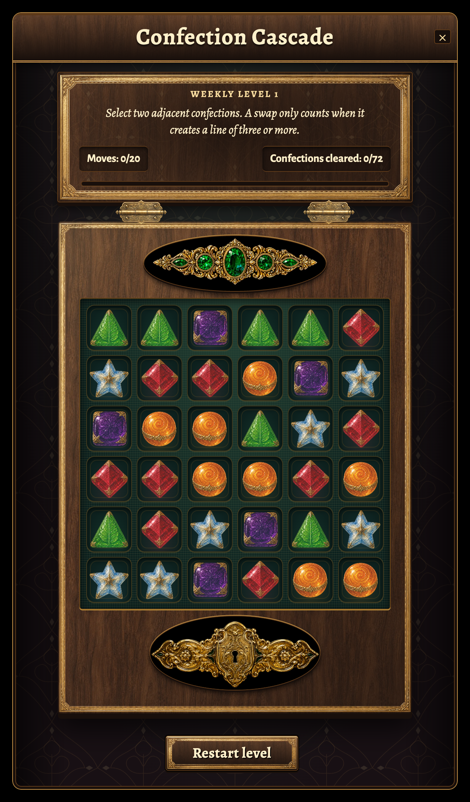

# Confection Cascade: solid jewels and engraved lock

Local visual refinement on `codex/confection-cascade-polish`, continuing the
[previous pass](../confection-cascade-v5/README.md) from PR #3847 at
`0abacf03af5d11862609b6476f3c78465560eb3b`.

The five-emerald ornament now has deeper green facets and stronger sculpted gold
highlights. The new lock adds mirrored engraved leaves, rosettes, small green
enamel inlays and a clearly defined keyhole. Both use solid dark enamel mounting
plates with a gold edge and contact shadow. Normal compositing preserves the dark
facets and recesses that the previous screen blend washed out against the wood.

The wider hardware has reserved wooden space above and below the tray, with no
rail or candy overlap. Mobile dimensions counter-scale with the existing UI scale.
This pass changes only art and layout; the existing VFX, Bitter defeat copy,
scoring and outcome behavior are retained.

## Visual evidence

These are actual component captures in the local preview fixture, not generated
mockups or a live multiplayer session.

[Jewel detail](jewels-detail.png), [lock detail](lock-detail.png),
[phone](phone.png), [victory](victory.png), [Bitter defeat](defeat.png).

[Exact generation prompts and provenance](hardware-provenance.md) and the
[asset manifest](asset-manifest.json) document the generated sources and the
121,704 bytes of new shipping WebP artwork. The originals remain intact.

## Verification

The two hardware comparisons change the underlying frame from white to magenta.
All 45,179 sampled interior jewel pixels and 55,829 lock pixels remain identical.
Injecting the old screen blend changes 45,126 and 55,828 pixels respectively,
confirming that the check detects the original fading problem. Both ornaments
remain decorative, hidden from assistive technology and pointer inert.

The [exact commands and outcomes](verification.json) record:

- 236 focused tests passing across 10 files.
- TypeScript and changed-file lint passing, with the existing lint warnings.
- Security gate passing with zero high findings after priors.
- 22 browser cases passing with zero page errors, including both endings, reachable
  actions, reduced motion, forced colors, 40px targets and the final-move win boundary.
- Production bundle and backdrop guard passing; all nine v4/v5/v6 UI assets match
  their source hashes and all 1,696 emitted media files are byte-verified.
- `git diff --check` passing.

Initial captures and the verification wrapper hit temporary disk exhaustion. Final
Chromium checks bound the disk cache and disable background component updates. The
separate delivery check uses the same APFS clone adapter [documented in v5](../confection-cascade-v5/README.md),
with repository build scripts unchanged. This is an equivalent delivery check, not
a claim that unmodified `npm run build:bundle` ran. Only its own untracked `dist`
output was removed afterwards.

A read-only frontend review checked the actual detail, phone and ending captures,
source geometry, clipping, accessibility and pixel evidence. No actionable findings
remain in this visual change.
The full merge gate remains subject to the previously documented unstaged i18n
freshness block. No files are staged, committed or pushed. The original worktree
is separate and clean. Live multiplayer and Safari/WebKit remain unverified.

Merge readiness is **NOT READY** until the full repository gate is green. The local
design preview is ready for visual feedback.
