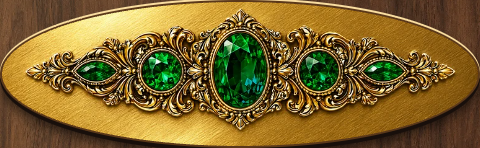
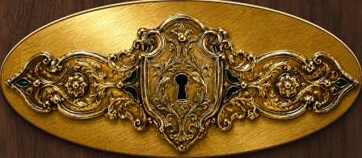

# Confection Cascade: polished gold surrounds

This local visual pass replaces the black area around the jewels and lock with
warm brushed gold, a broad diagonal shine and a brighter upper rim. The existing
five emeralds, carved wings, green inlays, dark keyhole and engraved recesses remain
clear. Geometry, opaque compositing, VFX, outcome copy and gameplay are unchanged.

[Full coffer](confection-cascade.png), [phone](phone.png),
[victory](victory.png), [Bitter defeat](defeat.png).

The [exact prompts and provenance](hardware-provenance.md) document two built-in
image-generation edits of the project v6 artwork. The [asset manifest](asset-manifest.json)
records both shipping paths, original source paths, metadata and SHA-256. The
originals and earlier shipping versions remain intact.

## Verification and workspace state

The four responsive browser cases passed with aligned rails, clear hardware and
at least 40px candy targets. Both hardware pixel comparisons passed with zero
backdrop bleed. Actual component detail captures show continuous gold texture,
intact clipping and clear relief. A read-only frontend review found no actionable
gaps in the v7 delta. The wider gameplay and accessibility results from the
[preceding pass](../confection-cascade-v6/README.md) still document unchanged behavior.

During this turn, the existing Git pointer stopped resolving because the shared
parent repository had been moved from `Documents/WoC/woc-pr-3655` to Trash. macOS
denies access to the moved metadata. No folder was restored, no Git metadata was
rewritten, and no access restriction was bypassed. Design edits were made in the
existing isolated preview directory with the affected source files backed up first.
The parent repository must be restored to its original path for normal Git checks.

Final command results are recorded in [verification.json](verification.json).
No files were staged, committed or pushed. Live multiplayer and Safari/WebKit
remain unverified. Merge readiness remains **NOT READY** until repository access
is restored and the complete gate passes. The local design preview is available.
