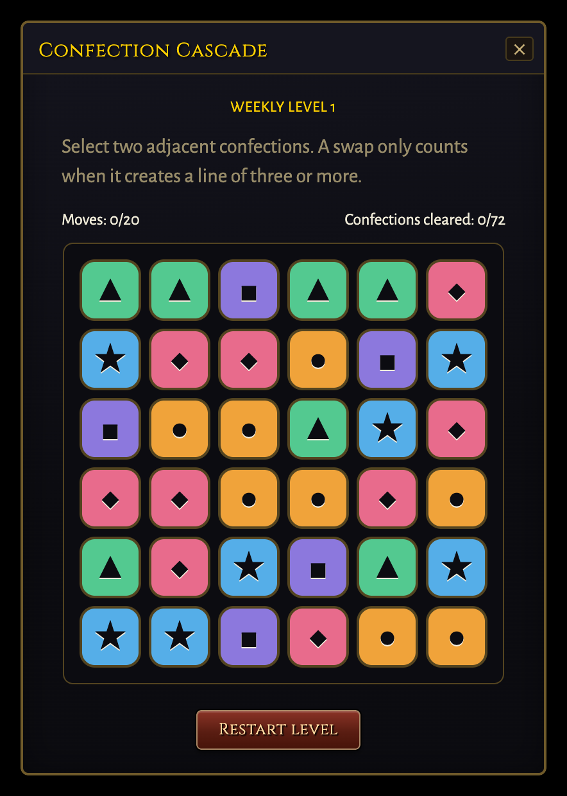
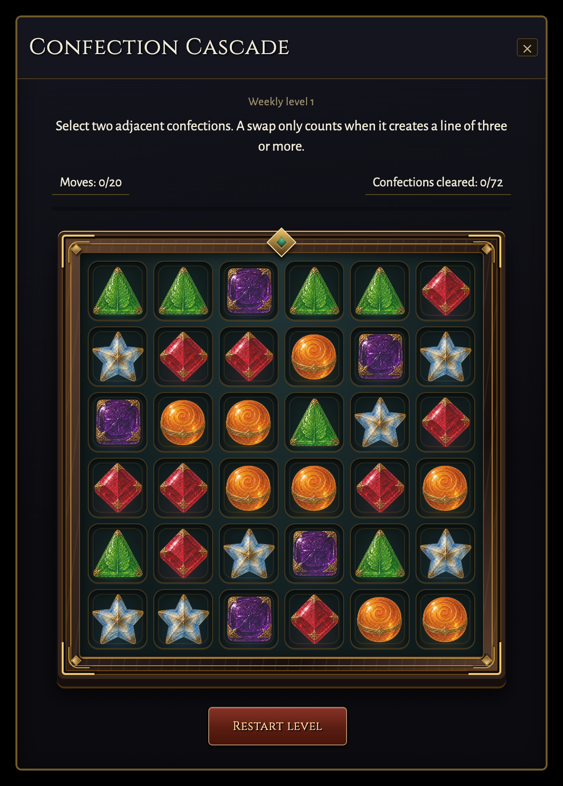

# Confection Cascade visual pass

Design iteration based on PR #3847, commit `0abacf03af5d11862609b6476f3c78465560eb3b`.
The inset board uses a raised walnut case, brass fittings, dark velvet wells, and five
engraved sugar gems. Short swap trails, sugar dust and settling glints accompany a
confirmed move. These are decorative overlays; the actual board and counters update
immediately from the world state. No objectives, move limits, refill order or scoring
rules change. Ley Beam Alignment has no new artwork or effects.

## Artwork provenance

- Tool: OpenAI built-in image generation, generation followed by one background edit.
- Shipping file: `public/ui/minigames/confection-candies.webp`.
- SHA-256: `32d54d7d6f7b686686c72dd1ce497bd8ce828d43953c807871fe5409c33968a6`.
- Format: 1536 x 1024 RGB WebP, 242390 bytes, quality 90; one atlas, five pieces.
- The generated checkerboard was replaced through image editing with pure black.
  CSS screen compositing removes the black on the dark inset board. This is not an
  alpha-transparent file. No external artist's asset was used as a reference.
- The PNG was transcoded with Sharp without resizing or changing the artwork.
- Silhouettes retain the existing five candy identities: berry diamond, citrus
  round, mint triangle, grape square and blue star. Existing accessible names and
  glyph fallbacks remain. Failed image loading and forced colors use the glyphs.

Generation prompt:

> Use case: stylized-concept. Asset type: transparent game UI candy sprite atlas for a premium classic medieval fantasy MMORPG matching the crafted high fantasy feeling of Warcraft and ancient elven craftsmanship. Create ONE 1536x1024 PNG sprite sheet, exactly 3 equal columns by 2 equal rows, each cell 512x512, NO grid lines or frames. Transparent background everywhere. Five distinct enchanted confectionery pieces, one perfectly centred in each of the first five cells, the sixth cell entirely empty/transparent. Each piece occupies 74 percent of its cell, isolated with generous transparent padding. Consistent mostly front-facing near-top-down camera, soft upper-left light, tangible 3D sculpted form, hand-painted game-art finish, crisp highlights, deeper shaded sidewalls, tiny ancient gold foil trims/engraved magical motifs integrated into the edible candy, appetising translucent boiled sugar, no neon haze beyond silhouette. Row 1 col 1: deep ruby raspberry lozenge with clearly DIAMOND silhouette, faceted sugar with tiny antique gold corner embellishment. Row 1 col 2: warm amber-orange citrus boiled-sugar bonbon with clearly ROUND orb silhouette, embossed spiral and a delicate aged gold equator band. Row 1 col 3: emerald mint confection with clearly TRIANGULAR silhouette, translucent leaf veins inside its triangular sculpted sugar. Row 2 col 1: deep amethyst grape confection with clearly SQUARE cushion silhouette, thick jewel-like violet sugar and finely embossed corners. Row 2 col 2: pale sapphire-blue and ivory enchanted sugar STAR, precisely FIVE POINTS, chunky carved sugar and tiny gold glints. Row 2 col 3 EMPTY transparent. Aim for old magical confectioner's treasures rather than modern wrapped candy, luxury crafted objects full of subtle detail, all readable at 64px. Keep shape and colour extremely distinct. No lettering, no text, no logos, no UI, no surrounding containers, no extra candy, no checkerboard drawn in the image. Real alpha transparency.

Background edit prompt:

> Edit this game sprite atlas. Preserve all five candy designs, their exact positions, size, colours, engraving and 1536x1024 canvas. Replace EVERY part of the white/grey checkerboard backdrop with perfectly solid pure BLACK RGB(0,0,0), including the empty bottom-right cell and all gaps around the candies. Do not render a checkerboard. Keep clean antialiased silhouettes against pure black. No ambient background glow, no cast shadows beyond the candy edges, no floor, no new objects, no text. This is an opaque sprite atlas for screen-blend compositing in a dark fantasy game. Maintain the exact three-column two-row grid alignment. Actual black backdrop is required, not a transparent checkerboard.

## Capture method

Component previews mount the actual UI and CSS with authored level-one data, using
a small local IWorld facade that applies the existing deterministic match-three
resolver. The plain backdrop is a component preview, not a screenshot of a live
multiplayer session. Preview scripts and raw logs are in the worktree's gitignored
`tmp/puzzle-preview/` directory.

The mobile correction places the existing weekly-puzzle CSS in its declared
component layer, allowing the existing touch rules to win. A regression test pins
that containment. No Ley Beam artwork or mechanics are changed by this correction.

## Review images

| Original | First visual pass |
|---|---|
|  |  |

Additional evidence: [phone](phone.png), [enlarged UI](large-ui.png),
[Parchment keyboard focus](parchment-focus.png), [forced colors](forced-colors.png),
[motion recording](motion.webm), and [running offline HUD](in-game.png).

The offline HUD capture uses `enterOfflineGame` and the real game HUD, with authored
level-one progress inserted for visual review at the Proving Shore. It confirms
integration and appearance, not natural quest availability in that zone. The
welcome dialog was dismissed before capture; the ordinary nearby-NPC prompt remains.

## Validation, 2026-09-06

This is a local design iteration, not a merge-ready claim. No commit, push, or
remote PR mutation was made. Work lives on `codex/confection-cascade-polish`.

| Check | Result |
|---|---|
| `npx vitest run tests/world_quest_match3_trace.test.ts tests/world_quest_match3.test.ts --maxWorkers=2` | 20 passed. |
| `npx vitest run tests/world_quest_confection_view.test.ts tests/world_quest_confection_window.test.ts tests/world_quest_puzzle_window.test.ts tests/architecture.test.ts tests/hud_perf_budget.test.ts tests/focus_restore.test.ts tests/language_fanout_registry.test.ts tests/language_fanout_relocalize.test.ts` | Initial pass: 357 passed, 4 existing skips. |
| `npx vitest run tests/world_quest_confection_window.test.ts tests/world_quest_confection_view.test.ts` | After review additions: 22 passed. Pins finite duration, live motion suppression and exact receipt matching. |
| `npx vitest run tests/css_layer_containment.test.ts tests/css_corpus.test.ts tests/css_token_resolution.test.ts tests/css_value_validity.test.ts tests/focus_visible_guard.test.ts tests/mobile_window_coverage.test.ts tests/mobile_window_layout.test.ts tests/mobile_window_transform.test.ts --maxWorkers=1` | 92 passed. The new layer-containment regression failed before the fix. |
| Deterministic comparison against untouched PR resolver | 54,000 input cases: identical outcomes, including trace final boards. |
| `node_modules/.bin/turbo run check:types build:env build:server build:bot --ui=stream` | Passed all five tasks including dependencies. |
| `node_modules/.bin/turbo run build:bundle --ui=stream` | Final build passed; CSS backdrop survival and 1,696 media outputs passed. Turbo reported insufficient space while writing its cache after the successful build. Task-generated `dist` was removed afterward to recover space. |
| `npm run gate` | Artifact generation/freshness, security scan and changed-file Biome passed. Full tests exposed 9 failures listed below; the run was stopped when concurrent checks exhausted disk space. Full-suite completion is not claimed. |
| `npm run test:browser` | 326 passed, 1 failed: existing calligraphy quest-strip height assertion (`en/lightning/traceDrawing`, 63px vs 61px). This failure remains unresolved; baseline browser reproduction was not performed. |
| Targeted Puppeteer component checks | Confirmed moves paint immediately; finite effects finish and cancel on reset, close, another move, OS/app reduced motion and low effects tier. Stable controls, no pointer interception, Parchment focus, forced colors and failed-art fallbacks passed, with no page errors. |
| `node tmp/puzzle-preview/game-confection.mjs` | Actual offline game boot and HUD capture passed: the Confection title, all 36 cells and loaded artwork are present. |
| Responsive component captures | 390x844 portrait and 844x390 landscape; portrait also at 1.4 UI scale. No horizontal content overflow; cells measure 43.66px on portrait and 60px on landscape. Short landscape uses the window's existing vertical scrolling. |
| Ley desktop captures | Initial and partially powered screenshots are byte-identical to the original PR captures. |
| Read-only reviews | Simulation architecture: no findings. Frontend: layer containment and focus contrast findings fixed. Test coverage: duration, live suppression and receipt gaps covered. |
| Final scoped Biome and `git diff --check` | Passed, no formatting errors; 13 non-null assertion warnings in the existing test style. |

The package manager was invoked through a task-local shim to the installed
`corepack pnpm` (10.34.5), with its directory prepended to `PATH`; no global package
manager or dependency change was made.

Baseline reproduction used a temporary clean detached worktree of the exact PR
commit and one worker:

```sh
npx vitest run tests/reliquary_content.test.ts tests/ci_workflow.test.ts tests/eastbrook_polish_capture_contract.test.ts tests/world_quests.test.ts tests/gathering.test.ts tests/deeds_view.test.ts --maxWorkers=1
```

It reproduced all 9 failures (297 passed), across the six same suites: title-deed
inventory, CI screenshot subtree coverage, Eastbrook capture provenance, four world
quest roster/layout expectations, gathering template coverage, and the fresh-character
deed denominator. The temporary baseline worktree was removed after verification.

Remaining verification: a green full repository gate, the unrelated quest-strip
browser failure, live multiplayer round-trip testing, and Safari/WebKit rendering.
