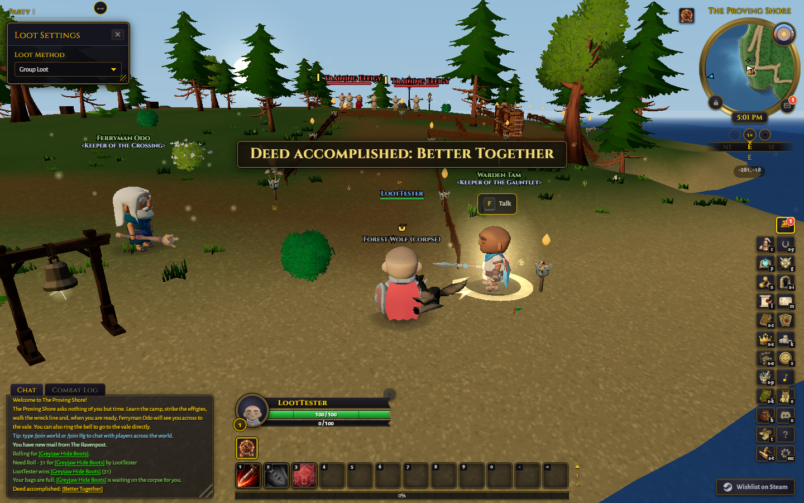
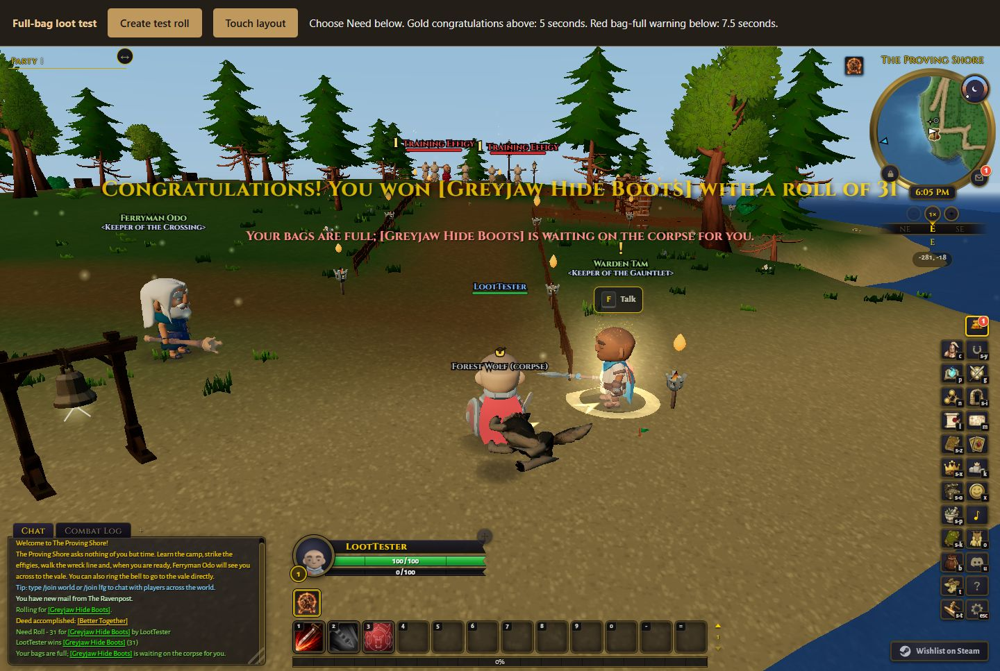
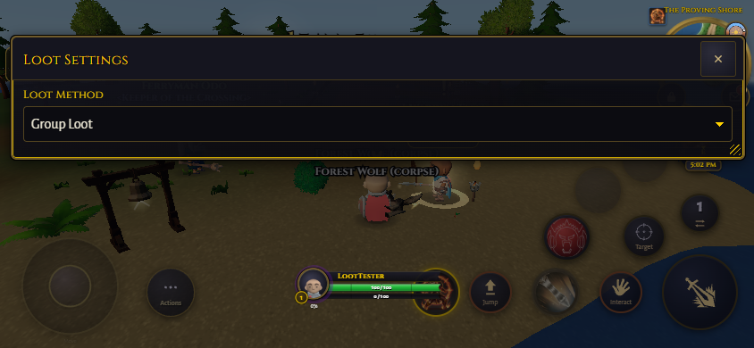
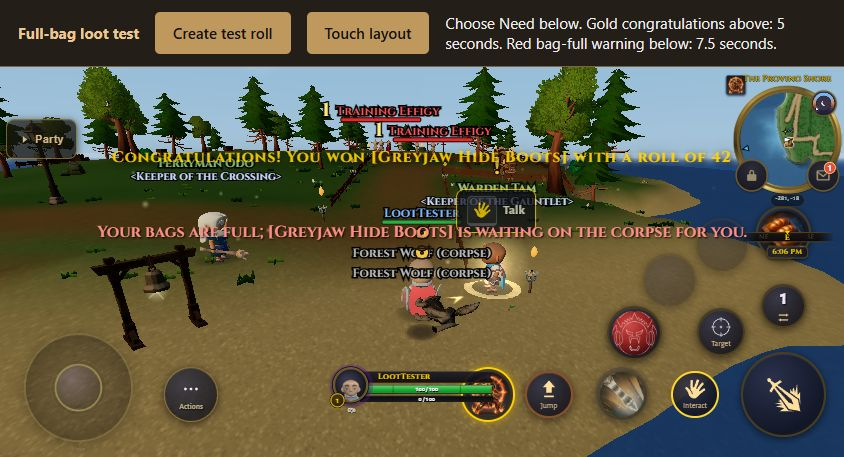
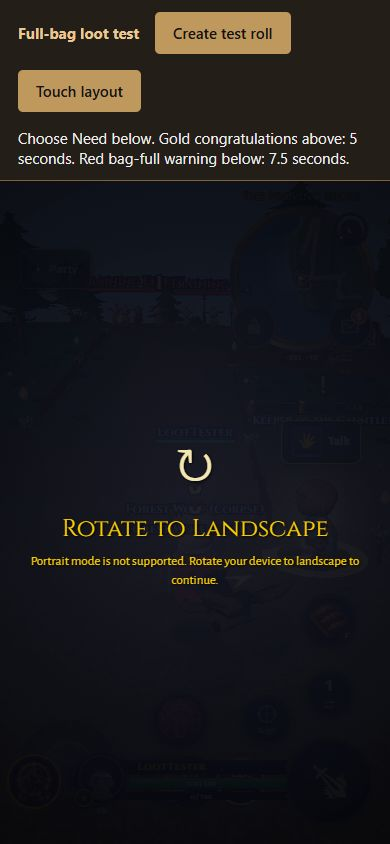

# Loot roll notifications

The after screenshots show an actual offline shared-loot roll with full bags,
using the lowest graphics preset. The other party member passes; the local player
clicks Need. The normal simulation emits the win and held-on-corpse messages.

- Gold, above: congratulations with the item and roll, displayed for 5 seconds.
- Red, below: the item is waiting on the corpse, displayed for 7.5 seconds.
- Before: only the existing chat line reports the full-bag outcome. These captures
  were taken on the original release base, `666e379951`, before this UI change.
- After: captured after rebasing onto `release/v0.44.0` at `0b13f800a0`.

The after images include the local test toolbar above the game. That toolbar is a
development fixture, not shipped UI. Desktop game area: 1440 by 900. Mobile game
area: 844 by 390 with the existing touch layout enabled. The mobile gold text ends
at y=99 and the red warning starts at y=154, leaving clear separation.

Portrait preserves the existing rotate-to-landscape guard. In-game portrait play
is not supported by the game.

| View | Before | After |
| --- | --- | --- |
| Desktop |  |  |
| Mobile landscape |  |  |

