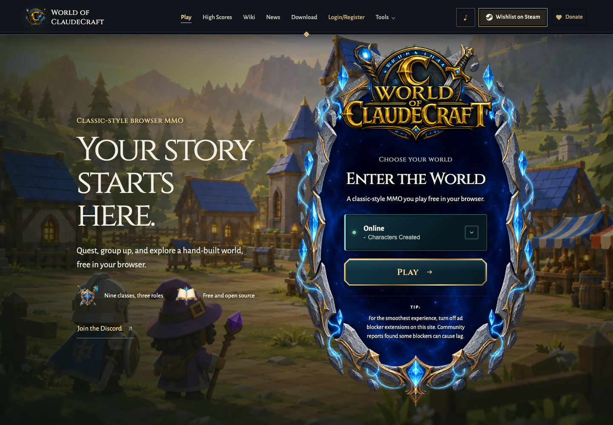
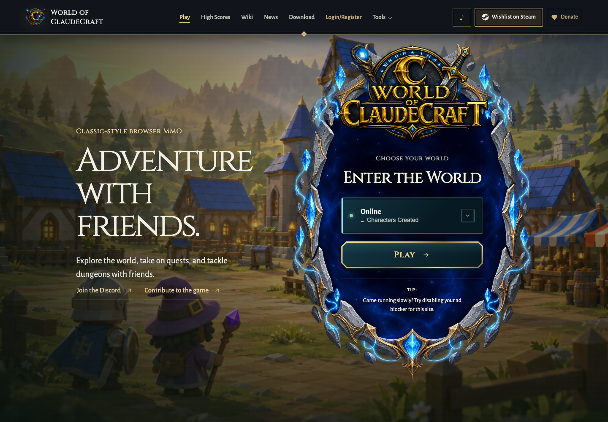
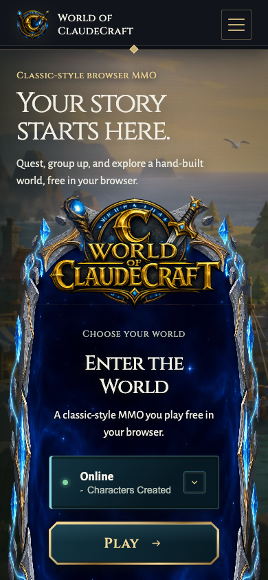
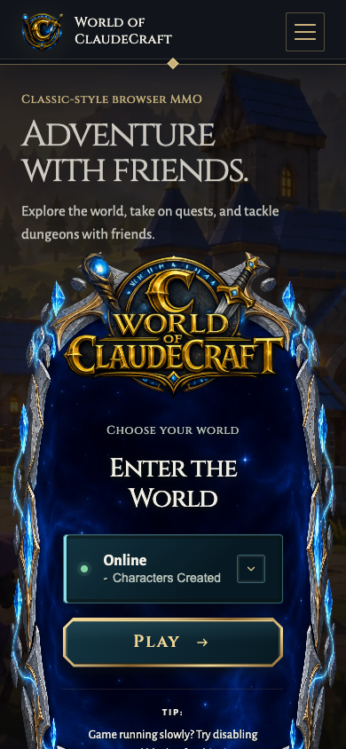
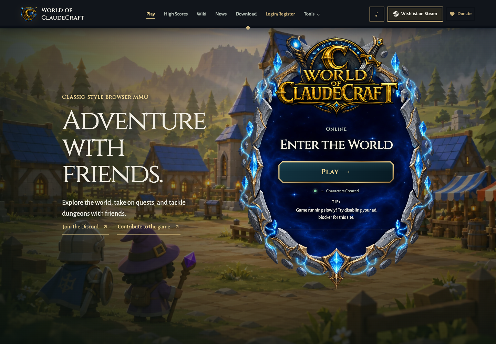
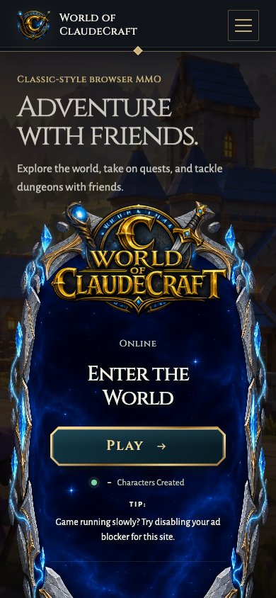

# Website navigation and copy follow-up

Follow-up to PR #4105 at `b02936334ac30ed3471ec44799e39dd2445df61c`.
The artwork, palette, typography and portal layout are retained. Redundant
feature badges and the repeated card tagline are removed. English hero, footer,
download, metadata and performance-tip copy is shorter and more concrete.
The hero also links to the source repository with "Contribute to the game"
beside Discord on both entries, wrapping to fit and centering with the tablet layout.

Both `/` and the online-only `/play` use the website styling. Existing Vite
dev/preview aliases support `/play`, `/play/` and query strings. Native and
desktop shells remain excluded by the website stylesheet runtime selectors.

| View | Before | After |
| --- | --- | --- |
| Homepage desktop |  |  |
| Homepage phone |  |  |
| Online-only play desktop | |  |
| Online-only play phone | |  |

The desktop before image was captured from the PR head before these edits.
The phone before image is the existing PR screenshot
`website-redesign/after-mobile.png`, retained as historical comparison.
After images are from this worktree without a running game backend, so character
statistics show their unavailable placeholder. Images capture the viewport;
the start screen scrolls independently of the document.

## Defects and link audit

- Page transitions cancel obsolete requests and clear stale inline opacity.
  Tests failed before the fix for rapid News/Play and enabling reduced motion
  after leaving Play.
- Panel transitions cancel before the same-panel early return. The regression
  test reproduced Login then Play opening Login after its delayed callback.
- The 0.43.3 desktop download links returned 404. All three published 0.43.2
  installers returned HTTP 200. Desktop download versions are now independent
  of the website version; release preparation preserves verified installer URLs.
- Discord, GitHub, Steam, Records, Scout and Parses responded successfully.
  Parses returned 404 for HEAD but 200 for the actual homepage GET. Ko-fi
  presented an automated-client challenge (403), also in Chromium, and remains
  unverified. Local wiki, legal pages and whitepaper returned HTTP 200.

## Validation

- `pnpm exec vitest run tests/website_view_navigation.test.ts tests/start_panel_navigation.test.ts tests/website_navigation.test.ts tests/play_online_only.test.ts tests/login_parity.test.ts tests/client_shell.test.ts tests/desktop_download.test.ts tests/desktop_download_dom.test.ts tests/release_version.test.ts tests/i18n_completeness.test.ts tests/monolith_budget.test.ts tests/architecture.test.ts --maxWorkers=2`: 394 passed. The two navigation suites were subsequently expanded and rerun: all 16 passed, including callback and missing-panel cases.
- `pnpm exec vitest run --config vitest.browser.config.ts tests/browser/website_navigation.browser.test.ts`: 2 passed with shipped CSS.
- `GAME_URL=http://127.0.0.1:5186/ node scripts/website_navigation_check.mjs`
  and the same command with `/play`: desktop 1440x1000, portrait 390x844,
  narrow 320x740 and landscape 844x390. Checks navigation round trips, primary
  Play to login, available recovery controls, rapid Login/Play, reduced motion,
  keyboard activation on desktop, page errors and horizontal overflow.
- `pnpm exec tsc --noEmit`: passed.
- `npm run build`: passed after the navigation and `/play` styling changes.
- Changed-file Biome checks passed with warnings only.
- `npm run security:gate`: passed, zero high findings after priors.
- `GATE_SELECT_BASE=origin/codex/premium-website-style node scripts/gate_select.mjs`
  with `GATE_MAX_WORKERS=2` passed artifact regeneration, freshness and malware
  checks. Its broader Vitest leg (1,287 floor seeds plus related tests) was
  interrupted after five minutes to defer repository-wide validation while
  publishing the focused fixes. No complete gate pass is claimed.
- `pnpm audit --audit-level high`: exited successfully under the existing policy;
  reported three moderate and one high advisory, with three already ignored.

English copy and generated catalogs are updated; existing translated wording
was not rewritten. Live-account authentication and gameplay entry were not
exercised against a running backend. Ko-fi still requires a manual link check;
the complete contribution gate and CI remain required before merge.
