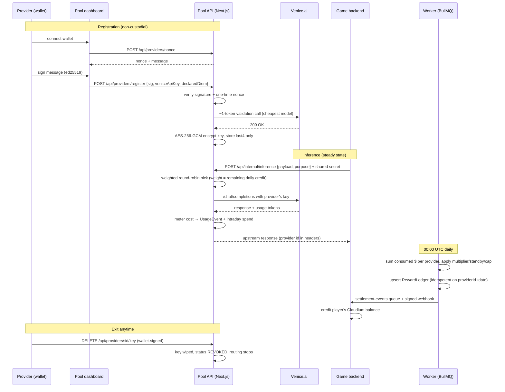

# WoCC Compute Delegation Pool (DIEM + BYOK)

Players delegate AI compute to World of ClaudeCraft and earn **Claudium**:

- **Venice/DIEM**: stake DIEM on Venice.ai for a daily-refreshing API credit
  ($1/day per DIEM) and register a scoped Venice key.
- **Bring-your-own-key (BYOK)**: attach your own **OpenAI**, **Anthropic**,
  or **Kimi (Moonshot)** API key with a self-imposed daily donation budget.

Either way it is non-custodial: keys are validated with a ~1-token call,
encrypted at rest, revocable anytime, and never shown again. The game routes
NPC dialogue, quest generation, dungeon-master and agent-player inference
through the pool by **model class**, meters actual consumed compute per
provider, and settles nightly in Claudium (internal ledger - no on-chain
transfer in v1).

Because BYOK keys spend real money, they carry extra fraud controls
(design: `docs/PLAN-byok-multi-vendor.md`):

- **Trust ramp** - a new key routes at most $2/day regardless of its declared
  budget, $25/day after 7 healthy days, uncapped at 30 (`TRUST_CAP_*`).
- **Reward vesting** - BYOK Claudium settles as PENDING and vests 7 days
  later; a key that goes INVALID upstream (stolen-key signature) or is
  revoked **voids** its unvested rewards.
- **No standby pay** - only stake-backed Venice capacity earns the standby
  rate; a free-to-declare BYOK budget pays only for consumed compute.
- **Pinned endpoints** - vendors are an allowlist with pool-configured base
  URLs; providers can never point us at their own server.

## Delegation flow



## Stack

- **Next.js 15 (App Router)** - API routes + provider/admin dashboard
- **PostgreSQL + Prisma** - providers, usage metering, reward ledger
- **BullMQ + Redis** - health probes (30 min), daily settlement (00:00 UTC),
  `settlement-events` outbox queue
- **Zod** - validation on every route
- **tweetnacl + bs58** - Solana wallet signature verification

## Setup

```bash
cd services/diem-pool
npm install

# 1. Local Postgres + Redis
docker compose up -d

# 2. Configure
cp .env.example .env
# fill in KEY_ENCRYPTION_KEY / INTERNAL_SHARED_SECRET / ADMIN_TOKEN:
#   openssl rand -hex 32

# 3. Database
npm run prisma:generate
npm run prisma:migrate      # applies prisma/migrations
npm run prisma:seed         # seeds the model pricing table

# 4. Run
npm run dev                 # Next.js app on :3100
npm run worker              # BullMQ worker (separate terminal)

# 5. Verify
npm test
npm run typecheck

# Optional full-stack verification (DESTRUCTIVE - scratch DB only): mock
# Venice upstream + real registration/routing/settlement flow end to end.
node scripts/mock_venice.mjs &          # set VENICE_BASE_URL=http://127.0.0.1:4567/api/v1
npx tsx scripts/e2e_smoke.mts           # API-level: 60+ checks incl. failover & concurrency
npx tsx scripts/ui_e2e.mts              # browser-level: dashboard/admin/leaderboard flows
npx tsx scripts/load_sanity.mts         # throughput/latency sanity vs the mock upstream
```

The game backend calls the pool by **model class** (`fast` | `standard` |
`smart`), and the pool resolves the concrete model per vendor via the
admin-editable `ModelClassMap`:

```bash
curl -s http://localhost:3100/api/internal/inference \
  -H "content-type: application/json" \
  -H "x-internal-secret: $INTERNAL_SHARED_SECRET" \
  -d '{
        "purpose": "npc_dialogue",
        "modelClass": "fast",
        "gameAccountId": "acct_123",
        "payload": {
          "messages": [{"role": "user", "content": "Greet the traveler."}],
          "max_tokens": 128
        }
      }'
```

The response body is always OpenAI chat-completion shaped regardless of the
serving vendor (the Anthropic adapter translates both directions);
`x-pool-provider-id` / `x-pool-vendor` / `x-pool-house` headers say who
served it. Two pinning forms remain supported in `payload.model`:
`"vendor:model"` routes to that vendor only, and a bare model name is the
legacy Venice contract.

## Router weighting algorithm

Smooth weighted round-robin (the nginx variant) over ACTIVE providers, where
each provider's weight is its **remaining routable budget** for the UTC day:

```
weight(p) = max(0, dailyCapacityUsd × SPEND_HEADROOM − spentTodayUsd)
```

- `SPEND_HEADROOM` (default 0.90) stops routing at ~90% of declared capacity,
  leaving slack for metering-vs-Venice estimation error.
- Per pick, every candidate's counter grows by its weight; the max counter
  wins and pays back the total. Selection is exactly proportional over time,
  burst-free, and deterministic - see `tests/router.test.ts`.
- Failure handling: one same-key retry on retryable errors (5xx/network/429),
  then failover to the next-best-budget provider (max 3 providers per
  request). Two consecutive hard failures → `DEGRADED` (skipped until a
  health probe recovers it). 401/403 → `INVALID`. "Insufficient credit" pins
  the provider's intraday spend to capacity so it sits out the rest of the day.
- Pool exhausted → the house Venice key serves the call, tagged `house`
  (never rewarded).

## Settlement economics (00:00 UTC, settles the day that just ended)

| Step | Rule |
| --- | --- |
| Base | `floor(consumedUsd × CLAUDIUM_PER_USD × vendorMultiplier)` - consumed compute only, never pledged capacity; the per-vendor multiplier is admin-tunable (default 1.0×) |
| Uptime bonus | ×`UPTIME_MULTIPLIER` (1.25) once `consecutiveHealthyDays ≥ 30` |
| Standby | `floor(unusedCapacityUsd × STANDBY_CLAUDIUM_PER_USD_CAPACITY)` for providers ACTIVE and healthy all day - **standby-eligible (Venice) vendors only** |
| Cap | nobody keeps more than `MAX_DAILY_SHARE` (20%) of the day's total uncapped emission |
| Vesting | Venice rows vest instantly; BYOK rows settle PENDING and vest after `vestingDays` (7); INVALID/revoked keys void their PENDING rows |

Trust tiers are recomputed from the healthy-day streak at settlement
(`NEW < 7d ≤ ESTABLISHED < 30d ≤ TRUSTED`) and cap BYOK routing budgets.
Credit events (queue + webhook) are emitted when a row **vests**, never for
pending or voided rows.

Notes:

- The cap only engages when at least `MIN_PROVIDERS_FOR_CAP` (default 5)
  providers earned that day - with a tiny pool a literal 20%-of-total cap
  would zero out most of the emission (a lone provider could never earn more
  than 20% of its own reward). Set it to 1 for the literal rule.
- Settlement is **idempotent**: ledger rows upsert on `(providerId, date)`;
  streak bumps and suspicion scores commit in one transaction guarded by
  `SettlementRun.streaksApplied`, so re-running a crashed or duplicate job
  never double-pays or double-bumps.
- Each settlement emits a message on the `settlement-events` BullMQ queue and
  (optionally) an HMAC-signed webhook (`x-wocc-signature`) to
  `GAME_WEBHOOK_URL`. Delivery is at-least-once - the game backend must
  dedupe on `(providerId, date)` before crediting Claudium.

## Security model

- **Keys**: validated with a ~1-token call before acceptance; AES-256-GCM
  encrypted at rest (`KEY_ENCRYPTION_KEY`, KMS-shaped envelope); never logged,
  never returned by any API (only `keyLast4`); wiped immediately on
  revocation. Upstream error bodies are redacted before they leave the
  service.
- **Provider mutations** (register/revoke): one-time server-issued nonce
  (10 min TTL, atomically consumed) + ed25519 wallet signature over a
  server-built message that binds action, wallet, and nonce - replay- and
  purpose-confusion-proof.
- **Internal inference**: constant-time shared-secret check
  (`x-internal-secret`); everything else is rejected.
- **Rate limits**: registration per-IP and per-wallet (Redis fixed windows).
- **Self-dealing**: each settlement scores providers by the share of their
  usage coming from their single busiest game account (`suspicionScore`,
  flagged at ≥0.6 in the admin panel - no auto-ban in v1).
- **Kill switch**: admin toggle pauses all routing instantly.

## Surfaces

| Path | What |
| --- | --- |
| `/` | Provider dashboard: connect wallet, register/revoke key, live stats |
| `/leaderboard` | Public ranking by lifetime $ served |
| `/admin` | Pool overview, pricing editor, kill switch (needs `ADMIN_TOKEN`) |
| `POST /api/providers/nonce` | Issue signing nonce |
| `POST /api/providers/register` | Register a validated Venice key |
| `DELETE /api/providers/:id/key` | Wallet-signed revocation |
| `GET /api/providers/by-wallet/:wallet` | Provider stats |
| `GET /api/leaderboard` | Leaderboard JSON |
| `POST /api/internal/inference` | Game → pool inference (shared secret) |
| `GET /api/admin/overview` · `GET/PUT /api/admin/pricing` · `GET/POST /api/admin/killswitch` · `GET/PUT /api/admin/vendors` | Admin API |

## Deploying (Railway)

The service ships a production `Dockerfile` (migrate-on-start web process;
the same image runs the worker with a different command) and a
`railway.json` with the `/api/health` healthcheck wired up. From a machine
with the Railway CLI authenticated:

```bash
cd services/diem-pool
railway init                       # or `railway link` to an existing project
railway add --database postgres    # provides DATABASE_URL
railway add --database redis       # provides REDIS_URL
railway variables set KEY_ENCRYPTION_KEY=$(openssl rand -hex 32) \
  INTERNAL_SHARED_SECRET=$(openssl rand -hex 32) ADMIN_TOKEN=$(openssl rand -hex 16)
railway up                         # builds the Dockerfile, deploys the web process
# Worker: add a second service on the same repo/image with
# start command `npm run worker`, sharing the same variables.
```

`prisma migrate deploy` runs on boot and is idempotent, so deploys and
rollbacks (redeploy the previous image) are safe in either direction.

## Operations

- **Monitoring**: `GET /api/health` (unauthenticated, for LB probes and
  alerting) reports DB round-trip latency, Redis reachability, last settled
  day (flags a stuck settlement worker), the kill-switch state, and provider
  status counts. 200 when fully healthy, 503 otherwise. Structured
  warn/error logs mark every degraded path: `[ratelimit]` fail-open,
  `[pricing]` unknown-model fallback, `[inference] METERING FAILED`,
  `[settle]`/`[health]`/`[worker]` job outcomes.
- **Rollback**: deploys are stateless - roll back by redeploying the previous
  image. The schema is a single additive migration (`prisma migrate deploy`
  is idempotent); settlement re-runs are idempotent by design. For incidents,
  the admin kill switch stops all routing instantly without a deploy, and
  individual providers can be revoked.
- **Job resilience**: scheduled jobs retry with exponential backoff
  (settlement: 5 attempts from midnight UTC; probes: 2). A settlement missed
  entirely (worker down) is picked up safely later - run
  `runDailySettlement()` for the missed date or just let ops re-fire; the
  `SettlementRun` guard prevents double-pay.
- **Data retention**: nonces are pruned automatically after a day.
  `UsageEvent` grows with traffic (one row per inference call) - the reward
  ledger only needs daily sums, so archive/partition events older than your
  audit window once volume warrants it.
- **Dependencies**: `package-lock.json` pins the tree; `npm audit` is clean
  as of the last commit (a `postcss` override keeps Next's transitive pin on
  the patched line).

## Known limitations (v1)

These are the places where the implementation makes assumptions that must be
checked against the real Venice API before money-equivalent rewards ship:

- **Upstream shapes are verified against faithful mocks, not live APIs.**
  The Venice/OpenAI/Kimi/Anthropic adapters encode each vendor's documented
  auth, request/response, and error conventions (including OpenAI's
  `insufficient_quota` 429s and Anthropic's 529/credit-balance errors), and
  the E2E suite exercises them against dialect-accurate mocks - but a pass
  against each real API with a funded key is required before launch.
- **Venice balance shapes are assumed, not verified.** `src/lib/venice.ts`
  sniffs a few plausible balance headers (`parseBalanceUsd`) and otherwise
  trusts the provider's *declared* DIEM count for capacity. Inspect real
  Venice responses and adapt; until then a provider can over-declare
  capacity (bounded by `MAX_DECLARED_DIEM`, and metering still only pays for
  actually-served compute).
- **Anthropic translation covers text chat only** - tool/function messages
  and image parts are rejected as `bad_request` rather than silently
  dropped; extend `translateRequest` when the game needs them.
- **Seeded model pricing is a snapshot** (`prisma/seed.ts`), not live data.
  Keep the table in sync with https://venice.ai/pricing via the admin
  editor; unknown models are metered at a conservative fallback rate and
  logged.
- **`purpose: image_gen` is tagged and metered but routed through
  `/chat/completions`** like everything else; wiring Venice's image endpoint
  is follow-up work.
- **Streaming is not supported** - the router forces `stream: false` so the
  `usage` block is always present for metering.
- **Self-dealing detection is a heuristic** (top-account share of daily
  usage), surfaced in admin only - it flags, it does not prove or ban.
- **The wallet flow is verified with an injected test wallet**
  (`scripts/ui_e2e.mts`) that implements the Phantom `connect`/`signMessage`
  interface with real ed25519 signatures; a pass against the actual Phantom
  extension is still worth doing before launch.

## Non-goals (v1)

- No on-chain Claudium settlement (internal ledger only)
- No custodial DIEM pooling - we never hold tokens
- No provider payouts in $WOC
